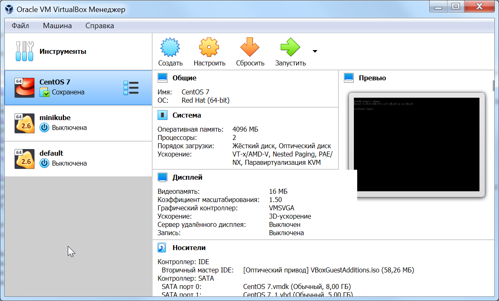
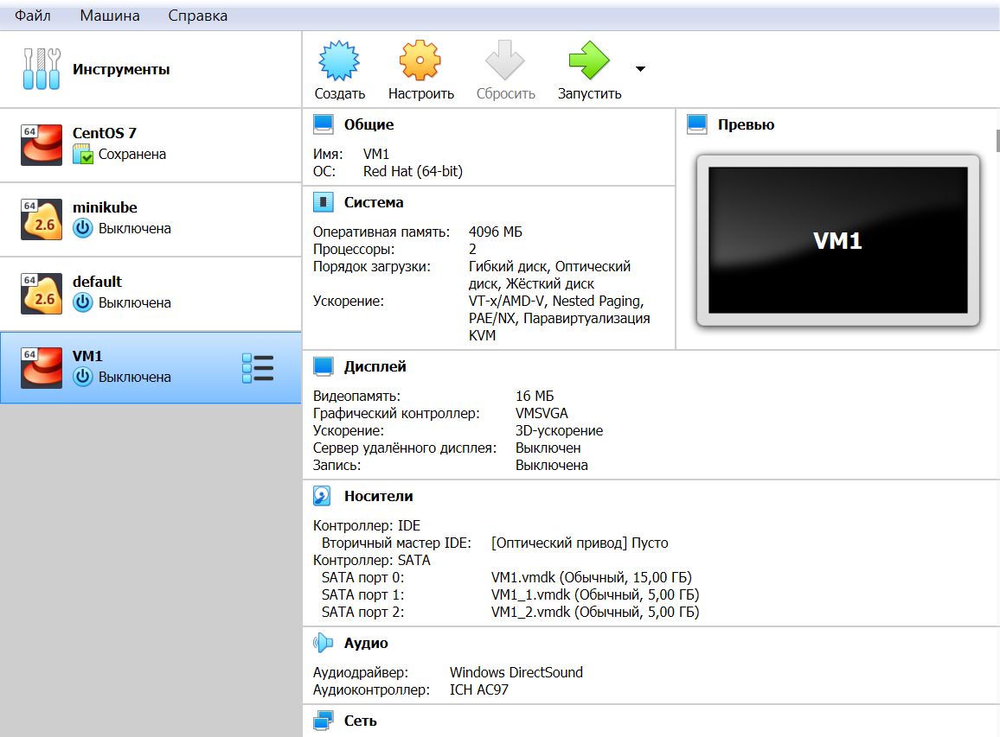
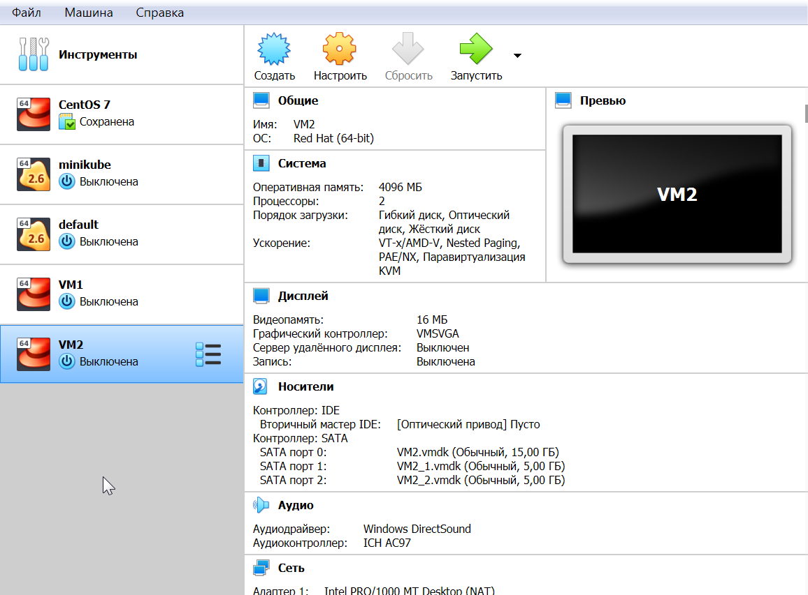
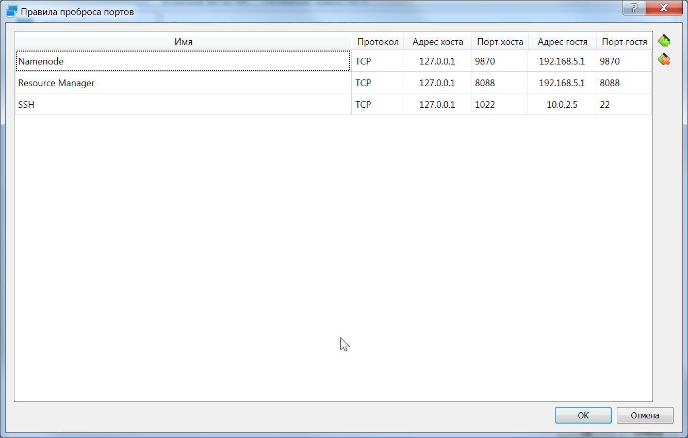
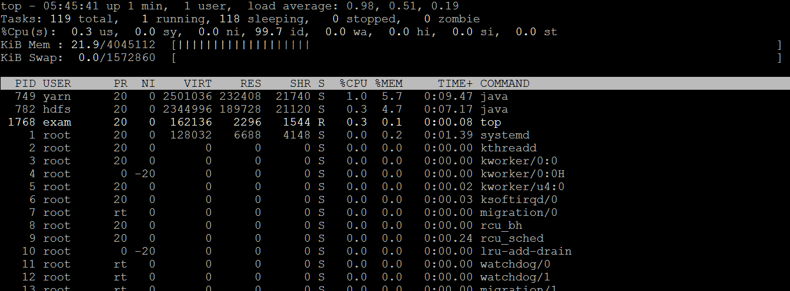
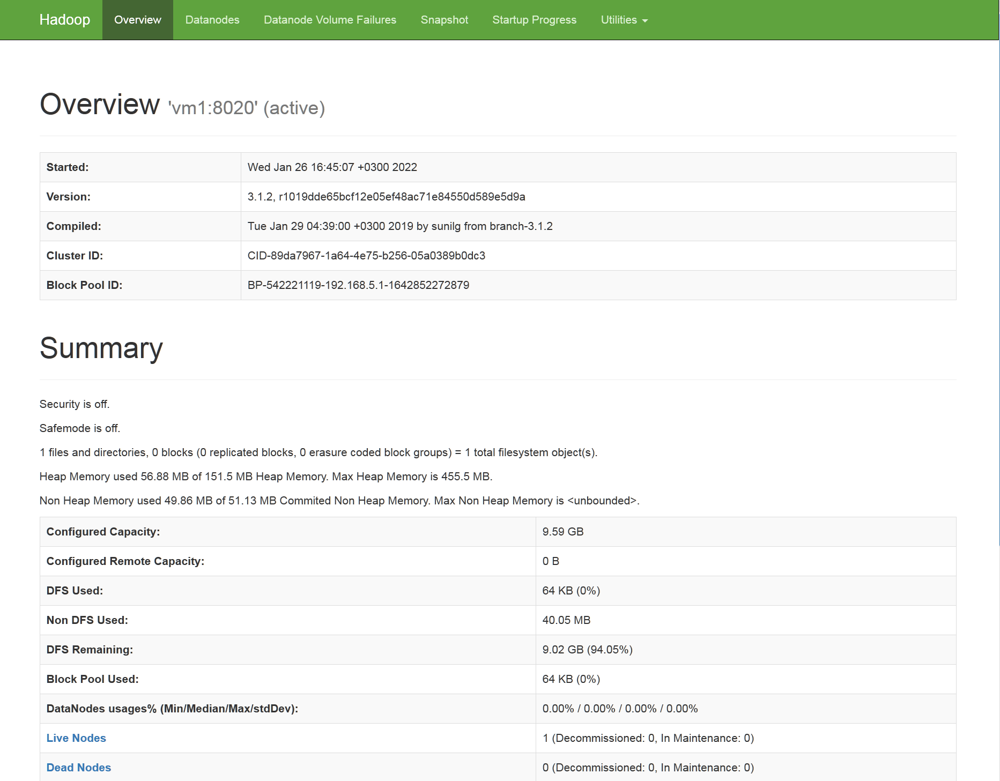
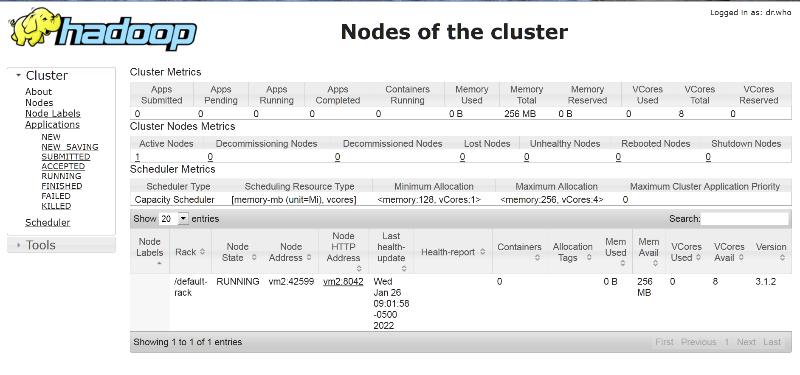

## _Tasks_  


  
1. Установить CentOS на 2 виртуальные машины:  
•	VM1: 2CPU, 2-4G памяти, системный диск на 15-20G и дополнительные 2 диска по 5G  
•	VM2: 2CPU, 2-4G памяти, системный диск на 15-20G и дополнительные 2 диска по 5G  
Все дальнейшие действия будут выполняться на обеих машинах, если не сказано иначе.  
  
  
  
  
2. При установке CentOS создать дополнительного пользователя exam и настроить для него использование sudo без пароля. Все последующие действия необходимо выполнять от этого пользователя, если не указано иное.  
  
__Host:__   
```
Vicont@Vladimir_K MINGW64 ~/.ssh
$ ssh-copy-id  -i vm_rsa.pub -p 1022 exam@127.0.0.1
/usr/bin/ssh-copy-id: INFO: Source of key(s) to be installed: "vm_rsa.pub"
The authenticity of host '[127.0.0.1]:1022 ([127.0.0.1]:1022)' can't be established.
ED25519 key fingerprint is SHA256:ejq+xawaTNyzfCTsNdVkEZrLHhegiSobaZjiK92v4uM.
This key is not known by any other names
Are you sure you want to continue connecting (yes/no/[fingerprint])? yes
/usr/bin/ssh-copy-id: INFO: attempting to log in with the new key(s), to filter out any that are already installed
/usr/bin/ssh-copy-id: INFO: 1 key(s) remain to be installed -- if you are prompted now it is to install the new keys
exam@127.0.0.1's password:

Number of key(s) added: 1

Now try logging into the machine, with:   "ssh -p '1022' 'exam@127.0.0.1'"
and check to make sure that only the key(s) you wanted were added.

$ ssh-copy-id  -i vm_rsa.pub -p 2022 exam@127.0.0.1
/usr/bin/ssh-copy-id: INFO: Source of key(s) to be installed: "vm_rsa.pub"
The authenticity of host '[127.0.0.1]:2022 ([127.0.0.1]:2022)' can't be established.
ED25519 key fingerprint is SHA256:C8YDx3DB9C1WwF9pQ1moIUmSFFgdkeVwbBu1tIBdql4.
This key is not known by any other names
Are you sure you want to continue connecting (yes/no/[fingerprint])? yes
/usr/bin/ssh-copy-id: INFO: attempting to log in with the new key(s), to filter out any that are already installed
/usr/bin/ssh-copy-id: INFO: 1 key(s) remain to be installed -- if you are prompted now it is to install the new keys
exam@127.0.0.1's password:

Number of key(s) added: 1

Now try logging into the machine, with:   "ssh -p '2022' 'exam@127.0.0.1'"
and check to make sure that only the key(s) you wanted were added.

```
  
__Both VMs:__  
```
[exam@vm1 ~]$ chmod 700 ~/.ssh
[exam@vm1 ~]$ chmod 600 ~/.ssh/authorized_keys
[exam@vm1 ~]$ sudo systemctl restart sshd.service
```
  
3. Установить OpenJDK8 из репозитория CentOS.    
  
__Both VMs:__   
```
[exam@vm1 ~]$ sudo yum install java-1.8.0-openjdk
Loaded plugins: fastestmirror
Loading mirror speeds from cached hostfile
 * base: mirror.axelname.ru
 * extras: mirror.axelname.ru
 * updates: mirror.axelname.ru
base                                                     | 3.6 kB     00:00
extras                                                   | 2.9 kB     00:00
updates                                                  | 2.9 kB     00:00
(1/4): base/7/x86_64/group_gz                              | 153 kB   00:00
(2/4): extras/7/x86_64/primary_db                          | 243 kB   00:00
(3/4): base/7/x86_64/primary_db                            | 6.1 MB   00:02
(4/4): updates/7/x86_64/primary_db                                      |  13 MB  00:00:06
Resolving Dependencies
--> Running transaction check
---> Package java-1.8.0-openjdk.x86_64 1:1.8.0.312.b07-1.el7_9 will be installed
--> Processing Dependency: java-1.8.0-openjdk-headless(x86-64) = 1:1.8.0.312.b07-1.el7_9 for package: 1:java-1.8.0-openjdk-1.8.0.312.b07-1.el7_9.x86_64

......

  xorg-x11-font-utils.x86_64 1:7.5-21.el7
  xorg-x11-fonts-Type1.noarch 0:7.5-9.el7

Complete!
[exam@vm1 ~]$ java -version
openjdk version "1.8.0_312"
OpenJDK Runtime Environment (build 1.8.0_312-b07)
OpenJDK 64-Bit Server VM (build 25.312-b07, mixed mode)
```
  
4. Скачать архив с Hadoop версии 3.1.2 (https://hadoop.apache.org/release/3.1.2.html)
  
__Both VMs:__  
```
[exam@vm1 ~]$ sudo yum install wget
Loaded plugins: fastestmirror
Loading mirror speeds from cached hostfile
 * base: mirror.axelname.ru
 * extras: mirror.axelname.ru
 * updates: mirror.reconn.ru
Resolving Dependencies
--> Running transaction check
---> Package wget.x86_64 0:1.14-18.el7_6.1 will be installed
--> Finished Dependency Resolution

Dependencies Resolved

================================================================================================
 Package            Arch                 Version                       Repository          Size
================================================================================================
Installing:
 wget               x86_64               1.14-18.el7_6.1               base               547 k

Transaction Summary
================================================================================================
Install  1 Package

Total download size: 547 k
Installed size: 2.0 M
Is this ok [y/d/N]: y
Downloading packages:
wget-1.14-18.el7_6.1.x86_64.rpm                                          | 547 kB  00:00:00
Running transaction check
Running transaction test
Transaction test succeeded
Running transaction
  Installing : wget-1.14-18.el7_6.1.x86_64                                                  1/1
  Verifying  : wget-1.14-18.el7_6.1.x86_64                                                  1/1

Installed:
  wget.x86_64 0:1.14-18.el7_6.1

Complete!

[exam@vm1 ~]$ wget https://archive.apache.org/dist/hadoop/common/hadoop-3.1.2/hadoop-3.1.2.tar.gz
--2022-01-19 20:15:49--  https://archive.apache.org/dist/hadoop/common/hadoop-3.1.2/hadoop-3.1.2.tar.gz
Resolving archive.apache.org (archive.apache.org)... 138.201.131.134, 2a01:4f8:172:2ec5::2
Connecting to archive.apache.org (archive.apache.org)|138.201.131.134|:443... connected.
HTTP request sent, awaiting response... 200 OK
Length: 332433589 (317M) [application/x-gzip]
Saving to: ‘hadoop-3.1.2.tar.gz’

100%[======================================================>] 332,433,589 3.17MB/s   in 91s

2022-01-19 20:17:20 (3.49 MB/s) - ‘hadoop-3.1.2.tar.gz’ saved [332433589/332433589]

```
  
5. Распаковать содержимое архива в /opt/hadoop-3.1.2/  
  
__Both VMs:__   
```[exam@vm1 ~]$ sudo tar -xzf hadoop-3.1.2.tar.gz -C /opt/
[exam@vm1 ~]$ ls /opt
hadoop-3.1.2
``` 
    
6. Сделать симлинк /usr/local/hadoop/current/ на директорию /opt/hadoop-3.1.2/  
   
__Both VMs:__   
```
[exam@vm1 ~]$ sudo mkdir /usr/local/hadoop
[exam@vm1 ~]$ sudo ln -s /opt/hadoop-3.1.2/ /usr/local/hadoop/current
[exam@vm1 ~]$ ls -la /usr/local/hadoop/current/
total 176
drwxr-xr-x. 9 1001 1002    149 Jan 19 20:28 .
drwxr-xr-x. 3 root root     26 Jan 19 20:19 ..
drwxr-xr-x. 2 1001 1002    183 Jan 29  2019 bin
drwxr-xr-x. 3 1001 1002     20 Jan 29  2019 etc
drwxr-xr-x. 2 1001 1002    106 Jan 29  2019 include
drwxr-xr-x. 3 1001 1002     20 Jan 29  2019 lib
drwxr-xr-x. 4 1001 1002    288 Jan 29  2019 libexec
-rw-rw-r--. 1 1001 1002 147145 Jan 23  2019 LICENSE.txt
-rw-rw-r--. 1 1001 1002  21867 Jan 23  2019 NOTICE.txt
-rw-rw-r--. 1 1001 1002   1366 Jan 23  2019 README.txt
drwxr-xr-x. 3 1001 1002   4096 Jan 29  2019 sbin
drwxr-xr-x. 4 1001 1002     31 Jan 29  2019 share
```
  
7. Создать пользователей hadoop, yarn и hdfs, а также группу hadoop, в которую необходимо добавить всех этих пользователей  
  
__First VM:__   
```
[exam@vm1 ~]$ sudo groupadd hadoop
[exam@vm1 ~]$ vi users.txt
[exam@vm1 ~]$ cat users.txt
hadoop:hadoop::::/home/hadoop:/bin/bash
yarn:yarn::::/home/yarn:/bin/bash
hdfs:hdfs::::/home/hdfs:/bin/bash
[exam@vm1 ~]$ sudo newusers users.txt
[exam@vm1 ~]$ sudo usermod -aG hadoop yarn
[exam@vm1 ~]$ sudo usermod -aG hadoop hdfs
[exam@vm1 ~]$ sudo usermod -aG hadoop hadoop
[exam@vm1 ~]$ cat /etc/group | grep hadoop
hadoop:x:1001:yarn,hdfs,hadoop
```
__Second VM:__   
```
[exam@vm2 ~]$ sudo groupadd hadoop
[exam@vm2 ~]$ vi users.txt
[exam@vm2 ~]$ cat users.txt
hadoop:hadoop::::/home/hadoop:/bin/bash
yarn:yarn::::/home/yarn:/bin/bash
hdfs:hdfs::::/home/hdfs:/bin/bash
[exam@vm2 ~]$ sudo newusers users.txt
[exam@vm2 ~]$ sudo usermod -aG hadoop hadoop
[exam@vm2 ~]$ sudo usermod -aG hadoop yarn
[exam@vm2 ~]$ sudo usermod -aG hadoop hdfs
[exam@vm2 ~]$ cat /etc/group | grep hadoop
hadoop:x:1001:hadoop,yarn,hdfs
```
  
8. Создать для обоих дополнительных дисков разделы размером в 100% диска.  
  
__Both VMs:__   
```
[exam@vm1 ~]$ lsblk -f
NAME            FSTYPE      LABEL UUID                                   MOUNTPOINT
sda
├─sda1          xfs               9b5f0b01-fb89-402e-8414-9664c8322344   /boot
└─sda2          LVM2_member       8fIpd0-1LAm-1Ubb-JPq5-fIqe-qEGj-AEk3Rb
  ├─centos-root xfs               da84fa4e-6d53-4dc5-b282-c6dac4bbdad9   /
  └─centos-swap swap              2d21460d-b6dc-4ee9-b543-b1414abb754c   [SWAP]
sdb
sdc
sr0

[exam@vm1 ~]$ sudo cfdisk /dev/sdb
Disk has been changed.

WARNING: If you have created or modified any
DOS 6.x partitions, please see the cfdisk manual
page for additional information.
[exam@vm1 ~]$ sudo cfdisk /dev/sdc

Disk has been changed.

WARNING: If you have created or modified any
DOS 6.x partitions, please see the cfdisk manual
page for additional information.

[exam@vm1 ~]$ lsblk -f
NAME            FSTYPE      LABEL UUID                                   MOUNTPOINT
sda
├─sda1          xfs               9b5f0b01-fb89-402e-8414-9664c8322344   /boot
└─sda2          LVM2_member       8fIpd0-1LAm-1Ubb-JPq5-fIqe-qEGj-AEk3Rb
  ├─centos-root xfs               da84fa4e-6d53-4dc5-b282-c6dac4bbdad9   /
  └─centos-swap swap              2d21460d-b6dc-4ee9-b543-b1414abb754c   [SWAP]
sdb
└─sdb1
sdc
└─sdc1
sr0

```
     
9. Инициализировать разделы из п.8 в качестве физических томов для LVM.  
  
__Both VMs:__  
```
[exam@vm1 ~]$ sudo pvcreate /dev/sdb1 /dev/sdc1
  Physical volume "/dev/sdb1" successfully created.
  Physical volume "/dev/sdc1" successfully created.
[exam@vm1 ~]$ sudo pvdisplay
  --- Physical volume ---
  PV Name               /dev/sda2
  VG Name               centos
  PV Size               <14.00 GiB / not usable 3.00 MiB
  Allocatable           yes (but full)
  PE Size               4.00 MiB
  Total PE              3583
  Free PE               0
  Allocated PE          3583
  PV UUID               8fIpd0-1LAm-1Ubb-JPq5-fIqe-qEGj-AEk3Rb

  "/dev/sdb1" is a new physical volume of "<5.00 GiB"
  --- NEW Physical volume ---
  PV Name               /dev/sdb1
  VG Name
  PV Size               <5.00 GiB
  Allocatable           NO
  PE Size               0
  Total PE              0
  Free PE               0
  Allocated PE          0
  PV UUID               lvJpEs-Rc3i-SQS0-a4us-6mju-lXE3-clhIWw

  "/dev/sdc1" is a new physical volume of "<5.00 GiB"
  --- NEW Physical volume ---
  PV Name               /dev/sdc1
  VG Name
  PV Size               <5.00 GiB
  Allocatable           NO
  PE Size               0
  Total PE              0
  Free PE               0
  Allocated PE          0
  PV UUID               Al7MIs-0pqf-qOnP-eQoq-4mgw-g4xj-2pzjcg
```
  
10. Создать две группы LVM и добавить в каждую из них по одному физическому тому из п.9.  
   
__Both VMs:__  
```
[exam@vm1 ~]$ sudo vgcreate vg1 /dev/sdb1
  Volume group "vg1" successfully created
[exam@vm1 ~]$ sudo vgcreate vg2 /dev/sdc1
  Volume group "vg2" successfully created
[exam@vm1 ~]$ sudo vgdisplay
  --- Volume group ---
  VG Name               vg2
  System ID
  Format                lvm2
  Metadata Areas        1
  Metadata Sequence No  1
  VG Access             read/write
  VG Status             resizable
  MAX LV                0
  Cur LV                0
  Open LV               0
  Max PV                0
  Cur PV                1
  Act PV                1
  VG Size               <5.00 GiB
  PE Size               4.00 MiB
  Total PE              1279
  Alloc PE / Size       0 / 0
  Free  PE / Size       1279 / <5.00 GiB
  VG UUID               W95313-CPFM-bIfp-CnWZ-m39L-n9Yj-Dn9LnH

  --- Volume group ---
  VG Name               centos
  System ID
  Format                lvm2
  Metadata Areas        1
  Metadata Sequence No  3
  VG Access             read/write
  VG Status             resizable
  MAX LV                0
  Cur LV                2
  Open LV               2
  Max PV                0
  Cur PV                1
  Act PV                1
  VG Size               <14.00 GiB
  PE Size               4.00 MiB
  Total PE              3583
  Alloc PE / Size       3583 / <14.00 GiB
  Free  PE / Size       0 / 0
  VG UUID               m2KTyf-Atvc-El3e-VM8P-EzvO-p6yP-yqSXjZ

  --- Volume group ---
  VG Name               vg1
  System ID
  Format                lvm2
  Metadata Areas        1
  Metadata Sequence No  1
  VG Access             read/write
  VG Status             resizable
  MAX LV                0
  Cur LV                0
  Open LV               0
  Max PV                0
  Cur PV                1
  Act PV                1
  VG Size               <5.00 GiB
  PE Size               4.00 MiB
  Total PE              1279
  Alloc PE / Size       0 / 0
  Free  PE / Size       1279 / <5.00 GiB
  VG UUID               zSUnWs-dZk9-YXn7-94Qq-mIsP-T5zc-bbEk7g
```
  
11. В каждой из групп из п.10 создать логический том LVM размером 100% группы.  
  
__Both VMs:__  
```
[exam@vm1 ~]$ sudo lvcreate -l +100%FREE -n first vg1
  Logical volume "first" created.
[exam@vm1 ~]$ sudo lvcreate -l +100%FREE -n second vg2
  Logical volume "second" created.
[exam@vm1 ~]$ sudo lvdisplay
  --- Logical volume ---
  LV Path                /dev/vg2/second
  LV Name                second
  VG Name                vg2
  LV UUID                P372BC-Xf7w-hvky-hTn1-JUyh-QwdS-T41zkf
  LV Write Access        read/write
  LV Creation host, time vm1, 2022-01-20 04:23:57 -0500
  LV Status              available
  # open                 0
  LV Size                <5.00 GiB
  Current LE             1279
  Segments               1
  Allocation             inherit
  Read ahead sectors     auto
  - currently set to     8192
  Block device           253:3

  --- Logical volume ---
  LV Path                /dev/centos/swap
  LV Name                swap
  VG Name                centos
  LV UUID                JhujUl-GmJf-ozXw-uojH-BU3V-pcw8-fveLz2
  LV Write Access        read/write
  LV Creation host, time vm1, 2022-01-19 18:04:14 -0500
  LV Status              available
  # open                 2
  LV Size                1.50 GiB
  Current LE             384
  Segments               1
  Allocation             inherit
  Read ahead sectors     auto
  - currently set to     8192
  Block device           253:1

  --- Logical volume ---
  LV Path                /dev/centos/root
  LV Name                root
  VG Name                centos
  LV UUID                cJHcml-EcMY-Cr63-kvKC-HWks-ENaC-m0ZStV
  LV Write Access        read/write
  LV Creation host, time vm1, 2022-01-19 18:04:14 -0500
  LV Status              available
  # open                 1
  LV Size                <12.50 GiB
  Current LE             3199
  Segments               1
  Allocation             inherit
  Read ahead sectors     auto
  - currently set to     8192
  Block device           253:0

  --- Logical volume ---
  LV Path                /dev/vg1/first
  LV Name                first
  VG Name                vg1
  LV UUID                N2SjiV-VgoC-CffW-4DEh-IGvF-PsCB-wesaDz
  LV Write Access        read/write
  LV Creation host, time vm1, 2022-01-20 04:23:45 -0500
  LV Status              available
  # open                 0
  LV Size                <5.00 GiB
  Current LE             1279
  Segments               1
  Allocation             inherit
  Read ahead sectors     auto
  - currently set to     8192
  Block device           253:2
```
  
12. На каждом логическом томе LVM создать файловую систему ext4.  
  
__Both VMs:__  
```
[exam@vm1 ~]$ sudo mkfs -t ext4 /dev/vg1/first
mke2fs 1.42.9 (28-Dec-2013)
Filesystem label=
OS type: Linux
Block size=4096 (log=2)
Fragment size=4096 (log=2)
Stride=0 blocks, Stripe width=0 blocks
327680 inodes, 1309696 blocks
65484 blocks (5.00%) reserved for the super user
First data block=0
Maximum filesystem blocks=1342177280
40 block groups
32768 blocks per group, 32768 fragments per group
8192 inodes per group
Superblock backups stored on blocks:
        32768, 98304, 163840, 229376, 294912, 819200, 884736

Allocating group tables: done
Writing inode tables: done
Creating journal (32768 blocks): done
Writing superblocks and filesystem accounting information: done

[exam@vm1 ~]$ sudo mkfs -t ext4 /dev/vg2/second
mke2fs 1.42.9 (28-Dec-2013)
Filesystem label=
OS type: Linux
Block size=4096 (log=2)
Fragment size=4096 (log=2)
Stride=0 blocks, Stripe width=0 blocks
327680 inodes, 1309696 blocks
65484 blocks (5.00%) reserved for the super user
First data block=0
Maximum filesystem blocks=1342177280
40 block groups
32768 blocks per group, 32768 fragments per group
8192 inodes per group
Superblock backups stored on blocks:
        32768, 98304, 163840, 229376, 294912, 819200, 884736

Allocating group tables: done
Writing inode tables: done
Creating journal (32768 blocks): done
Writing superblocks and filesystem accounting information: done

[exam@vm1 ~]$ lsblk -f
NAME            FSTYPE      LABEL UUID                                   MOUNTPOINT
sda
├─sda1          xfs               9b5f0b01-fb89-402e-8414-9664c8322344   /boot
└─sda2          LVM2_member       8fIpd0-1LAm-1Ubb-JPq5-fIqe-qEGj-AEk3Rb
  ├─centos-root xfs               da84fa4e-6d53-4dc5-b282-c6dac4bbdad9   /
  └─centos-swap swap              2d21460d-b6dc-4ee9-b543-b1414abb754c   [SWAP]
sdb
└─sdb1          LVM2_member       lvJpEs-Rc3i-SQS0-a4us-6mju-lXE3-clhIWw
  └─vg1-first   ext4              1497a540-9430-4777-baa9-df666f6b9e99
sdc
└─sdc1          LVM2_member       Al7MIs-0pqf-qOnP-eQoq-4mgw-g4xj-2pzjcg
  └─vg2-second  ext4              aae9f4ff-d9fa-4c82-b276-8784279860b5
sr0
```
  
13. Создать директории и использовать их в качестве точек монтирования файловых систем из п.12:  
•	/opt/mount1  
•	/opt/mount2  
  
__Both VMs:__  
```
[exam@vm1 ~]$ sudo mkdir /opt/mount1
[exam@vm1 ~]$ sudo mkdir /opt/mount2
[exam@vm1 ~]$ sudo mount /dev/vg1/first /opt/mount1
[exam@vm1 ~]$ sudo mount /dev/vg2/second /opt/mount2

```
  
14. Настроить систему так, чтобы монтирование происходило автоматически при запуске системы. Произвести монтирование новых файловых систем.  
  
__Both VMs:__  
```
[exam@vm1 ~]$ sudo vi /etc/fstab
[exam@vm1 ~]$ cat /etc/fstab

#
# /etc/fstab
# Created by anaconda on Wed Jan 19 18:04:15 2022
#
# Accessible filesystems, by reference, are maintained under '/dev/disk'
# See man pages fstab(5), findfs(8), mount(8) and/or blkid(8) for more info
#
/dev/mapper/centos-root /                       xfs     defaults        0 1
UUID=9b5f0b01-fb89-402e-8414-9664c8322344 /boot                   xfs     defaults        0 0
/dev/mapper/centos-swap swap                    swap    defaults        0 0
# /dev/sdb1
/dev/vg1/first                /opt/mount1             ext4    defaults        0 0
# /dev/sdc1
/dev/vg2/second               /opt/mount2             ext4    defaults        0 0
```
__After reboot:__  
```
[exam@vm1 ~]$ ls -la /opt
total 8
drwxr-xr-x.  5 root root   54 Jan 20 04:30 .
dr-xr-xr-x. 17 root root  224 Jan 19 18:11 ..
drwxr-xr-x.  9 yarn yarn  149 Jan 28  2019 hadoop-3.1.2
drwxr-xr-x.  3 root root 4096 Jan 20 04:26 mount1
drwxr-xr-x.  3 root root 4096 Jan 20 04:26 mount2
[exam@vm1 ~]$ ls -la /opt/mount1
total 20
drwxr-xr-x. 3 root root  4096 Jan 20 04:26 .
drwxr-xr-x. 5 root root    54 Jan 20 04:30 ..
drwx------. 2 root root 16384 Jan 20 04:26 lost+found
```  
  
Для VM1 (шаги 15-16):  
15. После монтирования создать 2 директории для хранения файлов Namenode сервиса HDFS:  
•	/opt/mount1/namenode-dir  
•	/opt/mount2/namenode-dir  
```
[exam@vm1 ~]$ sudo mkdir /opt/mount1/namenode-dir
[exam@vm1 ~]$ sudo mkdir /opt/mount2/namenode-dir
[exam@vm1 ~]$
```
  
16. Сделать пользователя hdfs и группу hadoop владельцами этих директорий.  
```
[exam@vm1 ~]$ ls -la /opt/mount1/
total 24
drwxr-xr-x. 4 root root  4096 Jan 20 05:02 .
drwxr-xr-x. 5 root root    54 Jan 20 04:30 ..
drwx------. 2 root root 16384 Jan 20 04:26 lost+found
drwxr-xr-x. 2 root root  4096 Jan 20 05:02 namenode-dir
[exam@vm1 ~]$ sudo chown hdfs:hadoop /opt/mount1/namenode-dir
[exam@vm1 ~]$ ls -la /opt/mount1/
total 24
drwxr-xr-x. 4 root root    4096 Jan 20 05:02 .
drwxr-xr-x. 5 root root      54 Jan 20 04:30 ..
drwx------. 2 root root   16384 Jan 20 04:26 lost+found
drwxr-xr-x. 2 hdfs hadoop  4096 Jan 20 05:02 namenode-dir
[exam@vm1 ~]$ sudo chown hdfs:hadoop /opt/mount2/namenode-dir
```
  
Для VM2 (шаги 17-20):  
17. После монтирования создать 2 директории для хранения файлов Datanode сервиса HDFS:  
•	/opt/mount1/datanode-dir  
•	/opt/mount2/datanode-dir  
  
```
[exam@vm2 ~]$ sudo mkdir /opt/mount1/datanode-dir
[exam@vm2 ~]$ sudo mkdir /opt/mount2/datanode-dir
```
18. Сделать пользователя hdfs и группу hadoop владельцами директорий из п.17.  
  
```
[exam@vm2 ~]$ sudo chown hdfs:hadoop /opt/mount1/datanode-dir
[exam@vm2 ~]$ sudo chown hdfs:hadoop /opt/mount2/datanode-dir
```
19. Создать дополнительные 4 директории для Nodemanager сервиса YARN:  
•	/opt/mount1/nodemanager-local-dir  
•	/opt/mount2/nodemanager-local-dir  
•	/opt/mount1/nodemanager-log-dir  
•	/opt/mount2/nodemanager-log-dir  
  
```
[exam@vm2 ~]$ sudo mkdir /opt/mount1/nodemanager-local-dir
[exam@vm2 ~]$ sudo mkdir /opt/mount2/nodemanager-local-dir
[exam@vm2 ~]$ sudo mkdir /opt/mount1/nodemanager-log-dir
[exam@vm2 ~]$ sudo mkdir /opt/mount2/nodemanager-log-dir
```
  
20. Сделать пользователя yarn и группу hadoop владельцами директорий из п.19.
    
```
[exam@vm2 ~]$ sudo chown yarn:hadoop /opt/mount1/nodemanager-local-dir
[exam@vm2 ~]$ sudo chown yarn:hadoop /opt/mount2/nodemanager-local-dir
[exam@vm2 ~]$ sudo chown yarn:hadoop /opt/mount1/nodemanager-log-dir
[exam@vm2 ~]$ sudo chown yarn:hadoop /opt/mount2/nodemanager-log-dir

[exam@vm2 ~]$ ls -la /opt/mount1
total 32
drwxr-xr-x. 6 root root    4096 Jan 20 06:27 .
drwxr-xr-x. 5 root root      54 Jan 20 06:23 ..
drwxr-xr-x. 2 hdfs hadoop  4096 Jan 20 06:26 datanode-dir
drwx------. 2 root root   16384 Jan 20 06:22 lost+found
drwxr-xr-x. 2 yarn hadoop  4096 Jan 20 06:27 nodemanager-local-dir
drwxr-xr-x. 2 yarn hadoop  4096 Jan 20 06:26 nodemanager-log-dir
```
  
Для обеих машин:  
21. Настроить доступ по SSH, используя ключи для пользователя hadoop.  
  
__First VM:__   
```
[exam@vm1 ~]$ su hadoop
Password:
[hadoop@vm1 exam]$ cd
[hadoop@vm1 ~]$ ssh-keygen -t rsa
Generating public/private rsa key pair.
Enter file in which to save the key (/home/hadoop/.ssh/id_rsa): hadoop_1
Enter passphrase (empty for no passphrase):
Enter same passphrase again:
Your identification has been saved in hadoop_1.
Your public key has been saved in hadoop_1.pub.
The key fingerprint is:
SHA256:w+7wXy6f7nLgiEeG3p+9bfnG7Pkk/XZNW4xcI0xcgv0 hadoop@vm1
The key's randomart image is:
+---[RSA 2048]----+
|            +... |
|           . +.  |
|            o .  |
|       .     o E.|
|       .S    ..+.|
|      ..o..   o.+|
|     ..=.o .. .=*|
|      o++ +=.oo+X|
|       .oo+BOo.*B|
+----[SHA256]-----+
[hadoop@vm1 ~]$ ssh-copy-id -i ~/hadoop_1 hadoop@vm2
/usr/bin/ssh-copy-id: INFO: Source of key(s) to be installed: "/home/hadoop/hadoop_1.pub"
/usr/bin/ssh-copy-id: INFO: attempting to log in with the new key(s), to filter out any that are already installed
/usr/bin/ssh-copy-id: INFO: 1 key(s) remain to be installed -- if you are prompted now it is to install the new keys
hadoop@vm2's password:

Number of key(s) added: 1

Now try logging into the machine, with:   "ssh 'hadoop@vm2'"
and check to make sure that only the key(s) you wanted were added.

[hadoop@vm1 ~]$ cd .ssh
[hadoop@vm1 .ssh]$ vi config
[hadoop@vm1 .ssh]$ chmod 600 config
[hadoop@vm1 .ssh]$ ls -la
total 8
drwx------. 2 hadoop hadoop  39 Jan 20 11:30 .
drwx------. 3 hadoop hadoop 131 Jan 20 11:27 ..
-rw-------. 1 hadoop hadoop  24 Jan 20 11:30 config
-rw-r--r--. 1 hadoop hadoop 177 Jan 20 10:51 known_hosts
[hadoop@vm1 .ssh]$ ssh vm2
Last login: Thu Jan 20 19:25:11 2022 from vm1
[hadoop@vm2 ~]$ exit
logout
Connection to vm2 closed.
[hadoop@vm1 .ssh]$ cd ..
[hadoop@vm1 ~]$ cat .ssh/config
IdentityFile ~/hadoop_1
```
  
__Second VM:__   
```
[exam@vm2 ~]$ sudo vi /etc/ssh/sshd_config
[exam@vm2 ~]$ sudo service sshd restart
[exam@vm2 ~]$ su hadoop
Password:
[hadoop@vm2 exam]$ cd
[hadoop@vm2 ~]$ ssh-keygen -t rsa
Generating public/private rsa key pair.
Enter file in which to save the key (/home/hadoop/.ssh/id_rsa): hadoop_2
Enter passphrase (empty for no passphrase):
Enter same passphrase again:
Your identification has been saved in hadoop_2.
Your public key has been saved in hadoop_2.pub.
The key fingerprint is:
SHA256:yiPXMv470ckrklzltOGT2lNlECv+fjEBcmZdx23fYBA hadoop@vm2
The key's randomart image is:
+---[RSA 2048]----+
|            E= o+|
|          . *.+ =|
|          .=.+ oo|
|         .+.  + o|
|        SB.= o . |
|     . oo X.. o  |
|    ..Bo.+ +.  o |
|     ++++ +.  .  |
|      .oo+ ...   |
+----[SHA256]-----+
[hadoop@vm2 ~]$ ssh-copy-id -i ~/hadoop_2 hadoop@vm1
/usr/bin/ssh-copy-id: INFO: Source of key(s) to be installed: "/home/hadoop/hadoop_2.pub"
/usr/bin/ssh-copy-id: INFO: attempting to log in with the new key(s), to filter out any that are already installed
/usr/bin/ssh-copy-id: INFO: 1 key(s) remain to be installed -- if you are prompted now it is to install the new keys
hadoop@vm1's password:

Number of key(s) added: 1

Now try logging into the machine, with:   "ssh 'hadoop@vm1'"
and check to make sure that only the key(s) you wanted were added.

[hadoop@vm2 ~]$ ssh hadoop@vm1
The authenticity of host 'vm1 (192.168.5.1)' can't be established.
ECDSA key fingerprint is SHA256:0VmzkMJLsQ1KLvRXZ8gEuRYQ59ekFBmRsmKde7KQZ7Y.
ECDSA key fingerprint is MD5:d2:38:7e:b1:3e:b7:80:53:e6:cf:79:81:8d:65:e5:6c.
Are you sure you want to continue connecting (yes/no)? yes
Warning: Permanently added 'vm1,192.168.5.1' (ECDSA) to the list of known hosts.
Last login: Thu Jan 20 11:33:38 2022 from vm2
[hadoop@vm1 ~]$ exit
logout
```
  
22. Добавить VM1 и VM2 в /etc/hosts.  
  
__First VM:__  
```
[exam@vm1 ~]$ sudo vi /etc/hosts
[exam@vm1 ~]$ cat /etc/hosts
127.0.0.1   localhost localhost.localdomain localhost4 localhost4.localdomain4
::1         localhost localhost.localdomain localhost6 localhost6.localdomain6
192.168.5.1 vm1
192.168.5.2 vm2
[exam@vm1 ~]$ ping vm2
PING vm2 (192.168.5.2) 56(84) bytes of data.
64 bytes from vm2 (192.168.5.2): icmp_seq=1 ttl=64 time=0.375 ms
64 bytes from vm2 (192.168.5.2): icmp_seq=2 ttl=64 time=0.348 ms
64 bytes from vm2 (192.168.5.2): icmp_seq=3 ttl=64 time=0.398 ms
64 bytes from vm2 (192.168.5.2): icmp_seq=4 ttl=64 time=0.446 ms
^C
--- vm2 ping statistics ---
4 packets transmitted, 4 received, 0% packet loss, time 3000ms
rtt min/avg/max/mdev = 0.348/0.391/0.446/0.043 ms
[exam@vm1 ~]$
```
  
__Second VM:__    
```
[exam@vm2 ~]$ sudo vi /etc/hosts
[exam@vm2 ~]$ cat /etc/hosts
127.0.0.1   localhost localhost.localdomain localhost4 localhost4.localdomain4
::1         localhost localhost.localdomain localhost6 localhost6.localdomain6
192.168.5.1 vm1
192.168.5.2 vm2
[exam@vm2 ~]$ ping vm1
PING vm1 (192.168.5.1) 56(84) bytes of data.
64 bytes from vm1 (192.168.5.1): icmp_seq=1 ttl=64 time=0.420 ms
64 bytes from vm1 (192.168.5.1): icmp_seq=2 ttl=64 time=0.572 ms
64 bytes from vm1 (192.168.5.1): icmp_seq=3 ttl=64 time=0.408 ms
^C
--- vm1 ping statistics ---
3 packets transmitted, 3 received, 0% packet loss, time 2143ms
rtt min/avg/max/mdev = 0.408/0.466/0.572/0.078 ms
```
  
23. Скачать файлы по ссылкам в /usr/local/hadoop/current/etc/hadoop/{hadoop-env.sh,core-site.xml,hdfs-site.xml,yarn-site.xml}. При помощи sed заменить заглушки на необходимые значения   
•	hadoop-env.sh (https://gist.github.com/rdaadr/2f42f248f02aeda18105805493bb0e9b)  
Необходимо определить переменные JAVA_HOME (путь до директории с OpenJDK8, установленную в п.3), HADOOP_HOME (необходимо указать путь к симлинку из п.6) и HADOOP_HEAPSIZE_MAX (укажите значение в 512M)  
•	core-site.xml (https://gist.github.com/rdaadr/64b9abd1700e15f04147ea48bc72b3c7)  
Необходимо указать имя хоста, на котором будет запущена HDFS Namenode (VM1)  
•	hdfs-site.xml (https://gist.github.com/rdaadr/2bedf24fd2721bad276e416b57d63e38)  
Необходимо указать директории namenode-dir, а также datanode-dir, каждый раз через запятую (например, /opt/mount1/namenode-dir,/opt/mount2/namenode-dir)  
•	yarn-site.xml (https://gist.github.com/Stupnikov-NA/ba87c0072cd51aa85c9ee6334cc99158)  
Необходимо подставить имя хоста, на котором будет развернут YARN Resource Manager (VM1), а также пути до директорий nodemanager-local-dir и nodemanager-log-dir (если необходимо указать несколько директорий, то необходимо их разделить запятыми)  
  
__Both VMs:__   
__Download:__  
```
[exam@vm1 ~]$ sudo wget https://gist.github.com/rdaadr/2f42f248f02aeda18105805493bb0e9b/raw/6303e424373b3459bcf3720b253c01373666fe7c/hadoop-env.sh -O /usr/local/hadoop/current/etc/hadoop/hadoop-env.sh
--2022-01-20 13:04:04--  https://gist.github.com/rdaadr/2f42f248f02aeda18105805493bb0e9b/raw/6303e424373b3459bcf3720b253c01373666fe7c/hadoop-env.sh
Resolving gist.github.com (gist.github.com)... 140.82.121.4
Connecting to gist.github.com (gist.github.com)|140.82.121.4|:443... connected.
HTTP request sent, awaiting response... 301 Moved Permanently
Location: https://gist.githubusercontent.com/rdaadr/2f42f248f02aeda18105805493bb0e9b/raw/6303e424373b3459bcf3720b253c01373666fe7c/hadoop-env.sh [following]
--2022-01-20 13:04:04--  https://gist.githubusercontent.com/rdaadr/2f42f248f02aeda18105805493bb0e9b/raw/6303e424373b3459bcf3720b253c01373666fe7c/hadoop-env.sh
Resolving gist.githubusercontent.com (gist.githubusercontent.com)... 185.199.108.133, 185.199.109.133, 185.199.110.133, ...
Connecting to gist.githubusercontent.com (gist.githubusercontent.com)|185.199.108.133|:443... connected.
HTTP request sent, awaiting response... 200 OK
Length: 15980 (16K) [text/plain]
Saving to: ‘/usr/local/hadoop/current/etc/hadoop/hadoop-env.sh’

100%[===============================================================================>] 15,980      --.-K/s   in 0.009s

2022-01-20 13:04:05 (1.74 MB/s) - ‘/usr/local/hadoop/current/etc/hadoop/hadoop-env.sh’ saved [15980/15980]

[exam@vm1 ~]$ sudo wget https://gist.github.com/rdaadr/64b9abd1700e15f04147ea48bc72b3c7/raw/2d416bf137cba81b107508153621ee548e2c877d/core-site.xml -O /usr/local/hadoop/current/etc/hadoop/core-site.xml
--2022-01-20 12:58:03--  https://gist.github.com/rdaadr/64b9abd1700e15f04147ea48bc72b3c7/raw/2d416bf137cba81b107508153621ee548e2c877d/core-site.xml
Resolving gist.github.com (gist.github.com)... 140.82.121.4
Connecting to gist.github.com (gist.github.com)|140.82.121.4|:443... connected.
HTTP request sent, awaiting response... 301 Moved Permanently
Location: https://gist.githubusercontent.com/rdaadr/64b9abd1700e15f04147ea48bc72b3c7/raw/2d416bf137cba81b107508153621ee548e2c877d/core-site.xml [following]
--2022-01-20 12:58:03--  https://gist.githubusercontent.com/rdaadr/64b9abd1700e15f04147ea48bc72b3c7/raw/2d416bf137cba81b107508153621ee548e2c877d/core-site.xml
Resolving gist.githubusercontent.com (gist.githubusercontent.com)... 185.199.108.133, 185.199.109.133, 185.199.110.133, ...
Connecting to gist.githubusercontent.com (gist.githubusercontent.com)|185.199.108.133|:443... connected.
HTTP request sent, awaiting response... 200 OK
Length: 908 [text/plain]
Saving to: ‘/usr/local/hadoop/current/etc/hadoop/core-site.xml’

100%[===============================================================================>] 908         --.-K/s   in 0s

2022-01-20 12:58:03 (35.6 MB/s) - ‘/usr/local/hadoop/current/etc/hadoop/core-site.xml’ saved [908/908]

[exam@vm1 ~]$ sudo wget https://gist.github.com/rdaadr/2bedf24fd2721bad276e416b57d63e38/raw/640ee95adafa31a70869b54767104b826964af48/hdfs-site.xml -O /usr/local/hadoop/current/etc/hadoop/hdfs-site.xml
--2022-01-20 12:59:52--  https://gist.github.com/rdaadr/2bedf24fd2721bad276e416b57d63e38/raw/640ee95adafa31a70869b54767104b826964af48/hdfs-site.xml
Resolving gist.github.com (gist.github.com)... 140.82.121.3
Connecting to gist.github.com (gist.github.com)|140.82.121.3|:443... connected.
HTTP request sent, awaiting response... 301 Moved Permanently
Location: https://gist.githubusercontent.com/rdaadr/2bedf24fd2721bad276e416b57d63e38/raw/640ee95adafa31a70869b54767104b826964af48/hdfs-site.xml [following]
--2022-01-20 12:59:52--  https://gist.githubusercontent.com/rdaadr/2bedf24fd2721bad276e416b57d63e38/raw/640ee95adafa31a70869b54767104b826964af48/hdfs-site.xml
Resolving gist.githubusercontent.com (gist.githubusercontent.com)... 185.199.108.133, 185.199.109.133, 185.199.110.133, ...
Connecting to gist.githubusercontent.com (gist.githubusercontent.com)|185.199.108.133|:443... connected.
HTTP request sent, awaiting response... 200 OK
Length: 1081 (1.1K) [text/plain]
Saving to: ‘/usr/local/hadoop/current/etc/hadoop/hdfs-site.xml’

100%[===============================================================================>] 1,081       --.-K/s   in 0s

2022-01-20 12:59:53 (39.7 MB/s) - ‘/usr/local/hadoop/current/etc/hadoop/hdfs-site.xml’ saved [1081/1081]

[exam@vm1 ~]$ sudo wget https://gist.github.com/Stupnikov-NA/ba87c0072cd51aa85c9ee6334cc99158/raw/bda0f760878d97213196d634be9b53a089e796ea/yarn-site.xml -O  /usr/local/hadoop/current/etc/hadoop/yarn-site.xml
--2022-01-20 13:02:45--  https://gist.github.com/Stupnikov-NA/ba87c0072cd51aa85c9ee6334cc99158/raw/bda0f760878d97213196d634be9b53a089e796ea/yarn-site.xml
Resolving gist.github.com (gist.github.com)... 140.82.121.4
Connecting to gist.github.com (gist.github.com)|140.82.121.4|:443... connected.
HTTP request sent, awaiting response... 301 Moved Permanently
Location: https://gist.githubusercontent.com/Stupnikov-NA/ba87c0072cd51aa85c9ee6334cc99158/raw/bda0f760878d97213196d634be9b53a089e796ea/yarn-site.xml [following]
--2022-01-20 13:02:45--  https://gist.githubusercontent.com/Stupnikov-NA/ba87c0072cd51aa85c9ee6334cc99158/raw/bda0f760878d97213196d634be9b53a089e796ea/yarn-site.xml
Resolving gist.githubusercontent.com (gist.githubusercontent.com)... 185.199.108.133, 185.199.109.133, 185.199.110.133, ...
Connecting to gist.githubusercontent.com (gist.githubusercontent.com)|185.199.108.133|:443... connected.
HTTP request sent, awaiting response... 200 OK
Length: 1499 (1.5K) [text/plain]
Saving to: ‘/usr/local/hadoop/current/etc/hadoop/yarn-site.xml’

100%[===============================================================================>] 1,499       --.-K/s   in 0s

2022-01-20 13:02:46 (13.6 MB/s) - ‘/usr/local/hadoop/current/etc/hadoop/yarn-site.xml’ saved [1499/1499]
```
  
__Replace:__  
```
[exam@vm1 ~]$ cat /usr/local/hadoop/current/etc/hadoop/hadoop-env.sh | grep JAVA
#  JAVA_HOME=/usr/java/testing hdfs dfs -ls
# Technically, the only required environment variable is JAVA_HOME.
export JAVA_HOME="%PATH_TO_OPENJDK8_INSTALLATION%"
[exam@vm1 ~]$ sudo sed -i -E '/^export JAVA_HOME=/s/%.*/\/usr\/lib\/jvm\/jre"/'  /usr/local/hadoop/current/etc/hadoop/hadoop-env.sh
[exam@vm1 ~]$ cat /usr/local/hadoop/current/etc/hadoop/hadoop-env.sh | grep JAVA
#  JAVA_HOME=/usr/java/testing hdfs dfs -ls
# Technically, the only required environment variable is JAVA_HOME.
export JAVA_HOME="/usr/lib/jvm/jre"

[exam@vm1 ~]$ cat /usr/local/hadoop/current/etc/hadoop/hadoop-env.sh | grep HADOOP_HOME
export HADOOP_HOME="%PATH_TO_HADOOP_INSTALLATION"
# export HADOOP_CONF_DIR=${HADOOP_HOME}/etc/hadoop
# ${HADOOP_HOME}/logs by default.
# export HADOOP_LOG_DIR=${HADOOP_HOME}/logs
[exam@vm1 ~]$ sudo sed -i -E '/^export HADOOP_HOME=/s/%.*/\/usr\/local\/hadoop\/current\/"/'  /usr/local/hadoop/current/etc/hadoop/hadoop-env.sh
[exam@vm1 ~]$ cat /usr/local/hadoop/current/etc/hadoop/hadoop-env.sh | grep HADOOP_HOME                            export HADOOP_HOME="/usr/local/hadoop/current/"
# export HADOOP_CONF_DIR=${HADOOP_HOME}/etc/hadoop
# ${HADOOP_HOME}/logs by default.
# export HADOOP_LOG_DIR=${HADOOP_HOME}/logs

[exam@vm1 ~]$ cat /usr/local/hadoop/current/etc/hadoop/hadoop-env.sh | grep HADOOP_HEAPSIZE_MAX
export HADOOP_HEAPSIZE_MAX="%HADOOP_HEAP_SIZE%"
[exam@vm1 ~]$ sudo sed -i -E '/^export HADOOP_HEAPSIZE_MAX=/s/%.*/512M"/'  /usr/local/hadoop/current/etc/hadoop/hadoop-env.sh
[exam@vm1 ~]$ cat /usr/local/hadoop/current/etc/hadoop/hadoop-env.sh | grep HADOOP_HEAPSIZE_MAX                    export HADOOP_HEAPSIZE_MAX="512M"

[exam@vm1 ~]$ sudo sed -i -E 's/%[A-Z,_,%]*/vm1/' /usr/local/hadoop/current/etc/hadoop/core-site.xml
[exam@vm1 ~]$ cat /usr/local/hadoop/current/etc/hadoop/core-site.xml  | grep vm1
        <value>hdfs://vm1:8020</value>

[exam@vm1 ~]$ sudo sed -i -E 's/%NA[A-Z,_,%]*/\/opt\/mount1\/namenode-dir,\/opt\/mount2\/namenode-dir/' /usr/local/hadoop/current/etc/hadoop/hdfs-site.xml
[exam@vm1 ~]$ sudo sed -i -E 's/%[A-Z,_,%]*/\/opt\/mount1\/datanode-dir,\/opt\/mount2\/datanode-dir/' /usr/local/hadoop/current/etc/hadoop/hdfs-site.xml
[exam@vm1 ~]$ cat /usr/local/hadoop/current/etc/hadoop/hdfs-site.xml | grep opt
      <value>/opt/mount1/namenode-dir,/opt/mount2/namenode-dir</value>
      <value>/opt/mount1/datanode-dir,/opt/mount2/datanode-dir</value>

[exam@vm1 ~]$ sudo sed -i -E 's/%Y[A-Z,_,%]*/vm1/' /usr/local/hadoop/current/etc/hadoop/yarn-site.xml
[exam@vm1 ~]$ sudo sed -i -E 's/%NODE_MANAGER_LOCAL_DIR%/\/opt\/mount1\/nodemanager-local-dir,\/opt\/mount2\/nodemanager-local-dir/' /usr/local/hadoop/current/etc/hadoop/yarn-site.xml
[exam@vm1 ~]$ sudo sed -i -E 's/%NODE_MANAGER_LOG_DIR%/\/opt\/mount1\/nodemanager-log-dir,\/opt\/mount2\/nodemanager-log-dir/' /usr/local/hadoop/current/etc/hadoop/yarn-site.xml
[exam@vm1 ~]$ cat /usr/local/hadoop/current/etc/hadoop/yarn-site.xml                                               <?xml version="1.0"?>
<!--
  Licensed under the Apache License, Version 2.0 (the "License");
  you may not use this file except in compliance with the License.
  You may obtain a copy of the License at

    http://www.apache.org/licenses/LICENSE-2.0

  Unless required by applicable law or agreed to in writing, software
  distributed under the License is distributed on an "AS IS" BASIS,
  WITHOUT WARRANTIES OR CONDITIONS OF ANY KIND, either express or implied.
  See the License for the specific language governing permissions and
  limitations under the License. See accompanying LICENSE file.
-->
<configuration>
    <property>
        <name>yarn.acl.enable</name>
        <value>false</value>
    </property>
    <property>
        <name>yarn.resourcemanager.hostname</name>
        <value>vm1</value>
    </property>
    <property>
        <name>yarn.scheduler.minimum-allocation-mb</name>
        <value>128</value>
    </property>
    <property>
        <name>yarn.scheduler.maximum-allocation-mb</name>
        <value>256</value>
    </property>
    <property>
        <name>yarn.nodemanager.resource.memory-mb</name>
        <value>256</value>
    </property>
    <property>
        <name>yarn.nodemanager.local-dirs</name>
        <value>/opt/mount1/nodemanager-local-dir,/opt/mount2/nodemanager-local-dir</value>
    </property>
    <property>
        <name>yarn.nodemanager.log-dirs</name>
        <value>/opt/mount1/nodemanager-log-dir,/opt/mount2/nodemanager-log-dir</value>
    </property>
</configuration>
```
  
24. Задать переменную окружения HADOOP_HOME через /etc/profile  
  
__Both VMs:__  
```
[exam@vm1 ~]$ sudo vi /etc/profile.d/hadoop.sh
[exam@vm1 ~]$ ls -la /etc/profile.d
total 72
drwxr-xr-x.  2 root root  268 Jan 20 13:37 .
drwxr-xr-x. 81 root root 8192 Jan 20 10:53 ..
-rw-r--r--.  1 root root  771 Oct 13  2020 256term.csh
-rw-r--r--.  1 root root  841 Oct 13  2020 256term.sh
-rw-r--r--.  1 root root  196 Mar 24  2017 colorgrep.csh
-rw-r--r--.  1 root root  201 Mar 24  2017 colorgrep.sh
-rw-r--r--.  1 root root 1741 Aug  6  2019 colorls.csh
-rw-r--r--.  1 root root 1606 Aug  6  2019 colorls.sh
-rw-r--r--.  1 root root   80 Apr  1  2020 csh.local
-rw-r--r--.  1 root root   58 Jan 20 13:37 hadoop.sh
-rw-r--r--.  1 root root 1706 Oct 13  2020 lang.csh
-rw-r--r--.  1 root root 2703 Oct 13  2020 lang.sh
-rw-r--r--.  1 root root  123 Jul 30  2015 less.csh
-rw-r--r--.  1 root root  121 Jul 30  2015 less.sh
-rw-r--r--.  1 root root   81 Apr  1  2020 sh.local
-rw-r--r--.  1 root root  164 Jan 27  2014 which2.csh
-rw-r--r--.  1 root root  169 Jan 27  2014 which2.sh
[exam@vm1 ~]$ cat /etc/profile.d/hadoop.sh
HADOOP_HOME=/usr/local/hadoop/current/
export HADOOP_HOME
```
  
Для VM1 (шаги 25-26):  
25. Произвести форматирование HDFS (от имени пользователя hdfs):  
•	$HADOOP_HOME/bin/hdfs namenode -format cluster1  
```
[exam@vm1 ~]$ su hdfs -c "$HADOOP_HOME/bin/hdfs namenode -format cluster1"
Password:
WARNING: /usr/local/hadoop/current/logs does not exist. Creating.
mkdir: cannot create directory ‘/usr/local/hadoop/current/logs’: Permission denied
ERROR: Unable to create /usr/local/hadoop/current/logs. Aborting.
[exam@vm1 ~]$ sudo chown :hadoop -R /opt/hadoop-3.1.2/
[exam@vm1 ~]$ sudo chmod g+sw /opt/hadoop-3.1.2/
[exam@vm1 ~]$ su hdfs -c "$HADOOP_HOME/bin/hdfs namenode -format cluster1"
Password:
WARNING: /usr/local/hadoop/current/logs does not exist. Creating.
```
<details> 
  <summary> Huge STDOUT log </summary> 
	```  
	2022-01-21 09:00:52,282 INFO namenode.NameNode: STARTUP_MSG:
	/************************************************************
	STARTUP_MSG: Starting NameNode
	STARTUP_MSG:   host = vm1/192.168.5.1
	STARTUP_MSG:   args = [-format, cluster1]
	STARTUP_MSG:   version = 3.1.2
	STARTUP_MSG:   classpath = /usr/local/hadoop/current/etc/hadoop:/usr/local/hadoop/current/share/hadoop/common/lib/accessors-smart-1.2.jar:/usr/local/hadoop/current/share/hadoop/common/lib/asm-5.0.4.jar:/usr/local/hadoop/current/share/hadoop/common/lib/audience-annotations-0.5.0.jar:/usr/local/hadoop/current/share/hadoop/common/lib/avro-1.7.7.jar:/usr/local/hadoop/current/share/hadoop/common/lib/commons-beanutils-1.9.3.jar:/usr/local/hadoop/current/share/hadoop/common/lib/commons-cli-1.2.jar:/usr/local/hadoop/current/share/hadoop/common/lib/commons-codec-1.11.jar:/usr/local/hadoop/current/share/hadoop/common/lib/commons-collections-3.2.2.jar:/usr/local/hadoop/current/share/hadoop/common/lib/commons-compress-1.18.jar:/usr/local/hadoop/current/share/hadoop/common/lib/commons-configuration2-2.1.1.jar:/usr/local/hadoop/current/share/hadoop/common/lib/commons-io-2.5.jar:/usr/local/hadoop/current/share/hadoop/common/lib/commons-lang-2.6.jar:/usr/local/hadoop/current/share/hadoop/common/lib/commons-lang3-3.4.jar:/usr/local/hadoop/current/share/hadoop/common/lib/commons-logging-1.1.3.jar:/usr/local/hadoop/current/share/hadoop/common/lib/commons-math3-3.1.1.jar:/usr/local/hadoop/current/share/hadoop/common/lib/commons-net-3.6.jar:/usr/local/hadoop/current/share/hadoop/common/lib/curator-client-2.13.0.jar:/usr/local/hadoop/current/share/hadoop/common/lib/curator-framework-2.13.0.jar:/usr/local/hadoop/current/share/hadoop/common/lib/curator-recipes-2.13.0.jar:/usr/local/hadoop/current/share/hadoop/common/lib/gson-2.2.4.jar:/usr/local/hadoop/current/share/hadoop/common/lib/guava-11.0.2.jar:/usr/local/hadoop/current/share/hadoop/common/lib/hadoop-annotations-3.1.2.jar:/usr/local/hadoop/current/share/hadoop/common/lib/hadoop-auth-3.1.2.jar:/usr/local/hadoop/current/share/hadoop/common/lib/htrace-core4-4.1.0-incubating.jar:/usr/local/hadoop/current/share/hadoop/common/lib/httpclient-4.5.2.jar:/usr/local/hadoop/current/share/hadoop/common/lib/httpcore-4.4.4.jar:/usr/local/hadoop/current/share/hadoop/common/lib/jackson-annotations-2.7.8.jar:/usr/local/hadoop/current/share/hadoop/common/lib/jackson-core-2.7.8.jar:/usr/local/hadoop/current/share/hadoop/common/lib/jackson-core-asl-1.9.13.jar:/usr/local/hadoop/current/share/hadoop/common/lib/jackson-databind-2.7.8.jar:/usr/local/hadoop/current/share/hadoop/common/lib/jackson-jaxrs-1.9.13.jar:/usr/local/hadoop/current/share/hadoop/common/lib/jackson-mapper-asl-1.9.13.jar:/usr/local/hadoop/current/share/hadoop/common/lib/jackson-xc-1.9.13.jar:/usr/local/hadoop/current/share/hadoop/common/lib/javax.servlet-api-3.1.0.jar:/usr/local/hadoop/current/share/hadoop/common/lib/jaxb-api-2.2.11.jar:/usr/local/hadoop/current/share/hadoop/common/lib/jaxb-impl-2.2.3-1.jar:/usr/local/hadoop/current/share/hadoop/common/lib/jcip-annotations-1.0-1.jar:/usr/local/hadoop/current/share/hadoop/common/lib/jersey-core-1.19.jar:/usr/local/hadoop/current/share/hadoop/common/lib/jersey-json-1.19.jar:/usr/local/hadoop/current/share/hadoop/common/lib/jersey-server-1.19.jar:/usr/local/hadoop/current/share/hadoop/common/lib/jersey-servlet-1.19.jar:/usr/local/hadoop/current/share/hadoop/common/lib/jettison-1.1.jar:/usr/local/hadoop/current/share/hadoop/common/lib/jetty-http-9.3.24.v20180605.jar:/usr/local/hadoop/current/share/hadoop/common/lib/jetty-io-9.3.24.v20180605.jar:/usr/local/hadoop/current/share/hadoop/common/lib/jetty-security-9.3.24.v20180605.jar:/usr/local/hadoop/current/share/hadoop/common/lib/jetty-server-9.3.24.v20180605.jar:/usr/local/hadoop/current/share/hadoop/common/lib/jetty-servlet-9.3.24.v20180605.jar:/usr/local/hadoop/current/share/hadoop/common/lib/jetty-util-9.3.24.v20180605.jar:/usr/local/hadoop/current/share/hadoop/common/lib/jetty-webapp-9.3.24.v20180605.jar:/usr/local/hadoop/current/share/hadoop/common/lib/jetty-xml-9.3.24.v20180605.jar:/usr/local/hadoop/current/share/hadoop/common/lib/jsch-0.1.54.jar:/usr/local/hadoop/current/share/hadoop/common/lib/json-smart-2.3.jar:/usr/local/hadoop/current/share/hadoop/common/lib/jsp-api-2.1.jar:/usr/local/hadoop/current/share/hadoop/common/lib/jsr305-3.0.0.jar:/usr/local/hadoop/current/share/hadoop/common/lib/jsr311-api-1.1.1.jar:/usr/local/hadoop/current/share/hadoop/common/lib/kerb-admin-1.0.1.jar:/usr/local/hadoop/current/share/hadoop/common/lib/kerb-client-1.0.1.jar:/usr/local/hadoop/current/share/hadoop/common/lib/kerb-common-1.0.1.jar:/usr/local/hadoop/current/share/hadoop/common/lib/kerb-core-1.0.1.jar:/usr/local/hadoop/current/share/hadoop/common/lib/kerb-crypto-1.0.1.jar:/usr/local/hadoop/current/share/hadoop/common/lib/kerb-identity-1.0.1.jar:/usr/local/hadoop/current/share/hadoop/common/lib/kerb-server-1.0.1.jar:/usr/local/hadoop/current/share/hadoop/common/lib/kerb-simplekdc-1.0.1.jar:/usr/local/hadoop/current/share/hadoop/common/lib/kerb-util-1.0.1.jar:/usr/local/hadoop/current/share/hadoop/common/lib/kerby-asn1-1.0.1.jar:/usr/local/hadoop/current/share/hadoop/common/lib/kerby-config-1.0.1.jar:/usr/local/hadoop/current/share/hadoop/common/lib/kerby-pkix-1.0.1.jar:/usr/local/hadoop/current/share/hadoop/common/lib/kerby-util-1.0.1.jar:/usr/local/hadoop/current/share/hadoop/common/lib/kerby-xdr-1.0.1.jar:/usr/local/hadoop/current/share/hadoop/common/lib/log4j-1.2.17.jar:/usr/local/hadoop/current/share/hadoop/common/lib/netty-3.10.5.Final.jar:/usr/local/hadoop/current/share/hadoop/common/lib/nimbus-jose-jwt-4.41.1.jar:/usr/local/hadoop/current/share/hadoop/common/lib/paranamer-2.3.jar:/usr/local/hadoop/current/share/hadoop/common/lib/protobuf-java-2.5.0.jar:/usr/local/hadoop/current/share/hadoop/common/lib/re2j-1.1.jar:/usr/local/hadoop/current/share/hadoop/common/lib/slf4j-api-1.7.25.jar:/usr/local/hadoop/current/share/hadoop/common/lib/slf4j-log4j12-1.7.25.jar:/usr/local/hadoop/current/share/hadoop/common/lib/snappy-java-1.0.5.jar:/usr/local/hadoop/current/share/hadoop/common/lib/stax2-api-3.1.4.jar:/usr/local/hadoop/current/share/hadoop/common/lib/token-provider-1.0.1.jar:/usr/local/hadoop/current/share/hadoop/common/lib/woodstox-core-5.0.3.jar:/usr/local/hadoop/current/share/hadoop/common/lib/zookeeper-3.4.13.jar:/usr/local/hadoop/current/share/hadoop/common/lib/jul-to-slf4j-1.7.25.jar:/usr/local/hadoop/current/share/hadoop/common/lib/metrics-core-3.2.4.jar:/usr/local/hadoop/current/share/hadoop/common/hadoop-common-3.1.2-tests.jar:/usr/local/hadoop/current/share/hadoop/common/hadoop-common-3.1.2.jar:/usr/local/hadoop/current/share/hadoop/common/hadoop-nfs-3.1.2.jar:/usr/local/hadoop/current/share/hadoop/common/hadoop-kms-3.1.2.jar:/usr/local/hadoop/current/share/hadoop/hdfs:/usr/local/hadoop/current/share/hadoop/hdfs/lib/commons-daemon-1.0.13.jar:/usr/local/hadoop/current/share/hadoop/hdfs/lib/jetty-util-ajax-9.3.24.v20180605.jar:/usr/local/hadoop/current/share/hadoop/hdfs/lib/leveldbjni-all-1.8.jar:/usr/local/hadoop/current/share/hadoop/hdfs/lib/netty-all-4.0.52.Final.jar:/usr/local/hadoop/current/share/hadoop/hdfs/lib/okhttp-2.7.5.jar:/usr/local/hadoop/current/share/hadoop/hdfs/lib/okio-1.6.0.jar:/usr/local/hadoop/current/share/hadoop/hdfs/lib/hadoop-auth-3.1.2.jar:/usr/local/hadoop/current/share/hadoop/hdfs/lib/commons-codec-1.11.jar:/usr/local/hadoop/current/share/hadoop/hdfs/lib/log4j-1.2.17.jar:/usr/local/hadoop/current/share/hadoop/hdfs/lib/httpclient-4.5.2.jar:/usr/local/hadoop/current/share/hadoop/hdfs/lib/httpcore-4.4.4.jar:/usr/local/hadoop/current/share/hadoop/hdfs/lib/commons-logging-1.1.3.jar:/usr/local/hadoop/current/share/hadoop/hdfs/lib/nimbus-jose-jwt-4.41.1.jar:/usr/local/hadoop/current/share/hadoop/hdfs/lib/jcip-annotations-1.0-1.jar:/usr/local/hadoop/current/share/hadoop/hdfs/lib/json-smart-2.3.jar:/usr/local/hadoop/current/share/hadoop/hdfs/lib/accessors-smart-1.2.jar:/usr/local/hadoop/current/share/hadoop/hdfs/lib/asm-5.0.4.jar:/usr/local/hadoop/current/share/hadoop/hdfs/lib/zookeeper-3.4.13.jar:/usr/local/hadoop/current/share/hadoop/hdfs/lib/audience-annotations-0.5.0.jar:/usr/local/hadoop/current/share/hadoop/hdfs/lib/netty-3.10.5.Final.jar:/usr/local/hadoop/current/share/hadoop/hdfs/lib/curator-framework-2.13.0.jar:/usr/local/hadoop/current/share/hadoop/hdfs/lib/curator-client-2.13.0.jar:/usr/local/hadoop/current/share/hadoop/hdfs/lib/guava-11.0.2.jar:/usr/local/hadoop/current/share/hadoop/hdfs/lib/jsr305-3.0.0.jar:/usr/local/hadoop/current/share/hadoop/hdfs/lib/kerb-simplekdc-1.0.1.jar:/usr/local/hadoop/current/share/hadoop/hdfs/lib/kerb-client-1.0.1.jar:/usr/local/hadoop/current/share/hadoop/hdfs/lib/kerby-config-1.0.1.jar:/usr/local/hadoop/current/share/hadoop/hdfs/lib/kerb-core-1.0.1.jar:/usr/local/hadoop/current/share/hadoop/hdfs/lib/kerby-pkix-1.0.1.jar:/usr/local/hadoop/current/share/hadoop/hdfs/lib/kerby-asn1-1.0.1.jar:/usr/local/hadoop/current/share/hadoop/hdfs/lib/kerby-util-1.0.1.jar:/usr/local/hadoop/current/share/hadoop/hdfs/lib/kerb-common-1.0.1.jar:/usr/local/hadoop/current/share/hadoop/hdfs/lib/kerb-crypto-1.0.1.jar:/usr/local/hadoop/current/share/hadoop/hdfs/lib/commons-io-2.5.jar:/usr/local/hadoop/current/share/hadoop/hdfs/lib/kerb-util-1.0.1.jar:/usr/local/hadoop/current/share/hadoop/hdfs/lib/token-provider-1.0.1.jar:/usr/local/hadoop/current/share/hadoop/hdfs/lib/kerb-admin-1.0.1.jar:/usr/local/hadoop/current/share/hadoop/hdfs/lib/kerb-server-1.0.1.jar:/usr/local/hadoop/current/share/hadoop/hdfs/lib/kerb-identity-1.0.1.jar:/usr/local/hadoop/current/share/hadoop/hdfs/lib/kerby-xdr-1.0.1.jar:/usr/local/hadoop/current/share/hadoop/hdfs/lib/jersey-core-1.19.jar:/usr/local/hadoop/current/share/hadoop/hdfs/lib/jsr311-api-1.1.1.jar:/usr/local/hadoop/current/share/hadoop/hdfs/lib/jersey-server-1.19.jar:/usr/local/hadoop/current/share/hadoop/hdfs/lib/javax.servlet-api-3.1.0.jar:/usr/local/hadoop/current/share/hadoop/hdfs/lib/json-simple-1.1.1.jar:/usr/local/hadoop/current/share/hadoop/hdfs/lib/jetty-server-9.3.24.v20180605.jar:/usr/local/hadoop/current/share/hadoop/hdfs/lib/jetty-http-9.3.24.v20180605.jar:/usr/local/hadoop/current/share/hadoop/hdfs/lib/jetty-util-9.3.24.v20180605.jar:/usr/local/hadoop/current/share/hadoop/hdfs/lib/jetty-io-9.3.24.v20180605.jar:/usr/local/hadoop/current/share/hadoop/hdfs/lib/jetty-webapp-9.3.24.v20180605.jar:/usr/local/hadoop/current/share/hadoop/hdfs/lib/jetty-xml-9.3.24.v20180605.jar:/usr/local/hadoop/current/share/hadoop/hdfs/lib/jetty-servlet-9.3.24.v20180605.jar:/usr/local/hadoop/current/share/hadoop/hdfs/lib/jetty-security-9.3.24.v20180605.jar:/usr/local/hadoop/current/share/hadoop/hdfs/lib/hadoop-annotations-3.1.2.jar:/usr/local/hadoop/current/share/hadoop/hdfs/lib/commons-cli-1.2.jar:/usr/local/hadoop/current/share/hadoop/hdfs/lib/commons-math3-3.1.1.jar:/usr/local/hadoop/current/share/hadoop/hdfs/lib/commons-net-3.6.jar:/usr/local/hadoop/current/share/hadoop/hdfs/lib/commons-collections-3.2.2.jar:/usr/local/hadoop/current/share/hadoop/hdfs/lib/jersey-servlet-1.19.jar:/usr/local/hadoop/current/share/hadoop/hdfs/lib/jersey-json-1.19.jar:/usr/local/hadoop/current/share/hadoop/hdfs/lib/jettison-1.1.jar:/usr/local/hadoop/current/share/hadoop/hdfs/lib/jaxb-impl-2.2.3-1.jar:/usr/local/hadoop/current/share/hadoop/hdfs/lib/jaxb-api-2.2.11.jar:/usr/local/hadoop/current/share/hadoop/hdfs/lib/jackson-core-asl-1.9.13.jar:/usr/local/hadoop/current/share/hadoop/hdfs/lib/jackson-mapper-asl-1.9.13.jar:/usr/local/hadoop/current/share/hadoop/hdfs/lib/jackson-jaxrs-1.9.13.jar:/usr/local/hadoop/current/share/hadoop/hdfs/lib/jackson-xc-1.9.13.jar:/usr/local/hadoop/current/share/hadoop/hdfs/lib/commons-lang-2.6.jar:/usr/local/hadoop/current/share/hadoop/hdfs/lib/commons-beanutils-1.9.3.jar:/usr/local/hadoop/current/share/hadoop/hdfs/lib/commons-configuration2-2.1.1.jar:/usr/local/hadoop/current/share/hadoop/hdfs/lib/commons-lang3-3.4.jar:/usr/local/hadoop/current/share/hadoop/hdfs/lib/avro-1.7.7.jar:/usr/local/hadoop/current/share/hadoop/hdfs/lib/paranamer-2.3.jar:/usr/local/hadoop/current/share/hadoop/hdfs/lib/snappy-java-1.0.5.jar:/usr/local/hadoop/current/share/hadoop/hdfs/lib/commons-compress-1.18.jar:/usr/local/hadoop/current/share/hadoop/hdfs/lib/re2j-1.1.jar:/usr/local/hadoop/current/share/hadoop/hdfs/lib/protobuf-java-2.5.0.jar:/usr/local/hadoop/current/share/hadoop/hdfs/lib/gson-2.2.4.jar:/usr/local/hadoop/current/share/hadoop/hdfs/lib/jsch-0.1.54.jar:/usr/local/hadoop/current/share/hadoop/hdfs/lib/curator-recipes-2.13.0.jar:/usr/local/hadoop/current/share/hadoop/hdfs/lib/htrace-core4-4.1.0-incubating.jar:/usr/local/hadoop/current/share/hadoop/hdfs/lib/jackson-databind-2.7.8.jar:/usr/local/hadoop/current/share/hadoop/hdfs/lib/jackson-annotations-2.7.8.jar:/usr/local/hadoop/current/share/hadoop/hdfs/lib/jackson-core-2.7.8.jar:/usr/local/hadoop/current/share/hadoop/hdfs/lib/stax2-api-3.1.4.jar:/usr/local/hadoop/current/share/hadoop/hdfs/lib/woodstox-core-5.0.3.jar:/usr/local/hadoop/current/share/hadoop/hdfs/hadoop-hdfs-3.1.2-tests.jar:/usr/local/hadoop/current/share/hadoop/hdfs/hadoop-hdfs-3.1.2.jar:/usr/local/hadoop/current/share/hadoop/hdfs/hadoop-hdfs-nfs-3.1.2.jar:/usr/local/hadoop/current/share/hadoop/hdfs/hadoop-hdfs-client-3.1.2-tests.jar:/usr/local/hadoop/current/share/hadoop/hdfs/hadoop-hdfs-client-3.1.2.jar:/usr/local/hadoop/current/share/hadoop/hdfs/hadoop-hdfs-native-client-3.1.2-tests.jar:/usr/local/hadoop/current/share/hadoop/hdfs/hadoop-hdfs-native-client-3.1.2.jar:/usr/local/hadoop/current/share/hadoop/hdfs/hadoop-hdfs-rbf-3.1.2-tests.jar:/usr/local/hadoop/current/share/hadoop/hdfs/hadoop-hdfs-rbf-3.1.2.jar:/usr/local/hadoop/current/share/hadoop/hdfs/hadoop-hdfs-httpfs-3.1.2.jar:/usr/local/hadoop/current/share/hadoop/mapreduce/lib/hamcrest-core-1.3.jar:/usr/local/hadoop/current/share/hadoop/mapreduce/lib/junit-4.11.jar:/usr/local/hadoop/current/share/hadoop/mapreduce/hadoop-mapreduce-client-app-3.1.2.jar:/usr/local/hadoop/current/share/hadoop/mapreduce/hadoop-mapreduce-client-common-3.1.2.jar:/usr/local/hadoop/current/share/hadoop/mapreduce/hadoop-mapreduce-client-core-3.1.2.jar:/usr/local/hadoop/current/share/hadoop/mapreduce/hadoop-mapreduce-client-hs-3.1.2.jar:/usr/local/hadoop/current/share/hadoop/mapreduce/hadoop-mapreduce-client-hs-plugins-3.1.2.jar:/usr/local/hadoop/current/share/hadoop/mapreduce/hadoop-mapreduce-client-jobclient-3.1.2-tests.jar:/usr/local/hadoop/current/share/hadoop/mapreduce/hadoop-mapreduce-client-jobclient-3.1.2.jar:/usr/local/hadoop/current/share/hadoop/mapreduce/hadoop-mapreduce-client-nativetask-3.1.2.jar:/usr/local/hadoop/current/share/hadoop/mapreduce/hadoop-mapreduce-client-shuffle-3.1.2.jar:/usr/local/hadoop/current/share/hadoop/mapreduce/hadoop-mapreduce-client-uploader-3.1.2.jar:/usr/local/hadoop/current/share/hadoop/mapreduce/hadoop-mapreduce-examples-3.1.2.jar:/usr/local/hadoop/current/share/hadoop/yarn:/usr/local/hadoop/current/share/hadoop/yarn/lib/HikariCP-java7-2.4.12.jar:/usr/local/hadoop/current/share/hadoop/yarn/lib/aopalliance-1.0.jar:/usr/local/hadoop/current/share/hadoop/yarn/lib/dnsjava-2.1.7.jar:/usr/local/hadoop/current/share/hadoop/yarn/lib/ehcache-3.3.1.jar:/usr/local/hadoop/current/share/hadoop/yarn/lib/fst-2.50.jar:/usr/local/hadoop/current/share/hadoop/yarn/lib/geronimo-jcache_1.0_spec-1.0-alpha-1.jar:/usr/local/hadoop/current/share/hadoop/yarn/lib/guice-4.0.jar:/usr/local/hadoop/current/share/hadoop/yarn/lib/guice-servlet-4.0.jar:/usr/local/hadoop/current/share/hadoop/yarn/lib/jackson-jaxrs-base-2.7.8.jar:/usr/local/hadoop/current/share/hadoop/yarn/lib/jackson-jaxrs-json-provider-2.7.8.jar:/usr/local/hadoop/current/share/hadoop/yarn/lib/jackson-module-jaxb-annotations-2.7.8.jar:/usr/local/hadoop/current/share/hadoop/yarn/lib/java-util-1.9.0.jar:/usr/local/hadoop/current/share/hadoop/yarn/lib/javax.inject-1.jar:/usr/local/hadoop/current/share/hadoop/yarn/lib/jersey-client-1.19.jar:/usr/local/hadoop/current/share/hadoop/yarn/lib/jersey-guice-1.19.jar:/usr/local/hadoop/current/share/hadoop/yarn/lib/json-io-2.5.1.jar:/usr/local/hadoop/current/share/hadoop/yarn/lib/metrics-core-3.2.4.jar:/usr/local/hadoop/current/share/hadoop/yarn/lib/mssql-jdbc-6.2.1.jre7.jar:/usr/local/hadoop/current/share/hadoop/yarn/lib/objenesis-1.0.jar:/usr/local/hadoop/current/share/hadoop/yarn/lib/snakeyaml-1.16.jar:/usr/local/hadoop/current/share/hadoop/yarn/lib/swagger-annotations-1.5.4.jar:/usr/local/hadoop/current/share/hadoop/yarn/hadoop-yarn-api-3.1.2.jar:/usr/local/hadoop/current/share/hadoop/yarn/hadoop-yarn-applications-distributedshell-3.1.2.jar:/usr/local/hadoop/current/share/hadoop/yarn/hadoop-yarn-applications-unmanaged-am-launcher-3.1.2.jar:/usr/local/hadoop/current/share/hadoop/yarn/hadoop-yarn-client-3.1.2.jar:/usr/local/hadoop/current/share/hadoop/yarn/hadoop-yarn-common-3.1.2.jar:/usr/local/hadoop/current/share/hadoop/yarn/hadoop-yarn-registry-3.1.2.jar:/usr/local/hadoop/current/share/hadoop/yarn/hadoop-yarn-server-applicationhistoryservice-3.1.2.jar:/usr/local/hadoop/current/share/hadoop/yarn/hadoop-yarn-server-common-3.1.2.jar:/usr/local/hadoop/current/share/hadoop/yarn/hadoop-yarn-server-nodemanager-3.1.2.jar:/usr/local/hadoop/current/share/hadoop/yarn/hadoop-yarn-server-resourcemanager-3.1.2.jar:/usr/local/hadoop/current/share/hadoop/yarn/hadoop-yarn-server-router-3.1.2.jar:/usr/local/hadoop/current/share/hadoop/yarn/hadoop-yarn-server-sharedcachemanager-3.1.2.jar:/usr/local/hadoop/current/share/hadoop/yarn/hadoop-yarn-server-tests-3.1.2.jar:/usr/local/hadoop/current/share/hadoop/yarn/hadoop-yarn-server-timeline-pluginstorage-3.1.2.jar:/usr/local/hadoop/current/share/hadoop/yarn/hadoop-yarn-server-web-proxy-3.1.2.jar:/usr/local/hadoop/current/share/hadoop/yarn/hadoop-yarn-services-api-3.1.2.jar:/usr/local/hadoop/current/share/hadoop/yarn/hadoop-yarn-services-core-3.1.2.jar
	STARTUP_MSG:   build = https://github.com/apache/hadoop.git -r 1019dde65bcf12e05ef48ac71e84550d589e5d9a; compiled by 'sunilg' on 2019-01-29T01:39Z
	STARTUP_MSG:   java = 1.8.0_312
	************************************************************/
	2022-01-21 09:00:52,306 INFO namenode.NameNode: registered UNIX signal handlers for [TERM, HUP, INT]
	2022-01-21 09:00:52,652 INFO namenode.NameNode: createNameNode [-format, cluster1]
	2022-01-21 09:00:54,194 INFO common.Util: Assuming 'file' scheme for path /opt/mount1/namenode-dir in configuration.
	2022-01-21 09:00:54,208 INFO common.Util: Assuming 'file' scheme for path /opt/mount2/namenode-dir in configuration.
	2022-01-21 09:00:54,233 INFO common.Util: Assuming 'file' scheme for path /opt/mount1/namenode-dir in configuration.
	2022-01-21 09:00:54,233 INFO common.Util: Assuming 'file' scheme for path /opt/mount2/namenode-dir in configuration.
	Formatting using clusterid: CID-c086cadd-280b-423d-9ec7-6bcaf96215be
	2022-01-21 09:00:54,435 INFO namenode.FSEditLog: Edit logging is async:true
	2022-01-21 09:00:54,458 INFO namenode.FSNamesystem: KeyProvider: null
	2022-01-21 09:00:54,460 INFO namenode.FSNamesystem: fsLock is fair: true
	2022-01-21 09:00:54,462 INFO namenode.FSNamesystem: Detailed lock hold time metrics enabled: false
	2022-01-21 09:00:54,499 INFO namenode.FSNamesystem: fsOwner             = hdfs (auth:SIMPLE)
	2022-01-21 09:00:54,499 INFO namenode.FSNamesystem: supergroup          = supergroup
	2022-01-21 09:00:54,499 INFO namenode.FSNamesystem: isPermissionEnabled = true
	2022-01-21 09:00:54,499 INFO namenode.FSNamesystem: HA Enabled: false
	2022-01-21 09:00:54,584 INFO common.Util: dfs.datanode.fileio.profiling.sampling.percentage set to 0. Disabling file IO profiling
	2022-01-21 09:00:54,601 INFO blockmanagement.DatanodeManager: dfs.block.invalidate.limit: configured=1000, counted=60, effected=1000
	2022-01-21 09:00:54,601 INFO blockmanagement.DatanodeManager: dfs.namenode.datanode.registration.ip-hostname-check=true
	2022-01-21 09:00:54,607 INFO blockmanagement.BlockManager: dfs.namenode.startup.delay.block.deletion.sec is set to 000:00:00:00.000
	2022-01-21 09:00:54,619 INFO blockmanagement.BlockManager: The block deletion will start around 2022 Jan 21 09:00:54
	2022-01-21 09:00:54,622 INFO util.GSet: Computing capacity for map BlocksMap
	2022-01-21 09:00:54,622 INFO util.GSet: VM type       = 64-bit
	2022-01-21 09:00:54,626 INFO util.GSet: 2.0% max memory 455.5 MB = 9.1 MB
	2022-01-21 09:00:54,626 INFO util.GSet: capacity      = 2^20 = 1048576 entries
	2022-01-21 09:00:54,634 INFO blockmanagement.BlockManager: dfs.block.access.token.enable = false
	2022-01-21 09:00:54,667 INFO Configuration.deprecation: No unit for dfs.namenode.safemode.extension(30000) assuming MILLISECONDS
	2022-01-21 09:00:54,667 INFO blockmanagement.BlockManagerSafeMode: dfs.namenode.safemode.threshold-pct = 0.9990000128746033
	2022-01-21 09:00:54,667 INFO blockmanagement.BlockManagerSafeMode: dfs.namenode.safemode.min.datanodes = 0
	2022-01-21 09:00:54,667 INFO blockmanagement.BlockManagerSafeMode: dfs.namenode.safemode.extension = 30000
	2022-01-21 09:00:54,667 INFO blockmanagement.BlockManager: defaultReplication         = 1
	2022-01-21 09:00:54,667 INFO blockmanagement.BlockManager: maxReplication             = 512
	2022-01-21 09:00:54,667 INFO blockmanagement.BlockManager: minReplication             = 1
	2022-01-21 09:00:54,667 INFO blockmanagement.BlockManager: maxReplicationStreams      = 2
	2022-01-21 09:00:54,667 INFO blockmanagement.BlockManager: redundancyRecheckInterval  = 3000ms
	2022-01-21 09:00:54,667 INFO blockmanagement.BlockManager: encryptDataTransfer        = false
	2022-01-21 09:00:54,667 INFO blockmanagement.BlockManager: maxNumBlocksToLog          = 1000
	2022-01-21 09:00:54,698 INFO namenode.FSDirectory: GLOBAL serial map: bits=24 maxEntries=16777215
	2022-01-21 09:00:54,717 INFO util.GSet: Computing capacity for map INodeMap
	2022-01-21 09:00:54,717 INFO util.GSet: VM type       = 64-bit
	2022-01-21 09:00:54,717 INFO util.GSet: 1.0% max memory 455.5 MB = 4.6 MB
	2022-01-21 09:00:54,717 INFO util.GSet: capacity      = 2^19 = 524288 entries
	2022-01-21 09:00:54,718 INFO namenode.FSDirectory: ACLs enabled? false
	2022-01-21 09:00:54,718 INFO namenode.FSDirectory: POSIX ACL inheritance enabled? true
	2022-01-21 09:00:54,718 INFO namenode.FSDirectory: XAttrs enabled? true
	2022-01-21 09:00:54,718 INFO namenode.NameNode: Caching file names occurring more than 10 times
	2022-01-21 09:00:54,724 INFO snapshot.SnapshotManager: Loaded config captureOpenFiles: false, skipCaptureAccessTimeOnlyChange: false, snapshotDiffAllowSnapRootDescendant: true, maxSnapshotLimit: 65536
	2022-01-21 09:00:54,727 INFO snapshot.SnapshotManager: SkipList is disabled
	2022-01-21 09:00:54,731 INFO util.GSet: Computing capacity for map cachedBlocks
	2022-01-21 09:00:54,731 INFO util.GSet: VM type       = 64-bit
	2022-01-21 09:00:54,732 INFO util.GSet: 0.25% max memory 455.5 MB = 1.1 MB
	2022-01-21 09:00:54,732 INFO util.GSet: capacity      = 2^17 = 131072 entries
	2022-01-21 09:00:54,740 INFO metrics.TopMetrics: NNTop conf: dfs.namenode.top.window.num.buckets = 10
	2022-01-21 09:00:54,740 INFO metrics.TopMetrics: NNTop conf: dfs.namenode.top.num.users = 10
	2022-01-21 09:00:54,740 INFO metrics.TopMetrics: NNTop conf: dfs.namenode.top.windows.minutes = 1,5,25
	2022-01-21 09:00:54,745 INFO namenode.FSNamesystem: Retry cache on namenode is enabled
	2022-01-21 09:00:54,745 INFO namenode.FSNamesystem: Retry cache will use 0.03 of total heap and retry cache entry expiry time is 600000 millis
	2022-01-21 09:00:54,748 INFO util.GSet: Computing capacity for map NameNodeRetryCache
	2022-01-21 09:00:54,748 INFO util.GSet: VM type       = 64-bit
	2022-01-21 09:00:54,748 INFO util.GSet: 0.029999999329447746% max memory 455.5 MB = 139.9 KB
	2022-01-21 09:00:54,748 INFO util.GSet: capacity      = 2^14 = 16384 entries
	2022-01-21 09:00:54,791 INFO namenode.FSImage: Allocated new BlockPoolId: BP-2044232760-192.168.5.1-1642773654783
	2022-01-21 09:00:54,844 INFO common.Storage: Storage directory /opt/mount1/namenode-dir has been successfully formatted.
	2022-01-21 09:00:54,868 INFO common.Storage: Storage directory /opt/mount2/namenode-dir has been successfully formatted.
	2022-01-21 09:00:54,886 INFO namenode.FSImageFormatProtobuf: Saving image file /opt/mount2/namenode-dir/current/fsimage.ckpt_0000000000000000000 using no compression
	2022-01-21 09:00:54,886 INFO namenode.FSImageFormatProtobuf: Saving image file /opt/mount1/namenode-dir/current/fsimage.ckpt_0000000000000000000 using no compression
	2022-01-21 09:00:55,046 INFO namenode.FSImageFormatProtobuf: Image file /opt/mount1/namenode-dir/current/fsimage.ckpt_0000000000000000000 of size 391 bytes saved in 0 seconds .
	2022-01-21 09:00:55,046 INFO namenode.FSImageFormatProtobuf: Image file /opt/mount2/namenode-dir/current/fsimage.ckpt_0000000000000000000 of size 391 bytes saved in 0 seconds .
	2022-01-21 09:00:55,061 INFO namenode.NNStorageRetentionManager: Going to retain 1 images with txid >= 0
	2022-01-21 09:00:55,068 INFO namenode.NameNode: SHUTDOWN_MSG:
	/************************************************************
	SHUTDOWN_MSG: Shutting down NameNode at vm1/192.168.5.1
	************************************************************/
	```
</detail>  
  
26. Запустить демоны сервисов Hadoop:  
Для запуска Namenode (от имени пользователя hdfs):  
•	$HADOOP_HOME/bin/hdfs --daemon start namenode  
Для запуска Resource Manager (от имени пользователя yarn):  
•	$HADOOP_HOME/bin/yarn --daemon start resourcemanager  
```
[exam@vm1 ~]$ su hdfs
Password:
[hdfs@vm1 exam]$ $HADOOP_HOME/bin/hdfs --daemon start namenode
[hdfs@vm1 exam]$
[hdfs@vm1 exam]$ exit
exit
[exam@vm1 ~]$ su yarn -c "$HADOOP_HOME/bin/yarn --daemon start resourcemanager"
Password:
[exam@vm1 ~]$
```
After the first attempt to run the namenode daemon with __[exam@vm1 ~]$ su hdfs -c ...__  I got an error (couldnt get permission to namenode directory), so I executed the command in "hdfs" user shell an it completed without errors.
  
Для VM2 (шаг 27):  
27. Запустить демоны сервисов:  
Для запуска Datanode (от имени hdfs):  
•	$HADOOP_HOME/bin/hdfs --daemon start datanode  
```
[exam@vm2 ~]$ sudo chown :hadoop -R /opt/hadoop-3.1.2/
[exam@vm2 ~]$ sudo chmod g+sw /opt/hadoop-3.1.2/
[exam@vm2 ~]$ su hdfs -c "$HADOOP_HOME/bin/hdfs --daemon start datanode"
Password:
WARNING: /usr/local/hadoop/current/logs does not exist. Creating. 
```
  
Для запуска Node Manager (от имени yarn):  
•	$HADOOP_HOME/bin/yarn --daemon start nodemanager  
```
[exam@vm2 ~]$ su yarn -c "$HADOOP_HOME/bin/yarn --daemon start nodemanager"
Password:
[exam@vm2 ~]$
```
  
28. Проверить доступность Web-интефейсов HDFS Namenode и YARN Resource Manager по портам 9870 и 8088 соответственно (VM1) - порты должны быть доступны с хостовой системы.  
  
   
For the first time I couldnt access to web interfaces from the host system, so I changed __firewalld__ rules and all went well.  
  
__First VM:__  
```
[exam@vm1 ~]$ sudo firewall-cmd --zone=public --list-ports

[exam@vm1 ~]$ sudo firewall-cmd --zone=public --add-port=9870/tcp --permanent
success
[exam@vm1 ~]$ sudo firewall-cmd --zone=public --add-port=8088/tcp --permanent
success
[exam@vm1 ~]$ sudo firewall-cmd --zone=public --list-ports
9870/tcp 8088/tcp
```
    
29. Настроить управление запуском каждого компонента Hadoop при помощи systemd (используя юниты-сервисы).  
  
__First VM:__  
```
[exam@vm1 ~]$ sudo vi namenode-autostart.service
[exam@vm1 ~]$ sudo vi resmanager-autostart.service
[exam@vm1 ~]$ cat namenode-autostart.service
[Unit]
Description=Hadoop namenode auto-start

[Service]
User=hdfs
Type=simple
ExecStart=/opt/hadoop-3.1.2/bin/hdfs namenode
Restart=on-failure

[Install]
WantedBy=multi-user.target
[exam@vm1 ~]$ cat resmanager-autostart.service
[Unit]
Description=Hadoop resourcemanager daemon auto-start

[Service]
User=yarn
Type=simple
ExecStart=/opt/hadoop-3.1.2/bin/yarn resourcemanager
Restart=on-failure

[Install]
WantedBy=multi-user.target

[exam@vm1 ~]$ sudo chown root:root namenode-autostart.service
[exam@vm1 ~]$ sudo chown root:root resmanager-autostart.service
[exam@vm1 ~]$ sudo mv namenode-autostart.service /etc/systemd/system/
[exam@vm1 ~]$ sudo mv resmanager-autostart.service /etc/systemd/system/
[exam@vm1 ~]$ ls -la /etc/systemd/system/
total 16
drwxr-xr-x. 11 root root 4096 Jan 22 09:26 .
drwxr-xr-x.  4 root root  151 Jan 19 18:06 ..
drwxr-xr-x.  2 root root   57 Jan 19 18:07 basic.target.wants
lrwxrwxrwx.  1 root root   41 Jan 19 18:07 dbus-org.fedoraproject.FirewallD1.service -> /usr/lib/systemd/system/firewalld.service
lrwxrwxrwx.  1 root root   57 Jan 19 18:06 dbus-org.freedesktop.nm-dispatcher.service -> /usr/lib/systemd/system/NetworkManager-dispatcher.service
lrwxrwxrwx.  1 root root   37 Jan 19 18:12 default.target -> /lib/systemd/system/multi-user.target
drwxr-xr-x.  2 root root   87 Jan 19 18:06 default.target.wants
drwxr-xr-x.  2 root root   32 Jan 19 18:06 getty.target.wants
drwxr-xr-x.  2 root root   35 Jan 19 18:06 local-fs.target.wants
drwxr-xr-x.  2 root root 4096 Jan 20 07:20 multi-user.target.wants
-rw-rw-r--.  1 root root  227 Jan 22 09:06 namenode-autostart.service
drwxr-xr-x.  2 root root   48 Jan 19 18:06 network-online.target.wants
-rw-rw-r--.  1 root root  281 Jan 22 09:12 resmanager-autostart.service
drwxr-xr-x.  2 root root   29 Jan 19 18:06 sockets.target.wants
drwxr-xr-x.  2 root root  254 Jan 19 18:07 sysinit.target.wants
drwxr-xr-x.  2 root root   44 Jan 19 18:06 system-update.target.wants
[exam@vm1 ~]$ sudo systemctl enable namenode-autostart.service
Created symlink from /etc/systemd/system/multi-user.target.wants/namenode-autostart.service to /etc/systemd/system/namenode-autostart.service.
[exam@vm1 ~]$ sudo systemctl enable resmanager-autostart.service
Created symlink from /etc/systemd/system/multi-user.target.wants/resmanager-autostart.service to /etc/systemd/system/resmanager-autostart.service.
[exam@vm1 ~]$ sudo firewall-cmd --zone=public --add-source=192.168.5.2 --permanent
success
[exam@vm1 ~]$ sudo firewall-cmd --zone=public --add-source=192.168.5.1 --permanent
success
[exam@vm1 ~]$ sudo firewall-cmd --zone=trusted --permanent --add-interface=enp0s8
The interface is under control of NetworkManager, setting zone to 'trusted'.
success

```
__Second VM:__  
```
[exam@vm2 ~]$ sudo vi datanode-autostart.service
[exam@vm2 ~]$ sudo vi nodemanager-autostart.service
[exam@vm2 ~]$ cat datanode-autostart.service
[Unit]
Description=Hadoop datanode auto-start

[Service]
User=hdfs
Type=simple
ExecStart=/opt/hadoop-3.1.2/bin/hdfs datanode
Restart=on-failure

[Install]
WantedBy=multi-user.target
[exam@vm2 ~]$ cat nodemanager-autostart.service
[Unit]
Description=Hadoop nodemanager daemon auto-start

[Service]
User=yarn
Type=simple
ExecStart=/opt/hadoop-3.1.2/bin/yarn nodemanager
Restart=on-failure

[Install]
WantedBy=multi-user.target
[exam@vm2 ~]$ sudo chown root:root datanode-autostart.service
[exam@vm2 ~]$ sudo chown root:root nodemanager-autostart.service
[exam@vm2 ~]$ sudo mv datanode-autostart.service /etc/systemd/system/
[exam@vm2 ~]$ sudo mv nodemanager-autostart.service /etc/systemd/system/
[exam@vm2 ~]$ ls -la /etc/systemd/system/
total 16
drwxr-xr-x. 11 root root 4096 Jan 26 14:32 .
drwxr-xr-x.  4 root root  151 Jan 20 16:37 ..
drwxr-xr-x.  2 root root   57 Jan 20 16:38 basic.target.wants
-rw-r--r--.  1 root root  182 Jan 26 14:30 datanode-autostart.service
lrwxrwxrwx.  1 root root   41 Jan 20 16:38 dbus-org.fedoraproject.FirewallD1.service -> /usr/lib/systemd/system/firewalld.service
lrwxrwxrwx.  1 root root   57 Jan 20 16:37 dbus-org.freedesktop.nm-dispatcher.service -> /usr/lib/systemd/system/NetworkManager-dispatcher.service
lrwxrwxrwx.  1 root root   37 Jan 20 16:41 default.target -> /lib/systemd/system/multi-user.target
drwxr-xr-x.  2 root root   87 Jan 20 16:37 default.target.wants
drwxr-xr-x.  2 root root   32 Jan 20 16:37 getty.target.wants
drwxr-xr-x.  2 root root   35 Jan 20 16:37 local-fs.target.wants
drwxr-xr-x.  2 root root 4096 Jan 20 16:38 multi-user.target.wants
drwxr-xr-x.  2 root root   48 Jan 20 16:37 network-online.target.wants
-rw-r--r--.  1 root root  195 Jan 26 14:31 nodemanager-autostart.service
drwxr-xr-x.  2 root root   29 Jan 20 16:37 sockets.target.wants
drwxr-xr-x.  2 root root  254 Jan 20 16:38 sysinit.target.wants
drwxr-xr-x.  2 root root   44 Jan 20 16:37 system-update.target.wants
[exam@vm2 ~]$ sudo systemctl enable datanode-autostart.service
Created symlink from /etc/systemd/system/multi-user.target.wants/datanode-autostart.service to /etc/systemd/system/datanode-autostart.service.
[exam@vm2 ~]$ sudo systemctl enable nodemanager-autostart.service
Created symlink from /etc/systemd/system/multi-user.target.wants/nodemanager-autostart.service to /etc/systemd/system/nodemanager-autostart.service.
[exam@vm2 ~]$ sudo firewall-cmd --zone=public --add-source=192.168.5.1 --permanent
success
```

After reboot:  
   
  
  

30. Checking the state of services:  
    
After completing task 27, I tried to run __start-dfs.sh__ script (as recommended in most manuals), but got "Permission denied" error. So I added SSH pubkey of "hadoop" user to its own __authorized_keys__ file.  
```
[exam@vm1 ~]$ su hadoop
Password:
[hadoop@vm1 exam]$ cd
[hadoop@vm1 ~]$ cat /home/hadoop/hadoop_1.pub >> .ssh/authorized_keys
[hadoop@vm1 ~]$ $HADOOP_HOME/sbin/start-dfs.sh
Starting namenodes on [vm1]
Starting datanodes
Starting secondary namenodes [vm1]
[hadoop@vm1 ~]$ 
```
  
After  succesful starting the script, I realized that my Java installation lacks __jps__ utility, commonly used for Hadoop status check.  
```
[hadoop@vm1 ~]$ jps
bash: jps: command not found
[hadoop@vm1 ~]$ ls /usr/lib/jvm/jre/bin
alt-java  jjs      orbd     policytool  rmiregistry  tnameserv
java      keytool  pack200  rmid        servertool   unpack200
```
So I installed it and try again:  
```
[hadoop@vm1 ~]$ exit
exit
[exam@vm1 ~]$ sudo yum install java-1.8.0-openjdk-devel
Loaded plugins: fastestmirror
Loading mirror speeds from cached hostfile
 * base: mirrors.datahouse.ru
 * extras: mirrors.datahouse.ru
 * updates: mirror.awanti.com
base                                                                               | 3.6 kB  00:00:00
extras                                                                             | 2.9 kB  00:00:00
updates                                                                            | 2.9 kB  00:00:00
Resolving Dependencies
--> Running transaction check
---> Package java-1.8.0-openjdk-devel.x86_64 1:1.8.0.312.b07-1.el7_9 will be installed
--> Finished Dependency Resolution

Dependencies Resolved

==========================================================================================================
 Package                          Arch           Version                            Repository       Size
==========================================================================================================
Installing:
 java-1.8.0-openjdk-devel         x86_64         1:1.8.0.312.b07-1.el7_9            updates         9.8 M

Transaction Summary
==========================================================================================================
Install  1 Package

Total download size: 9.8 M
Installed size: 40 M
Is this ok [y/d/N]: y
Downloading packages:
java-1.8.0-openjdk-devel-1.8.0.312.b07-1.el7_9.x86_64.rpm                          | 9.8 MB  00:00:05
Running transaction check
Running transaction test
Transaction test succeeded
Running transaction
  Installing : 1:java-1.8.0-openjdk-devel-1.8.0.312.b07-1.el7_9.x86_64                                1/1
  Verifying  : 1:java-1.8.0-openjdk-devel-1.8.0.312.b07-1.el7_9.x86_64                                1/1

Installed:
  java-1.8.0-openjdk-devel.x86_64 1:1.8.0.312.b07-1.el7_9

Complete!

[exam@vm1 ~]$ su hadoop
Password:
[hadoop@vm1 exam]$ cd
[hadoop@vm1 ~]$ jps
4496 Jps
4376 SecondaryNameNode

[hadoop@vm1 ~]$ $HADOOP_HOME/sbin/start-yarn.sh
Starting resourcemanager
Starting nodemanagers
[hadoop@vm1 ~]$ jps
3140 NodeManager
3269 Jps
2807 SecondaryNameNode

[hadoop@vm1 ~]$ $HADOOP_HOME/sbin/stop-yarn.sh
Stopping nodemanagers
Stopping resourcemanager
[hadoop@vm1 ~]$ $HADOOP_HOME/sbin/stop-dfs.sh
Stopping namenodes on [vm1]
Stopping datanodes
Stopping secondary namenodes [vm1]
```
