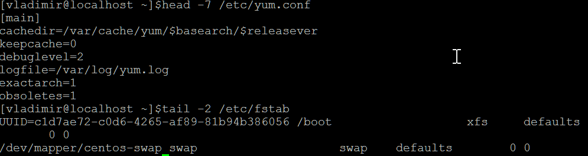

## _Задача 1_

- Вопрос 1:  
  "Используя команду ls, необходимо вывести на экран все файлы, которые расположены в секционных директориях /usr/share/man/manX и содержат слово "config" в имени."  
  
  _Command:_ __ls ./man{0..9}\*/\*config\*__  
  _Result:_  
  
  
- Вопрос 2:  
  "Одним вызовом ls найти все файлы, содержащие слово "system" в каталогах /usr/share/man/man1 и /usr/share/man/man7"  
  
  _Command:_ __ls ./{man1,man7}/\*system\*__    
  _Result:_  
  
  
  
## _Задача 2_

- Вопрос 1:  
  "Найти в директории /usr/share/man все файлы, которые содержат слово "help" в имени, найти там же все файлы, имя которых начинается на "conf"."  
  
  _Command:_ __find .  -name "\*help\*" -o -name "conf\*"__  
  _Result:_  
  
  
- Вопрос 2:  
  "Какие действия мы можем выполнить с файлами, найденными командой find (не запуская других команд)? Приведите любой пример с комментарием."  
  
  _Comment:_ Можно, например, удалить все найденные файлы.  
  _Result:_  
  
  
  
## _Задача 3_

- Вопрос 1:  
  "При помощи команд head и tail, выведите последние 2 строки файла /etc/fstab и первые 7 строк файла /etc/yum.conf"  
  
  _Command:_ __head -7 /etc/yum.conf__  
                      __tail -2 /etc/fstab__  
  _Result:_  
  
  
- Вопрос 2:  
  "Что произойдёт, если мы запросим больше строк, чем есть в файле? Попробуйте выполнить это на примере, используя команду wc (word cound) для подсчёта количества строк в файле"  
  
  _Command:_ __wc /etc/yum.conf -l__  
                      __head -50 /etc/yum.conf__  
  _Result:_ Выведется то количество строк, которое есть.  
    
  
  
## _Задача 4_

- Вопрос 1:  
  "Создайте в домашней директории файлы file_name1.md, file_name2.md и file_name3.md. Используя {}, переименуйте:  
  file_name1.md в file_name1.textdoc  
  file_name2.md в file_name2  
  file_name3.md в file_name3.md.latest  
  file_name1.textdoc в file_name1.txt"    
  
  _Command:_ __touch file_name{1..3}.md__  
                      __mv file_name1.{md,textdoc}__  
                      __mv file_name2.{md,}__  
                      __mv file_name3.{md,md.latest}__  
                      __mv file_name1.{textdoc,txt}__  					     
  _Result:_  
  
  
  
## _Задача 5_

- Вопрос 1:  
  "Перейдите в директорию /mnt. Напишите как можно больше различных вариантов команды cd, с помощью которых вы можете вернуться обратно в домашнюю директорию вашего пользователя. Различные относительные пути также считаются разными вариантами."  
  
  _Command:_ __cd ../home/vladimir__,  __cd /home/vladimir__,  __cd ~vladimir__,  __cd__, **cd \~**,  **cd -**  
					       
  
## _Задача 6_

- Вопрос 1:  
  "Создайте одной командой в домашней директории 3 папки new, in-process, processed. При этом in-process должна содержать в себе еще 3 папки tread0, tread1, tread2."  
  
  _Command:_ __mkdir -p ./new in-process/{tread0,tread1,tread2} processed__      
  _Result:_  
  
  
- Вопрос 2:  
  "Далее создайте 100 файлов формата data\[\[:digit:\]\]\[\[:digit:\]\] в папке new. Скопируйте 34 файла в tread0 и по 33 в tread1 и tread2 соответственно. Выведете содержимое каталога in-process одной командой."  
  
  _Command:_ __cd new/__  
                      __touch data\[\[:{0..9}:\]\]\[\[:{0..9}:\]\]__  
  _Result:_  		   
    				   
  _Command:_ __cp $(ls | head -34)  ../in-process/tread0/__  
					    __cp $(ls | tail -33)  ../in-process/tread2/__  
					    __cp $(ls | (head -67 | tail -33) )  ../in-process/tread1/__  
					    __ls -f ../in-process/*__    
  _Result:_  
  
  
- Вопрос 3:  
  "После этого переместите все файлы из каталогов tread в processed одной командой. Выведете содержимое каталога in-process и processed опять же одной командой"  
  
  _Command:_ __rsync -a --remove-source-files ../in-process/tread{0..2}/* ../processed/__  
  **ls -f ../processed ../in-process/\* **    
  _Result:_
    

- Вопрос 4:  
  "Сравните количество файлов в каталогах new и processed при помощи изученных ранее команд, если они равны удалите файлы из new"  
  
  _Command:_ __if diff ../new ../processed; then rm ../new/*; fi__    
  _Result:_
    
  
  
## _Задача 7_

- Вопрос 1:  
  "Получить разворачивание фигурных скобок для выражения. Согласно стандартному поведению bash, стандартного для CentOS 7, скобки в приведённом ниже выражении развёрнуты не будут. Необходимо найти способ получить ожидаемый вывод.  
  a=1; b=3
  echo file{$a..$b}  
  
  Необходимо предоставить модицицированную команду, результатом которой является следующий вывод:   
   file1 file2 file3 "  
  
  _Command:_ __eval echo file{$a..$b}__      
  _Result:_  
    

