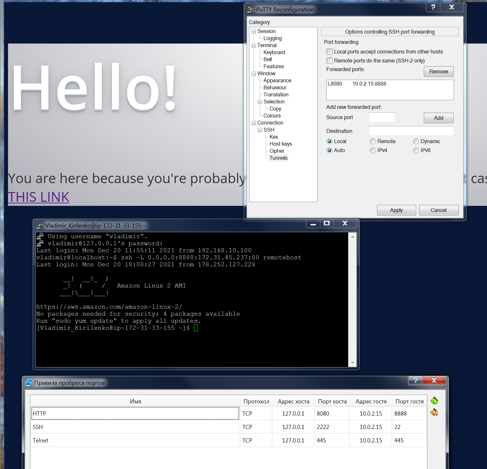

## _Задача 1_  

- Вопрос 1:  
  "SSH to remotehost using username and password provided to you in Slack. Log out from remotehost."  
  
  _Command:_ __ssh Vladimir_Kirilenko@18.221.144.175__  
  _Result:_  
  vladimir@localhost:~$ ssh Vladimir_Kirilenko@18.221.144.175  
  The authenticity of host '18.221.144.175 (18.221.144.175)' can't be established.  
  ECDSA key fingerprint is SHA256:Lqk214fPCrlvcsnoj1NGVS+Puxr7lGuEncIdALeLt78.  
  ECDSA key fingerprint is MD5:01:a1:c8:32:41:5c:9b:4b:0a:cc:f0:4b:7e:66:2b:38.  
  Are you sure you want to continue connecting (yes/no)? yes  
  Warning: Permanently added '18.221.144.175' (ECDSA) to the list of known hosts.  
  Vladimir_Kirilenko@18.221.144.175's password:  
  
       __|  __|_  )
       _|  (     /   Amazon Linux 2 AMI
      ___|\___|___|
  
  https://aws.amazon.com/amazon-linux-2/  
  No packages needed for security; 2 packages available  
  Run "sudo yum update" to apply all updates.  
  [Vladimir_Kirilenko@ip-172-31-33-155 ~]$ exit  
  logout  
  Connection to 18.221.144.175 closed.  

 
- Вопрос 2:  
  "Generate new SSH key-pair on your localhost with name "hw-5" (keys should be created in ~/.ssh folder)."  
  
  _Command:_ __ssh-keygen -t rsa__    
  _Result:_   
  vladimir@localhost:\~$ cd .ssh  
  vladimir@localhost:\~/.ssh$ ssh-keygen -t rsa  
  Generating public/private rsa key pair.  
  Enter file in which to save the key (/home/vladimir/.ssh/id_rsa): hw-5  
  Enter passphrase (empty for no passphrase):  
  Enter same passphrase again:  
  Your identification has been saved in hw-5.  
  Your public key has been saved in hw-5.pub.  
  The key fingerprint is:  
  SHA256:aqVewLSR8LRXGTGbg2h0Lf1NhClhpRwvdtbaUawIwBY vladimir@localhost.localdomain  
  The key's randomart image is:  
  +---[RSA 2048]----+
  |    . o.E=O*.+...|
  |     = =+=*Bo....|
  |      O.o.O+++o. |
  |     + + . =ooo. |
  |      + S   . .  |
  |       =         |
  |      + .        |
  |     o .         |
  |      .          |
  +----[SHA256]-----+
  vladimir@localhost:~/.ssh$  
  
- Вопрос 3:  
  "Set up key-based authentication, so that you can SSH to remotehost without password."  
    
  _Command:_ __ssh-copy-id -i \~/.ssh/hw-5 Vladimir_Kirilenko@18.221.144.175__  
  _Result:_    
  vladimir@localhost:\~$ ssh-copy-id -i ~/.ssh/hw-5 Vladimir_Kirilenko@18.221.144.175  
  /usr/bin/ssh-copy-id: INFO: Source of key(s) to be installed: "/home/vladimir/.ssh/hw-5.pub"  
  /usr/bin/ssh-copy-id: INFO: attempting to log in with the new key(s), to filter out any that are already installed  
  /usr/bin/ssh-copy-id: INFO: 1 key(s) remain to be installed -- if you are prompted now it is to install the new keys  
  Vladimir_Kirilenko@18.221.144.175's password:  
    
  Number of key(s) added: 1  
    
  Now try logging into the machine, with:   "ssh 'Vladimir_Kirilenko@18.221.144.175'"  
  and check to make sure that only the key(s) you wanted were added.  
    
  vladimir@localhost:\~$  

- Вопрос 4:  
  "SSH to remotehost without password. Log out from remotehost."  
    
  _Command:_ __ssh -i \~/.ssh/hw-5 Vladimir_Kirilenko@18.221.144.175__   
  _Result:_      
  vladimir@localhost:\~$ ssh -i \~/.ssh/hw-5 Vladimir_Kirilenko@18.221.144.175  
  Last login: Fri Dec 17 09:53:46 2021 from 178.252.127.228  

       __|  __|_  )
       _|  (     /   Amazon Linux 2 AMI
      ___|\___|___|

  https://aws.amazon.com/amazon-linux-2/  
  No packages needed for security; 2 packages available  
  Run "sudo yum update" to apply all updates.  
  [Vladimir_Kirilenko@ip-172-31-33-155 ~]$ exit  
  logout  
  Connection to 18.221.144.175 closed.  
  vladimir@localhost:~$  

- Вопрос 5:  
  "Create SSH config file, so that you can SSH to remotehost simply running `ssh remotehost` command. As a result, provide output of command `cat ~/.ssh/config`."  
  
  _Command:_ __cat \~/.ssh/config__    
  _Result:_      
  vladimir@localhost:~$ cat \~/.ssh/config  
  Host remotehost  
     HostName 18.221.144.175  
     Port 22  
     User Vladimir_Kirilenko  
     IdentityFile \~/.ssh/hw-5  
  
- Вопрос 6:  
  "Using command line utility (curl or telnet) verify that there are some webserver running on port 80 of webserver.  Notice that webserver has a private network IP, so you can access it only from the same network (when you are on remotehost that runs in the same private network). Log out from remotehost."  
  
  _Command:_ __ __  
  _Result:_     
  vladimir@localhost:\~$ curl 172.31.45.237  
  ^C  
  vladimir@localhost:\~$ ssh remotehost  
  Last login: Fri Dec 17 10:11:37 2021 from 178.252.127.228  

       __|  __|_  )
       _|  (     /   Amazon Linux 2 AMI
      ___|\___|___|
  
  https://aws.amazon.com/amazon-linux-2/  
  No packages needed for security; 2 packages available  
  Run "sudo yum update" to apply all updates.  
  [Vladimir_Kirilenko@ip-172-31-33-155 ~]$   
  [Vladimir_Kirilenko@ip-172-31-33-155 ~]$ curl 172.31.45.237  
  <!DOCTYPE html PUBLIC "-//W3C//DTD XHTML 1.1//EN" "http://www.w3.org/TR/xhtml11/DTD/xhtml11.dtd"><html><head>  
  <meta http-equiv="content-type" content="text/html; charset=UTF-8">  
                <title>Apache HTTP Server Test Page powered by CentOS</title>  
                <meta http-equiv="Content-Type" content="text/html; charset=UTF-8">  
    <!-- Bootstrap -->  
    <link href="/noindex/css/bootstrap.min.css" rel="stylesheet">  
    <link rel="stylesheet" href="noindex/css/open-sans.css" type="text/css" />  
  ....  
  [Vladimir_Kirilenko@ip-172-31-33-155 ~]$exit  
  logout  
  Connection to 18.221.144.175 closed.  
  vladimir@localhost:\~$  
  
- Вопрос 7: 
  "Using SSH setup port forwarding, so that you can reach webserver from your localhost (choose any free local port you like)."  
    
  _Command:_ __ssh -L 5555:172.31.45.237:80 remotehost__  
  
- Вопрос 8:   
  "Like in 1.6, but on localhost using command line utility verify that localhost and port you have specified act like webserver, returning same result as in 1.6."  
    
  __Open second terminal:__   
  vladimir@localhost:\~$ curl localhost:5555  
  <!DOCTYPE html PUBLIC "-//W3C//DTD XHTML 1.1//EN" "http://www.w3.org/TR/xhtml11/DTD/xhtml11.dtd"><html><head>  
  <meta http-equiv="content-type" content="text/html; charset=UTF-8">  
                <title>Apache HTTP Server Test Page powered by CentOS</title>  
                <meta http-equiv="Content-Type" content="text/html; charset=UTF-8">  
    <!-- Bootstrap -->  
    <link href="/noindex/css/bootstrap.min.css" rel="stylesheet">  
    <link rel="stylesheet" href="noindex/css/open-sans.css" type="text/css" />  
  ....  
    
  __After exit from remotehost (first terminal):__  
  vladimir@localhost:\~$ curl localhost:5555  
  curl: (7) Failed connect to localhost:5555; Connection refused  

- Вопрос 9:  
  "Open webserver webpage in browser of your Host machine of VirtualBox (Windows, or Mac, or whatever else you use). You may need to setup port forwarding in settings of VirtualBox."  
  
  _Command:_ __firewall-cmd --zone=public --add-port=8080/tcp --permanent__  
  _Result:_   
  

  
## _Задача 2_

- Вопрос 1:  
  "Imagine your localhost has been relocated to Havana. Change the time zone on the localhost to Havana and verify the time zone has been changed properly (may be multiple commands)."  
    
  _Command:_ __tzselect__  
  _Result:_    
  vladimir@localhost:\~$ tzselect  
  Please identify a location so that time zone rules can be set correctly.  
  Please select a continent or ocean.  
   1) Africa  
   2) Americas  
   3) Antarctica  
   4) Arctic Ocean  
   5) Asia  
   6) Atlantic Ocean  
   7) Australia  
   8) Europe  
   9) Indian Ocean  
  10) Pacific Ocean  
  11) none - I want to specify the time zone using the Posix TZ format.  
  \#? 2  
  Please select a country.  
   1) Anguilla              19) Dominican Republic    37) Peru  
   2) Antigua & Barbuda     20) Ecuador               38) Puerto Rico  
   3) Argentina             21) El Salvador           39) St Barthelemy  
   4) Aruba                 22) French Guiana         40) St Kitts & Nevis  
   5) Bahamas               23) Greenland             41) St Lucia  
   6) Barbados              24) Grenada               42) St Maarten (Dutch)  
   7) Belize                25) Guadeloupe            43) St Martin (French)  
   8) Bolivia               26) Guatemala             44) St Pierre & Miquelon  
   9) Brazil                27) Guyana                45) St Vincent  
  10) Canada                28) Haiti                 46) Suriname  
  11) Caribbean NL          29) Honduras              47) Trinidad & Tobago  
  12) Cayman Islands        30) Jamaica               48) Turks & Caicos Is  
  13) Chile                 31) Martinique            49) United States  
  14) Colombia              32) Mexico                50) Uruguay  
  15) Costa Rica            33) Montserrat            51) Venezuela  
  16) Cuba                  34) Nicaragua             52) Virgin Islands (UK)  
  17) Curaçao               35) Panama                53) Virgin Islands (US)  
  18) Dominica              36) Paraguay  
  \#? 16  
    
  The following information has been given:  
    
        Cuba  
  
  Therefore TZ='America/Havana' will be used.  
  Local time is now:      Fri Dec 17 08:44:33 CST 2021.  
  Universal Time is now:  Fri Dec 17 13:44:33 UTC 2021.  
  Is the above information OK?  
  1) Yes  
  2) No  
  \#? 1  
    
  You can make this change permanent for yourself by appending the line  
        TZ='America/Havana'; export TZ  
  to the file '.profile' in your home directory; then log out and log in again.  
  
  Here is that TZ value again, this time on standard output so that you  
  can use the /usr/bin/tzselect command in shell scripts:  
  America/Havana  
  vladimir@localhost:\~$ date  
  Fri Dec 17 16:45:18 MSK 2021  
  vladimir@localhost:\~$  TZ='America/Havana'  
  vladimir@localhost:\~$ date  
  Fri Dec 17 08:45:32 CST 2021  
  vladimir@localhost:\~$  
  
    
- Вопрос 2:  
  "Find all systemd journal messages on localhost, that were recorded in the last 50 minutes and originate from a system service started with user id 81 (single command)."  
    
  _Command:_ __journalctl -u *.service _UID=81 --since "2021-12-17 16:15:00"__  
  _Result:_    
  vladimir@localhost:\~$ journalctl -u *.service _UID=81 --since "2021-12-17 16:15:00"  
  -- No entries --  
  vladimir@localhost:\~$  

   
- Вопрос 3:  
  "Configure rsyslogd by adding a rule to the newly created configuration file /etc/rsyslog.d/auth-errors.conf to log all security and authentication messages with the priority alert and higher to the /var/log/auth-errors file. Test the newly added log directive with the logger command (multiple commands)."  
    
  _Command:_ __cat /etc/rsyslog.d/auth-errors.conf__   
  _Result:_  
  vladimir@localhost:\~$ cat /etc/rsyslog.d/auth-errors.conf
    
  if  
  ( $syslogseverity < 2  and $syslogfacility-text startswith "auth" )  
  then  
   { action(type="omfile" file="/var/log/auth-errors.log") }    
  vladimir@localhost:\~$ sudo service rsyslog stop  
  Redirecting to /bin/systemctl stop rsyslog.service  
  vladimir@localhost:\~$ sudo service rsyslog start  
  Redirecting to /bin/systemctl start rsyslog.service  
  vladimir@localhost:\~$ sudo logger -p auth.emerg "Test9"  
    
  Broadcast message from systemd-journald@localhost.localdomain (Fri 2021-12-17 10:53:46 EST):  
    
  vladimir[2843]: Test9  
    
  Message from syslogd@localhost at Dec 17 10:53:46 ...  
   vladimir:Test9  
  vladimir@localhost:\~$ sudo logger -p authpriv.alert "Test10"  
  vladimir@localhost:\~$ cat /var/log/auth-errors.log  
  Dec 17 10:52:00 localhost vladimir: Test8  
  Dec 17 10:53:46 localhost vladimir: Test9  
  Dec 17 10:54:22 localhost vladimir: Test10  
    
  vladimir@localhost:\~$  

