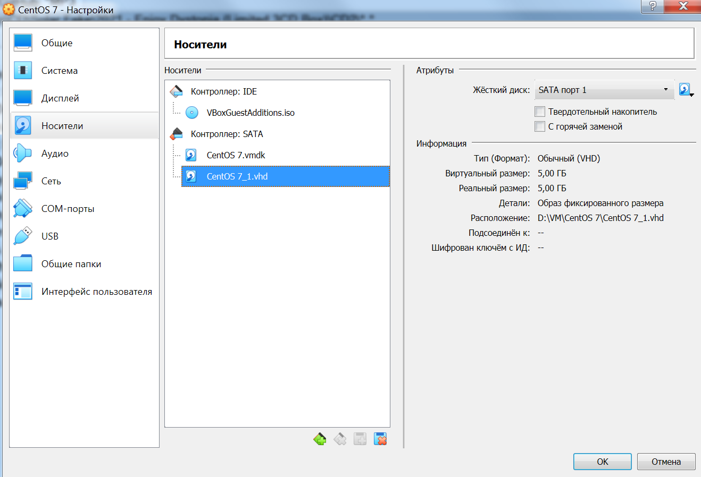

## _Задача 1_
  "Imagine you was asked to add new partition to your host for backup purposes. To simulate appearance of new physical disk in your server, please create new disk in Virtual Box (5 GB) and attach it to your virtual machine.
  Also imagine your system started experiencing RAM leak in one of the applications, thus while developers try to debug and fix it, you need to mitigate OutOfMemory errors; you will do it by adding some swap space.
  /dev/sdc - 5GB disk, that you just attached to the VM (in your case it may appear as /dev/sdb, /dev/sdc or other, it doesn't matter)" 
    

- Вопрос 1:  
  "Create a 2GB   !!! GPT !!!   partition on /dev/sdc of type "Linux filesystem" (means all the following partitions created in the following steps on /dev/sdc will be GPT as well)"  
  
  _Command:_ __lsblk -f; sudo cfdisk /dev/sdb__  
  _Result:_  
vladimir@localhost:\~$ lsblk -f
NAME            FSTYPE      LABEL           UUID                                   MOUNTPOINT
sda
├─sda1          xfs                         c1d7ae72-c0d6-4265-af89-81b94b386056   /boot
└─sda2          LVM2_member                 SHuUi4-MHf2-hhKo-zcmN-rFLp-AcBG-dXLHvc
  ├─centos-root xfs                         30966cea-b2c1-40f9-8e19-9f2047a9f66f   /
  └─centos-swap swap                        27701614-86fb-447d-a85a-fe429869c7f1   [SWAP]
sdb
sr0             iso9660     VBox_GAs_6.1.28 2021-10-18-18-19-23-40

  
- Вопрос 2:  
  "Create a 512MB partition on /dev/sdc of type "Linux swap"  
  
  _Command:_ __sudo sfdisk -l -uM__    
  _Result:_  
vladimir@localhost:\~$ sudo sfdisk -l -uM

Disk /dev/sda: 1044 cylinders, 255 heads, 63 sectors/track
Units: 1MiB = 1024*1024 bytes, blocks of 1024 bytes, counting from 0

   Device Boot Start   End    MiB    #blocks   Id  System
/dev/sda1   *     1   1024   1024    1048576   83  Linux
/dev/sda2      1025   8191   7167    7339008   8e  Linux LVM
/dev/sda3         0      -      0          0    0  Empty
/dev/sda4         0      -      0          0    0  Empty

Disk /dev/sdb: 652 cylinders, 255 heads, 63 sectors/track
Units: 1MiB = 1024*1024 bytes, blocks of 1024 bytes, counting from 0

   Device Boot Start   End    MiB    #blocks   Id  System
/dev/sdb1         0+  1953-  1954-   2000061   83  Linux
/dev/sdb2      1953+  2439-   487-    498015   82  Linux swap / Solaris
/dev/sdb3         0      -      0          0    0  Empty
/dev/sdb4         0      -      0          0    0  Empty
....

- Вопрос 3:  
  "Format the 2GB partition with an XFS file system"  
  
  _Command:_ __sudo mkfs -t xfs /dev/sdb1__    
  _Result:_  
vladimir@localhost:\~$ sudo mkfs -t xfs /dev/sdb1
meta-data=/dev/sdb1              isize=512    agcount=4, agsize=125004 blks
         =                       sectsz=512   attr=2, projid32bit=1
         =                       crc=1        finobt=0, sparse=0
data     =                       bsize=4096   blocks=500015, imaxpct=25
         =                       sunit=0      swidth=0 blks
naming   =version 2              bsize=4096   ascii-ci=0 ftype=1
log      =internal log           bsize=4096   blocks=2560, version=2
         =                       sectsz=512   sunit=0 blks, lazy-count=1
realtime =none                   extsz=4096   blocks=0, rtextents=0

- Вопрос 4:  
  "Initialize 512MB partition as swap space"  
  
  _Command:_ __sudo mkswap /dev/sdb2__    
  _Result:_  
vladimir@localhost:\~$ swapon -s
Filename                                Type            Size    Used    Priority
/dev/dm-1                               partition       839676  0       -2
vladimir@localhost:\~$ sudo mkswap /dev/sdb2
Setting up swapspace version 1, size = 498008 KiB
no label, UUID=025bdc2b-f4ee-40c6-8f16-7f35fda2d4e1
vladimir@localhost:\~$ sudo swapon /dev/sdb2
vladimir@localhost:\~$ swapon -s
Filename                                Type            Size    Used    Priority
/dev/dm-1                               partition       839676  0       -2
/dev/sdb2                               partition       498008  0       -3

- Вопрос 5:  
  "Configure the newly created XFS file system to persistently mount at /backup"  
  
  _Command:_ __sudo mount -t xfs /dev/sdb1 /mnt/backup__    
  _Result:_  
vladimir@localhost:\~$ ll /mnt
total 0
drwxr-xr-x.  2 root root   6 Apr 11  2018 ./
dr-xr-xr-x. 18 root root 237 Dec  8 15:33 ../
vladimir@localhost:\~$ sudo mkdir /mnt/backup
vladimir@localhost:\~$ sudo chmod 770 /mnt/backup
vladimir@localhost:\~$ sudo mount -t xfs /dev/sdb1 /mnt/backup
vladimir@localhost:\~$ lsblk -f
NAME            FSTYPE      LABEL           UUID                                   MOUNTPOINT
sda
├─sda1          xfs                         c1d7ae72-c0d6-4265-af89-81b94b386056   /boot
└─sda2          LVM2_member                 SHuUi4-MHf2-hhKo-zcmN-rFLp-AcBG-dXLHvc
  ├─centos-root xfs                         30966cea-b2c1-40f9-8e19-9f2047a9f66f   /
  └─centos-swap swap                        27701614-86fb-447d-a85a-fe429869c7f1   \[SWAP\]
sdb
├─sdb1          xfs                         d4685d8a-b072-48da-8c83-c0f58ee5e9fa   /mnt/backup
└─sdb2
sr0             iso9660     VBox_GAs_6.1.28 2021-10-18-18-19-23-40

- Вопрос 6:  
  "Configure the newly created swap space to be enabled at boot"  
  
  _Command:_ __  __    
  _Result:_ 
vladimir@localhost:\~$ sudo vi /etc/fstab
vladimir@localhost:\~$ cat /etc/fstab

\#
\# /etc/fstab
\# Created by anaconda on Thu Nov 25 11:04:12 2021
\#
\# Accessible filesystems, by reference, are maintained under '/dev/disk'
\# See man pages fstab(5), findfs(8), mount(8) and/or blkid(8) for more info
\#
/dev/mapper/centos-root /                       xfs     defaults        0 0
UUID=c1d7ae72-c0d6-4265-af89-81b94b386056 /boot                   xfs     defaults        0 0
/dev/mapper/centos-swap swap                    swap    defaults        0 0
/dev/sdb2               swap                    swap    defaults        0 0
  

- Вопрос 7:  
  "Reboot your host and verify that /dev/sdc1 is mounted at /backup and that your swap partition  (/dev/sdc2) is enabled"  
  
  _Command:_ __lsblk -f; swapon -s; free -k__    
  _Result:_  
Using username "vladimir".
vladimir@127.0.0.1's password:
Last login: Wed Dec 22 19:18:16 2021 from gateway
vladimir@localhost:~$ lsblk -f
NAME   FSTYPE   LABEL          UUID                                   MOUNTPOINT
sda
├─sda1 xfs                     c1d7ae72-c0d6-4265-af89-81b94b386056   /boot
└─sda2 LVM2_mem                SHuUi4-MHf2-hhKo-zcmN-rFLp-AcBG-dXLHvc
  ├─centos-root
       xfs                     30966cea-b2c1-40f9-8e19-9f2047a9f66f   /
  └─centos-swap
       swap                    27701614-86fb-447d-a85a-fe429869c7f1   [SWAP]
sdb
├─sdb1 xfs                     d4685d8a-b072-48da-8c83-c0f58ee5e9fa
└─sdb2 swap                    025bdc2b-f4ee-40c6-8f16-7f35fda2d4e1   [SWAP]
sr0    iso9660  VBox_GAs_6.1.28
                               2021-10-18-18-19-23-40
vladimir@localhost:~$ swapon -s
Filename                                Type            Size    Used    Priority
/dev/sdb2                               partition       498008  0       -2
/dev/dm-1                               partition       839676  0       -3
vladimir@localhost:~$ free -k
              total        used        free      shared  buff/cache   available
Mem:        3880236      195156     3475888        8828      209192     3458852
Swap:       1337684           0     1337684

  
## _Задача 2_
  "LVM. Imagine you're running out of space on your root device. As we found out during the lesson default CentOS installation should already have LVM, means you can easily extend size of your root device."  

- Вопрос 1:  
  "Create 2GB partition on /dev/sdc of type "Linux LVM""  
  
  _Command:_ __sudo cfdisk /dev/sdb__  
  _Result:_  
vladimir@localhost:\~$ sudo sfdisk -l -uM

Disk /dev/sda: 1044 cylinders, 255 heads, 63 sectors/track
Units: 1MiB = 1024*1024 bytes, blocks of 1024 bytes, counting from 0

   Device Boot Start   End    MiB    #blocks   Id  System
/dev/sda1   *     1   1024   1024    1048576   83  Linux
/dev/sda2      1025   8191   7167    7339008   8e  Linux LVM
/dev/sda3         0      -      0          0    0  Empty
/dev/sda4         0      -      0          0    0  Empty

Disk /dev/sdb: 652 cylinders, 255 heads, 63 sectors/track
Units: 1MiB = 1024*1024 bytes, blocks of 1024 bytes, counting from 0

   Device Boot Start   End    MiB    #blocks   Id  System
/dev/sdb1         0+  1953-  1954-   2000061   83  Linux
/dev/sdb2      1953+  2439-   487-    498015   82  Linux swap / Solaris
/dev/sdb3      2439+  4392-  1954-   2000092+  8e  Linux LVM
/dev/sdb4         0      -      0          0    0  Empty

Disk /dev/mapper/centos-root: 808 cylinders, 255 heads, 63 sectors/track

Disk /dev/mapper/centos-swap: 104 cylinders, 255 heads, 63 sectors/track

  
- Вопрос 2:  
  "Initialize the partition as a physical volume (PV)"  
  
  _Command:_ __sudo pvcreate /dev/sdb3__    
  _Result:_  
vladimir@localhost:\~$ sudo partprobe /dev/sdb
vladimir@localhost:\~$ sudo pvcreate /dev/sdb3
Physical volume "/dev/sdb3" successfully created.

- Вопрос 3:  
  "Extend the volume group (VG) of your root device using your newly created PV"  
  
  _Command:_ __sudo vgextend centos /dev/sdb3__    
  _Result:_  
vladimir@localhost:\~$ sudo pvs
  PV         VG     Fmt  Attr PSize  PFree
  /dev/sda2  centos lvm2 a--  <7.00g     0
  /dev/sdb3         lvm2 ---  <1.91g <1.91g
vladimir@localhost:\~$ sudo vgdisplay
  --- Volume group ---
  VG Name               centos
  System ID
  Format                lvm2
  Metadata Areas        1
  Metadata Sequence No  3
  VG Access             read/write
  VG Status             resizable
  MAX LV                0
  Cur LV                2
  Open LV               2
  Max PV                0
  Cur PV                1
  Act PV                1
  VG Size               <7.00 GiB
  PE Size               4.00 MiB
  Total PE              1791
  Alloc PE / Size       1791 / <7.00 GiB
  Free  PE / Size       0 / 0
  VG UUID               f5beyP-8TCF-ibc2-6jxx-ZUdq-HOAR-GDZ1A4

vladimir@localhost:\~$ sudo vgextend centos /dev/sdb3
  Volume group "centos" successfully extended

- Вопрос 4:  
  "Extend your root logical volume (LV) by 1GB, leaving other 1GB unassigned"  
  
  _Command:_ __sudo lvextend -l +50%FREE /dev/centos/root__    
  _Result:_  
vladimir@localhost:\~$ sudo pvs
  PV         VG     Fmt  Attr PSize  PFree
  /dev/sda2  centos lvm2 a--  <7.00g     0
  /dev/sdb3  centos lvm2 a--  <1.91g <1.91g
vladimir@localhost:\~$ sudo lvdisplay
  --- Logical volume ---
  LV Path                /dev/centos/swap
  LV Name                swap
  VG Name                centos
  LV UUID                UrjRRW-nVl4-bjMr-4gnk-Vznu-zKYe-EFIng7
  LV Write Access        read/write
  LV Creation host, time localhost, 2021-11-25 19:04:11 +0300
  LV Status              available
  \# open                 2
  LV Size                820.00 MiB
  Current LE             205
  Segments               1
  Allocation             inherit
  Read ahead sectors     auto
  - currently set to     8192
  Block device           253:1

  --- Logical volume ---
  LV Path                /dev/centos/root
  LV Name                root
  VG Name                centos
  LV UUID                sIZDU9-cIEb-YCcp-BYx6-Xf3q-Mhgw-Z6IVN8
  LV Write Access        read/write
  LV Creation host, time localhost, 2021-11-25 19:04:11 +0300
  LV Status              available
  \# open                 1
  LV Size                <6.20 GiB
  Current LE             1586
  Segments               1
  Allocation             inherit
  Read ahead sectors     auto
  - currently set to     8192
  Block device           253:0

vladimir@localhost:\~$ sudo lvextend -l +50%FREE /dev/centos/root
  Size of logical volume centos/root changed from <6.20 GiB (1586 extents) to <7.15 GiB (1830 extents).
  Logical volume centos/root successfully resized.

  
- Вопрос 5:  
  "Check current disk space usage of your root device"  
  
  _Command:_ __df -h__    
  _Result:_  
vladimir@localhost:\~$ df -h
Filesystem               Size  Used Avail Use% Mounted on
devtmpfs                 1.9G     0  1.9G   0% /dev
tmpfs                    1.9G     0  1.9G   0% /dev/shm
tmpfs                    1.9G  8.6M  1.9G   1% /run
tmpfs                    1.9G     0  1.9G   0% /sys/fs/cgroup
/dev/mapper/centos-root  6.2G  2.6G  3.7G  41% /
/dev/sda1               1014M  194M  821M  20% /boot
tmpfs                    379M     0  379M   0% /run/user/1000
vladimir@localhost:\~$ sudo xfs_growfs /dev/mapper/centos-root
meta-data=/dev/mapper/centos-root isize=512    agcount=4, agsize=406016 blks
         =                       sectsz=512   attr=2, projid32bit=1
         =                       crc=1        finobt=0 spinodes=0
data     =                       bsize=4096   blocks=1624064, imaxpct=25
         =                       sunit=0      swidth=0 blks
naming   =version 2              bsize=4096   ascii-ci=0 ftype=1
log      =internal               bsize=4096   blocks=2560, version=2
         =                       sectsz=512   sunit=0 blks, lazy-count=1
realtime =none                   extsz=4096   blocks=0, rtextents=0
data blocks changed from 1624064 to 1873920
vladimir@localhost:\~$ df -h
Filesystem               Size  Used Avail Use% Mounted on
devtmpfs                 1.9G     0  1.9G   0% /dev
tmpfs                    1.9G     0  1.9G   0% /dev/shm
tmpfs                    1.9G  8.6M  1.9G   1% /run
tmpfs                    1.9G     0  1.9G   0% /sys/fs/cgroup
/dev/mapper/centos-root  7.2G  2.6G  4.7G  36% /
/dev/sda1               1014M  194M  821M  20% /boot
tmpfs                    379M     0  379M   0% /run/user/1000

  
- Вопрос 6:  
  "Extend your root device filesystem to be able to use additional free space of root LV"  
  
  _Comment:_ __sudo lvextend -l +100%FREE /dev/centos/root -r__    
  _Result:_  
vladimir@localhost:\~$ sudo lvextend -l +100%FREE /dev/centos/root -r
  Size of logical volume centos/root changed from <7.15 GiB (1830 extents) to 8.10 GiB (2074 extents).
  Logical volume centos/root successfully resized.
meta-data=/dev/mapper/centos-root isize=512    agcount=5, agsize=406016 blks
         =                       sectsz=512   attr=2, projid32bit=1
         =                       crc=1        finobt=0 spinodes=0
data     =                       bsize=4096   blocks=1873920, imaxpct=25
         =                       sunit=0      swidth=0 blks
naming   =version 2              bsize=4096   ascii-ci=0 ftype=1
log      =internal               bsize=4096   blocks=2560, version=2
         =                       sectsz=512   sunit=0 blks, lazy-count=1
realtime =none                   extsz=4096   blocks=0, rtextents=0
data blocks changed from 1873920 to 2123776
vladimir@localhost:\~$ df -h
Filesystem               Size  Used Avail Use% Mounted on
devtmpfs                 1.9G     0  1.9G   0% /dev
tmpfs                    1.9G     0  1.9G   0% /dev/shm
tmpfs                    1.9G  8.6M  1.9G   1% /run
tmpfs                    1.9G     0  1.9G   0% /sys/fs/cgroup
/dev/mapper/centos-root  8.1G  2.6G  5.6G  32% /
/dev/sda1               1014M  194M  821M  20% /boot
tmpfs                    379M     0  379M   0% /run/user/1000

  
- Вопрос 7:  
  "Verify that after reboot your root device is still 1GB bigger than at 2.5."  
  
  _Command:_ __df -h__  
  _Result:_  
Using username "vladimir".
vladimir@127.0.0.1's password:
Last login: Wed Dec 22 19:21:41 2021 from gateway
vladimir@localhost:\~$ df -h
Filesystem               Size  Used Avail Use% Mounted on
devtmpfs                 1.9G     0  1.9G   0% /dev
tmpfs                    1.9G     0  1.9G   0% /dev/shm
tmpfs                    1.9G  8.7M  1.9G   1% /run
tmpfs                    1.9G     0  1.9G   0% /sys/fs/cgroup
/dev/mapper/centos-root  8.1G  2.6G  5.6G  32% /
/dev/sda1               1014M  194M  821M  20% /boot
tmpfs                    379M     0  379M   0% /run/user/0
tmpfs                    379M     0  379M   0% /run/user/1000
vladimir@localhost:\~$

  