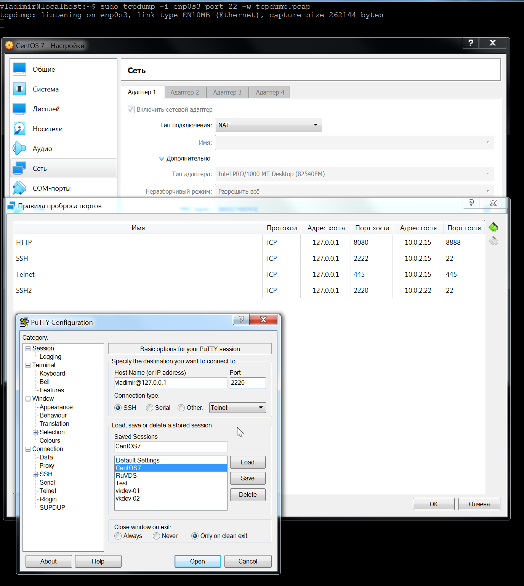

## _Task 1_
  "Add secondary ip address to you second network interface enp0s8. Each point must be presented with commands and showing that new address was applied to the interface. To repeat adding address for points 2 and 3 address must be deleted (please add deleting address to you homework log)"  

  _Checking:_
```
  vladimir@localhost:~$ ip -4 a
1: lo: <LOOPBACK,UP,LOWER_UP> mtu 65536 qdisc noqueue state UNKNOWN group default qlen 1000
    inet 127.0.0.1/8 scope host lo
       valid_lft forever preferred_lft forever
2: enp0s3: <BROADCAST,MULTICAST,UP,LOWER_UP> mtu 1500 qdisc pfifo_fast state UP group default qlen 1000
    inet 10.0.2.15/24 brd 10.0.2.255 scope global noprefixroute dynamic enp0s3
       valid_lft 86333sec preferred_lft 86333sec
```

  Methods:  
  
- 1. using ip utility (stateless)   

_Set address:_    
```
vladimir@localhost:~$ sudo ip addr add 10.0.2.20/24 dev enp0s3
vladimir@localhost:~$ ip -4 a
1: lo: <LOOPBACK,UP,LOWER_UP> mtu 65536 qdisc noqueue state UNKNOWN group default qlen 1000
    inet 127.0.0.1/8 scope host lo
       valid_lft forever preferred_lft forever
2: enp0s3: <BROADCAST,MULTICAST,UP,LOWER_UP> mtu 1500 qdisc pfifo_fast state UP group default qlen 1000
    inet 10.0.2.15/24 brd 10.0.2.255 scope global noprefixroute dynamic enp0s3
       valid_lft 85620sec preferred_lft 85620sec
    inet 10.0.2.20/24 scope global secondary enp0s3
       valid_lft forever preferred_lft forever
vladimir@localhost:~$ ping 10.0.2.20
PING 10.0.2.20 (10.0.2.20) 56(84) bytes of data.
64 bytes from 10.0.2.20: icmp_seq=1 ttl=64 time=0.085 ms
64 bytes from 10.0.2.20: icmp_seq=2 ttl=64 time=0.083 ms
64 bytes from 10.0.2.20: icmp_seq=3 ttl=64 time=0.064 ms
^C
--- 10.0.2.20 ping statistics ---
3 packets transmitted, 3 received, 0% packet loss, time 2029ms
rtt min/avg/max/mdev = 0.064/0.077/0.085/0.011 ms
```  
   _Delete address:_
```
vladimir@localhost:~$ sudo ip addr del 10.0.2.20/24 dev enp0s3
vladimir@localhost:~$ ip -4 a
1: lo: <LOOPBACK,UP,LOWER_UP> mtu 65536 qdisc noqueue state UNKNOWN group default qlen 1000
    inet 127.0.0.1/8 scope host lo
       valid_lft forever preferred_lft forever
2: enp0s3: <BROADCAST,MULTICAST,UP,LOWER_UP> mtu 1500 qdisc pfifo_fast state UP group default qlen 1000
    inet 10.0.2.15/24 brd 10.0.2.255 scope global noprefixroute dynamic enp0s3
       valid_lft 85411sec preferred_lft 85411sec
```
  
- 2. using centos network configuration file (statefull)
  
```
vladimir@localhost:~$ sudo vi /etc/sysconfig/network-scripts/ifcfg-enp0s3
vladimir@localhost:~$ cat /etc/sysconfig/network-scripts/ifcfg-enp0s3
TYPE="Ethernet"
PROXY_METHOD="none"
BROWSER_ONLY="no"
BOOTPROTO="dhcp"
DEFROUTE="yes"
IPV4_FAILURE_FATAL="no"
IPV6INIT="yes"
IPV6_AUTOCONF="yes"
IPV6_DEFROUTE="yes"
IPV6_FAILURE_FATAL="no"
IPV6_ADDR_GEN_MODE="stable-privacy"
NAME="enp0s3"
UUID="0b06f854-f889-4b8f-bfd0-83df65122452"
DEVICE="enp0s3"
ONBOOT="yes
IPADDR="10.0.2.21"
vladimir@localhost:~$ sudo systemctl restart network
vladimir@localhost:~$ ip -4 a
1: lo: <LOOPBACK,UP,LOWER_UP> mtu 65536 qdisc noqueue state UNKNOWN group default qlen 1000
    inet 127.0.0.1/8 scope host lo
       valid_lft forever preferred_lft forever
2: enp0s3: <BROADCAST,MULTICAST,UP,LOWER_UP> mtu 1500 qdisc pfifo_fast state UP group default qlen 1000
    inet 10.0.2.21/8 brd 10.255.255.255 scope global noprefixroute enp0s3
       valid_lft forever preferred_lft forever
    inet 10.0.2.15/24 brd 10.0.2.255 scope global noprefixroute dynamic enp0s3
       valid_lft 86395sec preferred_lft 86395sec
 ```
  
- 3. using nmcli utility (statefull)  
  
```

vladimir@localhost:~$ sudo nmcli con mod enp0s3 ipv4.addresses 10.0.2.22/24
vladimir@localhost:~$ ip -4 a
1: lo: <LOOPBACK,UP,LOWER_UP> mtu 65536 qdisc noqueue state UNKNOWN group default qlen 1000
    inet 127.0.0.1/8 scope host lo
       valid_lft forever preferred_lft forever
2: enp0s3: <BROADCAST,MULTICAST,UP,LOWER_UP> mtu 1500 qdisc pfifo_fast state UP group default qlen 1000
    inet 10.0.2.15/24 brd 10.0.2.255 scope global noprefixroute dynamic enp0s3
       valid_lft 85975sec preferred_lft 85975sec
vladimir@localhost:~$ sudo nmcli con up enp0s3
Connection successfully activated (D-Bus active path: /org/freedesktop/NetworkManager/ActiveConnection/4)
vladimir@localhost:~$ ip -4 a
1: lo: <LOOPBACK,UP,LOWER_UP> mtu 65536 qdisc noqueue state UNKNOWN group default qlen 1000
    inet 127.0.0.1/8 scope host lo
       valid_lft forever preferred_lft forever
2: enp0s3: <BROADCAST,MULTICAST,UP,LOWER_UP> mtu 1500 qdisc pfifo_fast state UP group default qlen 1000
    inet 10.0.2.15/24 brd 10.0.2.255 scope global noprefixroute dynamic enp0s3
       valid_lft 86397sec preferred_lft 86397sec
    inet 10.0.2.22/24 brd 10.0.2.255 scope global secondary noprefixroute enp0s3
       valid_lft forever preferred_lft forever
vladimir@localhost:~$ cat /etc/sysconfig/network-scripts/ifcfg-enp0s3
TYPE="Ethernet"
PROXY_METHOD="none"
BROWSER_ONLY="no"
BOOTPROTO="dhcp"
DEFROUTE="yes"
IPV4_FAILURE_FATAL="no"
IPV6INIT="yes"
IPV6_AUTOCONF="yes"
IPV6_DEFROUTE="yes"
IPV6_FAILURE_FATAL="no"
IPV6_ADDR_GEN_MODE="stable-privacy"
NAME="enp0s3"
UUID="0b06f854-f889-4b8f-bfd0-83df65122452"
DEVICE="enp0s3"
ONBOOT="yes"

IPADDR="10.0.2.22"
PREFIX=24
vladimir@localhost:~$ sudo vi /etc/sysconfig/network-scripts/ifcfg-enp0s3
```  
  
  
## _Task 2_
  "You should have a possibility to use ssh client to connect to your node using new address from previous step. Run tcpdump in separate tmux session or separate connection before starting ssh client and capture packets that are related to this ssh connection. Find packets that are related to TCP session establish."  
  
  
  
_New address use:_
```
reading from file tcpdump.pcap, link-type EN10MB (Ethernet)
23:13:09.381917 IP 10.0.2.15.ssh > 10.0.2.2.4721: tcp 144
        0x0000:  4510 00b8 c261 4000 4006 5fbe 0a00 020f  E....a@.@._.....
        0x0010:  0a00 0202 0016 1271 b0f2 b713 0049 9316  .......q.....I..
        0x0020:  5018 ffff 18bb 0000 aedd 4e02 da97 2cb7  P.........N...,.
        0x0030:  0978 52d1 c145 d5e2 2cd6 9743 42c8 dc0f  .xR..E..,..CB...
        0x0040:  a119 6886 6a77 236c 969a 218b 6ee7 55a2  ..h.jw#l..!.n.U.
        0x0050:  50e3 0575 9623 da97 7855 8ae7 774f 036f  P..u.#..xU..wO.o
        0x0060:  348f 1be1 4d1b 194a 2087 a06f 6319 d5dd  4...M..J...oc...
        0x0070:  4562 4e48 354b 13c0 7cc3 a4f4 87f4 4763  EbNH5K..|.....Gc
        0x0080:  08c6 eae7 68eb 5d89 59ec d521 d95a 9ef4  ....h.].Y..!.Z..
        0x0090:  338a f3ba 0692 8ef2 1e95 de43 b5ed 17ef  3..........C....
        0x00a0:  e95e 34ba 159f 5399 b08e 5014 5bb3 2a74  .^4...S...P.[.*t
        0x00b0:  9662 eb21 77ff 2347                      .b.!w.#G
23:13:09.382342 IP 10.0.2.2.4721 > 10.0.2.15.ssh: tcp 0
        0x0000:  4500 0028 dd78 0000 4006 8547 0a00 0202  E..(.x..@..G....
        0x0010:  0a00 020f 1271 0016 0049 9316 b0f2 b7a3  .....q...I......
        0x0020:  5010 ffff 8947 0000 0000 0000 0000       P....G........
23:14:45.830458 IP 10.0.2.2.12535 > 10.0.2.22.ssh: tcp 0
        0x0000:  4500 002c dd7a 0000 4006 853a 0a00 0202  E..,.z..@..:....
        0x0010:  0a00 0216 30f7 0016 14b0 e001 0000 0000  ....0...........
        0x0020:  6002 ffff 5a50 0000 0204 05b4 0000       `...ZP........
23:14:45.830567 IP 10.0.2.22.ssh > 10.0.2.2.12535: tcp 0
        0x0000:  4500 002c 0000 4000 4006 22b5 0a00 0216  E..,..@.@.".....
        0x0010:  0a00 0202 0016 30f7 8650 1cc9 14b0 e002  ......0..P......
        0x0020:  6012 7210 1836 0000 0204 05b4            `.r..6......
23:14:45.830877 IP 10.0.2.2.12535 > 10.0.2.22.ssh: tcp 0
        0x0000:  4500 0028 dd7b 0000 4006 853d 0a00 0202  E..(.{..@..=....
        0x0010:  0a00 0216 30f7 0016 14b0 e002 8650 1cca  ....0........P..
        0x0020:  5010 ffff cee2 0000 0000 0000 0000       P.............
```
  
_Connection start:_
```
vladimir@localhost:~$ tcpdump -x -r tcpdump.pcap
reading from file tcpdump.pcap, link-type EN10MB (Ethernet)
...
23:14:45.830458 IP gateway.12535 > localhost.localdomain.ssh: Flags [S], seq 347136001, win 65535, options [mss 1460], length 0
        0x0000:  4500 002c dd7a 0000 4006 853a 0a00 0202
        0x0010:  0a00 0216 30f7 0016 14b0 e001 0000 0000
        0x0020:  6002 ffff 5a50 0000 0204 05b4 0000
23:14:45.830567 IP localhost.localdomain.ssh > gateway.12535: Flags [S.], seq 2253397193, ack 347136002, win 29200, options [mss 1460], length 0
        0x0000:  4500 002c 0000 4000 4006 22b5 0a00 0216
        0x0010:  0a00 0202 0016 30f7 8650 1cc9 14b0 e0
...
```  
  
## _Task 3_
  "Close session. Find in tcpdump output packets that are related to TCP session closure."  
  
_Connection finish:_
```
vladimir@localhost:~$ tcpdump -x -r tcpdump.pcap
reading from file tcpdump.pcap, link-type EN10MB (Ethernet)
...
23:15:30.454936 IP gateway.12535 > localhost.localdomain.ssh: Flags [F.], seq 4181, ack 5158, win 65535, length 0
        0x0000:  4500 0028 ddf5 0000 4006 84c3 0a00 0202
        0x0010:  0a00 0216 30f7 0016 14b0 f056 8650 30ef
        0x0020:  5011 ffff aa68 0000 0000 0000 0000
23:15:30.455936 IP localhost.localdomain.ssh > gateway.12535: Flags [F.], seq 5158, ack 4182, win 36424, length 0
        0x0000:  4510 0028 1564 4000 4006 0d45 0a00 0216
        0x0010:  0a00 0202 0016 30f7 8650 30ef 14b0 f057
        0x0020:  5011 8e48 1832 0000
...
```
  
  
## _Task 4_
  "Run tcpdump and request any http site in separate session. Find HTTP request and answer packets with ASCII data in it.  Tcpdump command must be as strict as possible to capture only needed packages for this http request."  
  
```
vladimir@localhost:~$ sudo tcpdump -i enp0s3 dst google.com and port 80 -w google.pcap
tcpdump: listening on enp0s3, link-type EN10MB (Ethernet), capture size 262144 bytes
^C6 packets captured
10 packets received by filter
0 packets dropped by kernel
vladimir@localhost:~$ tcpdump -A -r google.pcap
reading from file google.pcap, link-type EN10MB (Ethernet)
23:56:51.433996 IP localhost.localdomain.58546 > lt-in-f138.1e100.net.http: Flags [S], seq 1043968473, win 29200, options [mss 1460,sackOK,TS val 13407132 ecr 0,nop,wscale 7], length 0
E..<"E@.@..-
...l......P>9........r..x.........
............
23:56:51.445462 IP localhost.localdomain.58546 > lt-in-f138.1e100.net.http: Flags [.], ack 636032002, win 29200, length 0
E..("F@.@..@
...l......P>9..%...P.r..d..
23:56:51.446012 IP localhost.localdomain.58546 > lt-in-f138.1e100.net.http: Flags [P.], seq 0:74, ack 1, win 29200, length 74: HTTP: GET / HTTP/1.1
E..r"G@.@...
...l......P>9..%...P.r.....GET / HTTP/1.1
User-Agent: curl/7.29.0
Host: google.com
Accept: */*


23:56:51.654641 IP localhost.localdomain.58546 > lt-in-f138.1e100.net.http: Flags [.], ack 529, win 30016, length 0
E..("H@.@..>
...l......P>9.$%...P.u@.d..
23:56:51.660173 IP localhost.localdomain.58546 > lt-in-f138.1e100.net.http: Flags [F.], seq 74, ack 529, win 30016, length 0
E..("I@.@..=
...l......P>9.$%...P.u@.d..
23:56:51.699410 IP localhost.localdomain.58546 > lt-in-f138.1e100.net.http: Flags [.], ack 530, win 30016, length 0
E..(.A@.@..E
...l......P>9.%%...P.u@....
```
This is not a good looking output, though. So we can use something like that:
```  
vladimir@localhost:~$ sudo tcpdump 'tcp port 80 and (((ip[2:2] - ((ip[0]&0xf)<<2)) - ((tcp[12]&0xf0)>>2)) != 0)' > gg
tcpdump: verbose output suppressed, use -v or -vv for full protocol decode
listening on enp0s3, link-type EN10MB (Ethernet), capture size 262144 bytes
^C2 packets captured
2 packets received by filter
0 packets dropped by kernel
vladimir@localhost:~$ cat gg
00:03:26.845519 IP localhost.localdomain.48626 > lb-in-f113.1e100.net.http: Flags [P.], seq 783456307:783456381, ack 681728002, win 29200, length 74: HTTP: GET / HTTP/1.1
00:03:26.887639 IP lb-in-f113.1e100.net.http > localhost.localdomain.48626: Flags [P.], seq 1:529, ack 74, win 65535, length 528: HTTP: HTTP/1.1 301 Moved Permanently
```  
