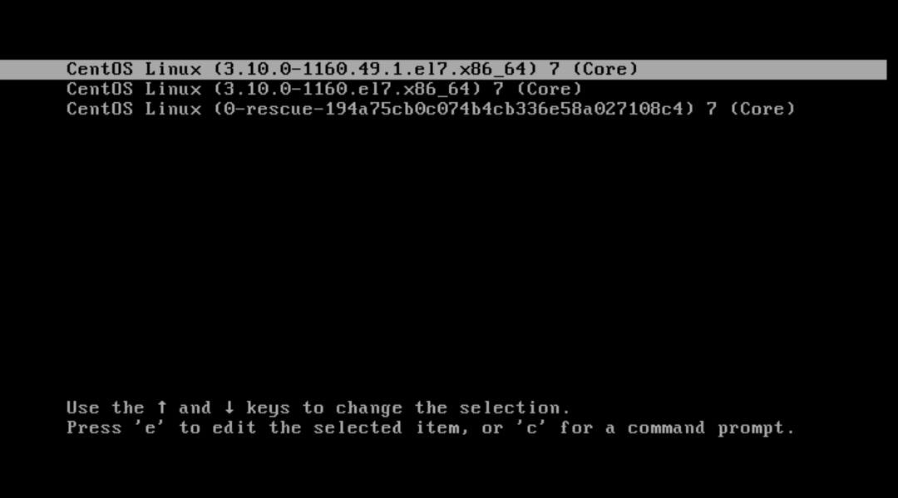
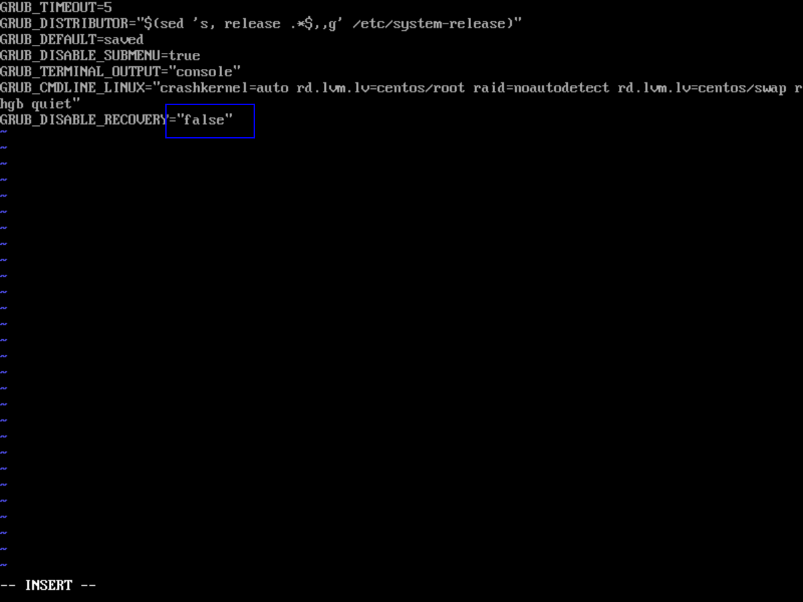
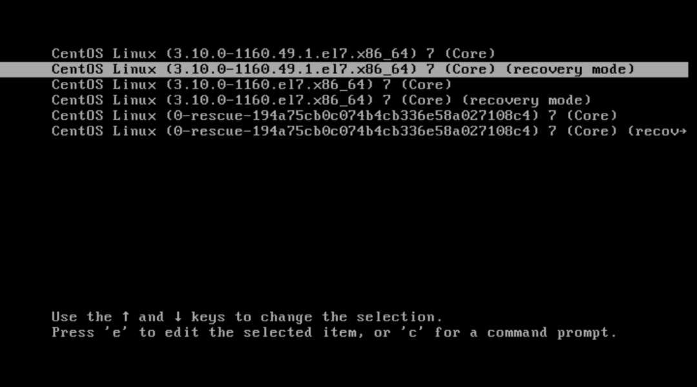
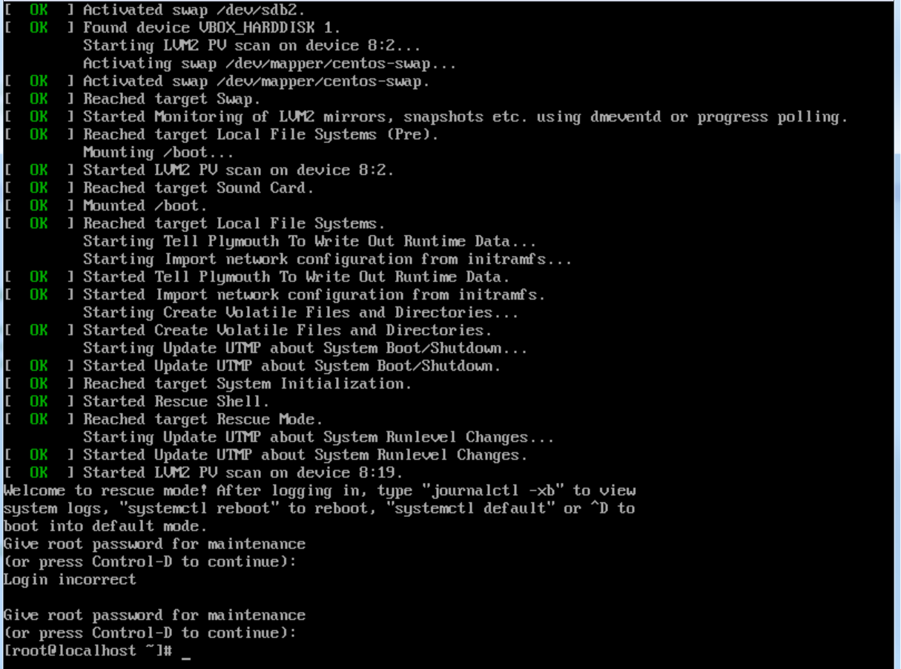

## _Boot process_  

- Вопрос 1:  
  "enable recovery options for grub, update main configuration file and find new item in grub2 config in /boot."  
  
**Before:**  
  
```
vladimir@localhost:~$ sudo grub2-mkconfig
#
# DO NOT EDIT THIS FILE
#
# It is automatically generated by grub2-mkconfig using templates
# from /etc/grub.d and settings from /etc/default/grub
#

### BEGIN /etc/grub.d/00_header ###
set pager=1

....

### BEGIN /etc/grub.d/40_custom ###
# This file provides an easy way to add custom menu entries.  Simply type the
# menu entries you want to add after this comment.  Be careful not to change
# the 'exec tail' line above.
### END /etc/grub.d/40_custom ###

.......
```
**Modify vi /etc/default/grub:**  
   
```
vladimir@localhost:~$ sudo vi /etc/default/grub
vladimir@localhost:~$ sudo grub2-mkconfig -o /boot/grub2/grub.cfg
vladimir@localhost:~$ sudo reboot
```
  
**After:**  
  
  
  
**Adding new first line at 40_custom file...:**    
```
[root@localhost ~]# vi /etc/grub.d/40_custom
[root@localhost ~]# grub2-mkconfig -o /boot/grub2/grub.cfg
```
**...and checking the changes after reboot in normal mode:**  
```
vladimir@localhost:~$ sudo grub2-mkconfig
#
# DO NOT EDIT THIS FILE
#
# It is automatically generated by grub2-mkconfig using templates
# from /etc/grub.d and settings from /etc/default/grub
#

### BEGIN /etc/grub.d/00_header ###
set pager=1

....

### BEGIN /etc/grub.d/40_custom ###
# This is the test version of 40 GRUB section
# This file provides an easy way to add custom menu entries.  Simply type the
# menu entries you want to add after this comment.  Be careful not to change
# the 'exec tail' line above.
### END /etc/grub.d/40_custom ###

....
```
  
 
- Вопрос 2:  
  "modify option vm.dirty_ratio:"  
  
```
vladimir@localhost:~$ cat /proc/sys/vm/dirty_ratio
30
```
  
  \- _using echo utility:_
  
```
vladimir@localhost:~$ sudo bash -c "echo 20 > /proc/sys/vm/dirty_ratio"
vladimir@localhost:~$ cat /proc/sys/vm/dirty_ratio
20
```
 
  \- _using sysctl utility:_
 
```
vladimir@localhost:~$ sudo sysctl -w vm.dirty_ratio=25
vm.dirty_ratio = 25
vladimir@localhost:~$ cat /proc/sys/vm/dirty_ratio
25
``` 
  
  \- _using sysctl configuration files:_
  
```
vladimir@localhost:~$ sudo vi /etc/sysctl.conf
vladimir@localhost:~$ cat /etc/sysctl.conf
# sysctl settings are defined through files in
# /usr/lib/sysctl.d/, /run/sysctl.d/, and /etc/sysctl.d/.
#
# Vendors settings live in /usr/lib/sysctl.d/.
# To override a whole file, create a new file with the same in
# /etc/sysctl.d/ and put new settings there. To override
# only specific settings, add a file with a lexically later
# name in /etc/sysctl.d/ and put new settings there.
#
# For more information, see sysctl.conf(5) and sysctl.d(5).
vm.dirty_ratio = 30
vladimir@localhost:~$ sysctl vm.dirty_ratio
vm.dirty_ratio = 25
vladimir@localhost:~$ sudo sysctl --system
* Applying /usr/lib/sysctl.d/00-system.conf ...
* Applying /usr/lib/sysctl.d/10-default-yama-scope.conf ...
kernel.yama.ptrace_scope = 0
* Applying /usr/lib/sysctl.d/50-default.conf ...
kernel.sysrq = 16
kernel.core_uses_pid = 1
kernel.kptr_restrict = 1
net.ipv4.conf.default.rp_filter = 1
net.ipv4.conf.all.rp_filter = 1
net.ipv4.conf.default.accept_source_route = 0
net.ipv4.conf.all.accept_source_route = 0
net.ipv4.conf.default.promote_secondaries = 1
net.ipv4.conf.all.promote_secondaries = 1
fs.protected_hardlinks = 1
fs.protected_symlinks = 1
* Applying /usr/lib/sysctl.d/99-docker.conf ...
fs.may_detach_mounts = 1
* Applying /etc/sysctl.d/99-sysctl.conf ...
vm.dirty_ratio = 30
* Applying /etc/sysctl.conf ...
vm.dirty_ratio = 30
vladimir@localhost:~$ sysctl vm.dirty_ratio
vm.dirty_ratio = 30
```

- Вопрос 3:  
  "Inspect initrd file contents. Find all files that are related to XFS filesystem and give a short description for every file."  
    
```
vladimir@localhost:~$ sudo lsinitrd /boot/initramfs-3.10.0-1160.el7.x86_64.img | grep xfs
drwxr-xr-x   2 root     root            0 Dec  4 11:16 usr/lib/modules/3.10.0-1160.el7.x86_64/kernel/fs/xfs
-rw-r--r--   1 root     root       335716 Oct 19  2020 usr/lib/modules/3.10.0-1160.el7.x86_64/kernel/fs/xfs/xfs.ko.xz
-rwxr-xr-x   1 root     root          433 Sep 30  2020 usr/sbin/fsck.xfs
-rwxr-xr-x   1 root     root       590208 Dec  4 11:16 usr/sbin/xfs_db
-rwxr-xr-x   1 root     root          747 Sep 30  2020 usr/sbin/xfs_metadump
-rwxr-xr-x   1 root     root       576720 Dec  4 11:16 usr/sbin/xfs_repair
```
**usr/lib/modules/3.10.0-1160.el7.x86_64/kernel/fs/xfs/xfs.ko.xz** This is the kernel driver of XFS filesystem  
**2020 usr/sbin/fsck.xfs** XFS startup check & repair utility  
**usr/sbin/xfs_db** XFS debugger  
**usr/sbin/xfs_metadump** XFS metadata copy (to file) utility  
**usr/sbin/xfs_repair** XFS repair utility  


- Вопрос 4:  
  "Study dracut utility that is used for rebuilding initrd image. Give an example for adding driver/kernel module for your initrd and recreating it."  
    
```
vladimir@localhost:~$ dracut --add   my_module   /boot/initramfs-3.10.0-1160.49.1.el7.x86_64.img --force
# --add-drivers for .ko modules  
vladimir@localhost:~$ dracut --omit  my_module   /boot/initramfs-3.10.0-1160.49.1.el7.x86_64.img --force
```

- Вопрос 5:  
  "Explain the difference between ordinary and rescue initrd images" 

The main difference between them is the ability to mount different FS or sources in rescue mode (with an optional automount though) to configure the correct way to boot the system. However, this mount is temporary and will be lost after rebooting.  
 
  
## _Selinux_

- Вопрос 1:  
  "Disable selinux using kernel cmdline"  
   
```
vladimir@localhost:~$ sestatus
SELinux status:                 enabled
SELinuxfs mount:                /sys/fs/selinux
SELinux root directory:         /etc/selinux
Loaded policy name:             targeted
Current mode:                   enforcing
Mode from config file:          enforcing
Policy MLS status:              enabled
Policy deny_unknown status:     allowed
Max kernel policy version:      31
vladimir@localhost:~$ sudo grubby --update-kernel ALL --args selinux=0
vladimir@localhost:~$ sudo reboot

Using username "vladimir".
vladimir@127.0.0.1's password:
Last login: Thu Dec 23 01:28:46 2021 from gateway
vladimir@localhost:~$ sestatus
SELinux status:                 disabled
```   
  
  
## _Firewalls_

- Вопрос 1:  
  "Add rule using firewall-cmd that will allow SSH access to your server *only* from network 192.168.56.0/24 and interface enp0s8 (if your network and/on interface name differs - change it accordingly)."  
  
```
C:\Users\Vladimir>ipconfig

Настройка протокола IP для Windows

Ethernet adapter Radmin VPN:

   DNS-суффикс подключения . . . . . :
   IPv6-адрес. . . . . . . . . . . . : fdfd::1af1:3aca
   Локальный IPv6-адрес канала . . . : fe80::9ca8:fa9c:d501:4c87%34
   IPv4-адрес. . . . . . . . . . . . : 26.241.58.202
   Маска подсети . . . . . . . . . . : 255.0.0.0
   Основной шлюз. . . . . . . . . : 26.0.0.1

Ethernet adapter Подключение по локальной сети:

   DNS-суффикс подключения . . . . . :
   Локальный IPv6-адрес канала . . . : fe80::1916:9a1b:4844:8c84%11
   IPv4-адрес. . . . . . . . . . . . : 192.168.10.100
   Маска подсети . . . . . . . . . . : 255.255.255.0
   Основной шлюз. . . . . . . . . : 192.168.10.1

Ethernet adapter VMware Network Adapter VMnet1:

   DNS-суффикс подключения . . . . . :
   Локальный IPv6-адрес канала . . . : fe80::192b:42e6:897d:78ec%17
   IPv4-адрес. . . . . . . . . . . . : 192.168.5.1
   Маска подсети . . . . . . . . . . : 255.255.255.0
   Основной шлюз. . . . . . . . . :

Ethernet adapter VMware Network Adapter VMnet8:

   DNS-суффикс подключения . . . . . :
   Локальный IPv6-адрес канала . . . : fe80::813d:562d:9008:e02f%18
   IPv4-адрес. . . . . . . . . . . . : 192.168.231.1
   Маска подсети . . . . . . . . . . : 255.255.255.0
   Основной шлюз. . . . . . . . . :

Ethernet adapter VirtualBox Host-Only Network:

   DNS-суффикс подключения . . . . . :
   Локальный IPv6-адрес канала . . . : fe80::594d:ec18:7bd7:9127%20
   IPv4-адрес. . . . . . . . . . . . : 192.168.56.1
   Маска подсети . . . . . . . . . . : 255.255.255.0
   Основной шлюз. . . . . . . . . :
```  
  
   
```
vladimir@localhost:~$ ip -4 a
1: lo: <LOOPBACK,UP,LOWER_UP> mtu 65536 qdisc noqueue state UNKNOWN group default qlen 1000
    inet 127.0.0.1/8 scope host lo
       valid_lft forever preferred_lft forever
2: enp0s3: <BROADCAST,MULTICAST,UP,LOWER_UP> mtu 1500 qdisc pfifo_fast state UP group default qlen 1000
    inet 10.0.2.15/24 brd 10.0.2.255 scope global noprefixroute dynamic enp0s3
       valid_lft 86282sec preferred_lft 86282sec	 
vladimir@localhost:~$ ip n
10.0.2.2 dev enp0s3 lladdr 52:54:00:12:35:02 REACHABLE
vladimir@localhost:~$ sudo firewall-cmd --list-all
public (active)
  target: default
  icmp-block-inversion: no
  interfaces: enp0s3
  sources:
  services: dhcpv6-client ssh
  ports: 8888/tcp
  protocols:
  masquerade: no
  forward-ports:
  source-ports:
  icmp-blocks:
  rich rules:
vladimir@localhost:~$ sudo firewall-cmd --zone=internal --add-port=22/tcp --permanent
success
vladimir@localhost:~$ sudo firewall-cmd --zone=internal --add-interface=enp0s3 --permanent
success	  
vladimir@localhost:~$ sudo firewall-cmd --zone=internal --add-source=192.168.56.1/24 --permanent
success	 
vladimir@localhost:~$ firewall-cmd --set-default-zone internal
vladimir@localhost:~$ sudo firewall-cmd --reload
vladimir@localhost:~$ sudo firewall-cmd --list-all --zone=internal
internal (active)
  target: default
  icmp-block-inversion: no
  interfaces: enp0s3
  sources: 192.168.56.1/24
  services: dhcpv6-client mdns samba-client ssh
  ports: 22/tcp
  protocols:
  masquerade: no
  forward-ports:
  source-ports:
  icmp-blocks:
  rich rules:
```   
  
    
- Вопрос 2:  
  "Shutdown firewalld and add the same rules via iptables."  
  
```
vladimir@localhost:~$ sudo systemctl status firewalld
● firewalld.service - firewalld - dynamic firewall daemon
   Loaded: loaded (/usr/lib/systemd/system/firewalld.service; enabled; vendor preset: enabled)
   Active: active (running) since Thu 2021-12-23 00:18:04 MSK; 2 weeks 4 days ago
     Docs: man:firewalld(1)
 Main PID: 746 (firewalld)
   Memory: 33.8M
   CGroup: /system.slice/firewalld.service
           └─746 /usr/bin/python2 -Es /usr/sbin/firewalld --nofork --nopid

Dec 23 00:18:03 localhost.localdomain systemd[1]: Starting firewalld - dynami...
Dec 23 00:18:04 localhost.localdomain systemd[1]: Started firewalld - dynamic...
Dec 23 00:18:04 localhost.localdomain firewalld[746]: WARNING: AllowZoneDrift...
Hint: Some lines were ellipsized, use -l to show in full.
vladimir@localhost:~$ sudo systemctl stop firewalld
vladimir@localhost:~$ sudo systemctl status firewalld
● firewalld.service - firewalld - dynamic firewall daemon
   Loaded: loaded (/usr/lib/systemd/system/firewalld.service; enabled; vendor preset: enabled)
   Active: inactive (dead) since Mon 2022-01-10 21:48:35 MSK; 1s ago
     Docs: man:firewalld(1)
  Process: 746 ExecStart=/usr/sbin/firewalld --nofork --nopid $FIREWALLD_ARGS (code=exited, status=0/SUCCESS)
 Main PID: 746 (code=exited, status=0/SUCCESS)

Dec 23 00:18:03 localhost.localdomain systemd[1]: Starting firewalld - dynami...
Dec 23 00:18:04 localhost.localdomain systemd[1]: Started firewalld - dynamic...
Dec 23 00:18:04 localhost.localdomain firewalld[746]: WARNING: AllowZoneDrift...
Jan 10 21:48:31 localhost.localdomain systemd[1]: Stopping firewalld - dynami...
Jan 10 21:48:35 localhost.localdomain systemd[1]: Stopped firewalld - dynamic...
Hint: Some lines were ellipsized, use -l to show in full.
vladimir@localhost:~$ sudo iptables -L
Chain INPUT (policy ACCEPT)
target     prot opt source               destination

Chain FORWARD (policy ACCEPT)
target     prot opt source               destination

Chain OUTPUT (policy ACCEPT)
target     prot opt source               destination
vladimir@localhost:~$ sudo iptables -A INPUT -j DROP
vladimir@localhost:~$ sudo iptables -A INPUT -i enp0s3 -p tcp --dport 22 -s 192.168.56.1/24 -j ACCEPT
vladimir@localhost:~$ sudo iptables -L
Chain INPUT (policy ACCEPT)
target     prot opt source               destination
ACCEPT     all  --  anywhere             anywhere             state RELATED,ESTABLISHED
ACCEPT     icmp --  anywhere             anywhere
ACCEPT     all  --  anywhere             anywhere
ACCEPT     tcp  --  anywhere             anywhere             state NEW tcp dpt:ssh
REJECT     all  --  anywhere             anywhere             reject-with icmp-host-prohibited
DROP       all  --  anywhere             anywhere
ACCEPT     tcp  --  192.168.56.0/24      anywhere             tcp dpt:ssh

Chain FORWARD (policy ACCEPT)
target     prot opt source               destination
REJECT     all  --  anywhere             anywhere             reject-with icmp-host-prohibited

Chain OUTPUT (policy ACCEPT)
target     prot opt source               destination

vladimir@localhost:~$ sudo systemctl restart iptables.service
```
    
