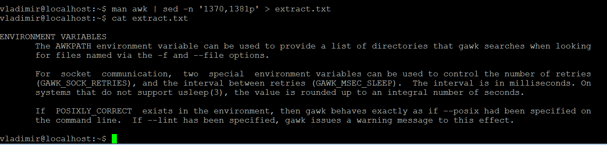
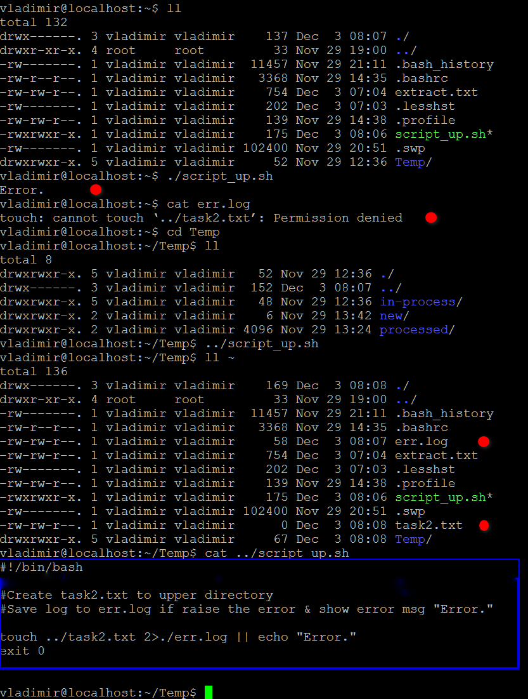
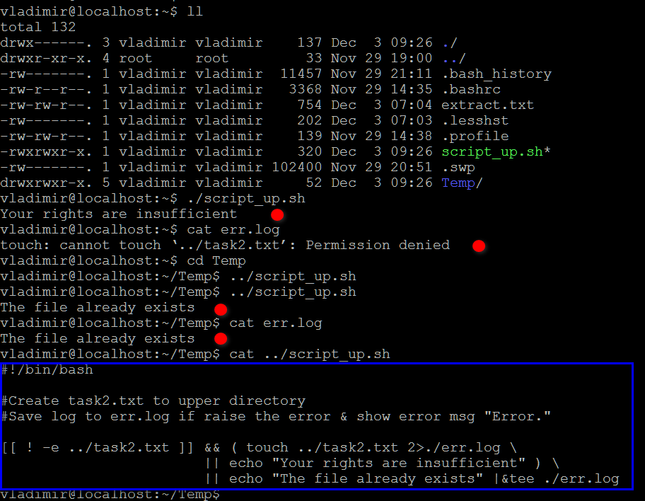
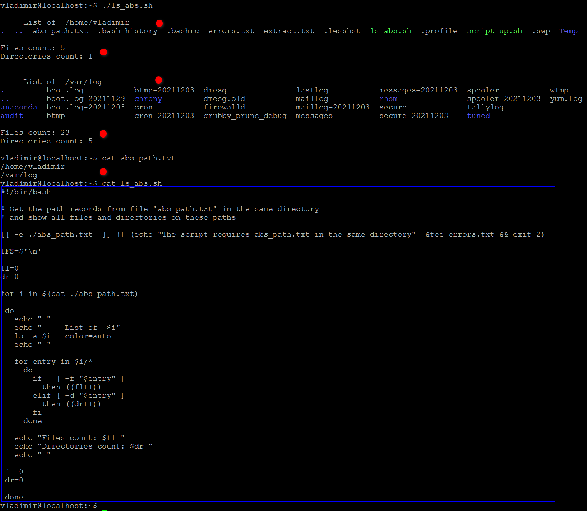

## _Задача 1_

- Вопрос 1:  
  "Открыть инструкцию по пользованию приложением awk. Найти секцию про использование переменных окружения. Сохранить эту секцию в отдельный файл.."   
    
   _Command:_ __man awk | sed -n '1370,1381p' > extract.txt__ 
  
  _Result:_  
  
  
  
  
## _Задача 2_

- Вопрос 1:  
  "Написать скрипт, который создаёт файл "task2.txt" директорией выше своего местоположения. В случае ошибки текст ошибки записывается в err.log а пользователю выдаётся сообщение "Error.""     
    
    
    
- Вопрос 2:  
  "Если файл уже существует, выдаётся одна ошибка, а если нет прав для его создания - другая."  
  
  
  
## _Задача 3_

- Вопрос 1:  
  "Создать 2 файла: 1-й - текстовый с указанием абслютного пути до директории. 2-й - скрипт, который при выполнении выводит содержимое директории по указанному в первом файле."  
   
- Вопрос 2:  
  "Скрипт выводит отдельно количество файлов и количество директорий."  
    
- Вопрос 3:  
  "Скрипт принимает любое количество записей в первом файле и обрабатывает их последовательно."  
  
    	
  