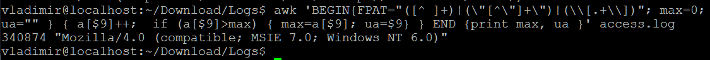
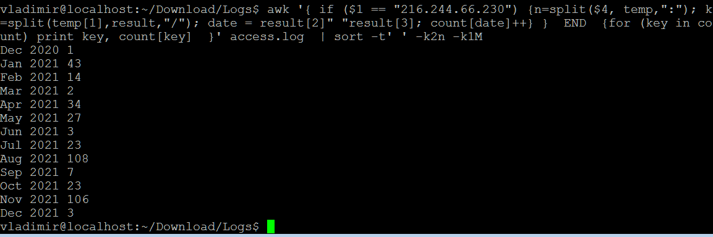
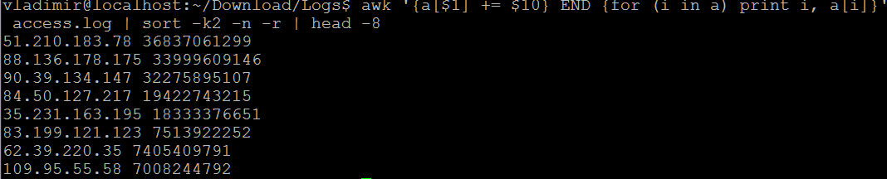
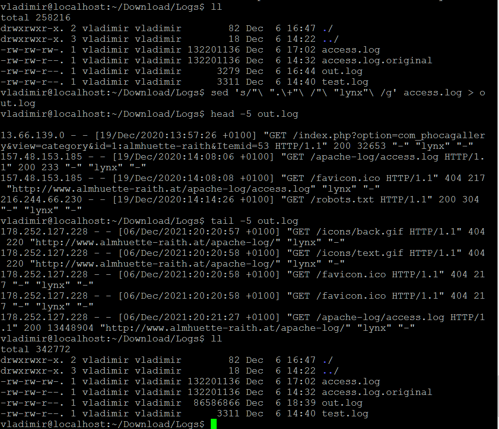
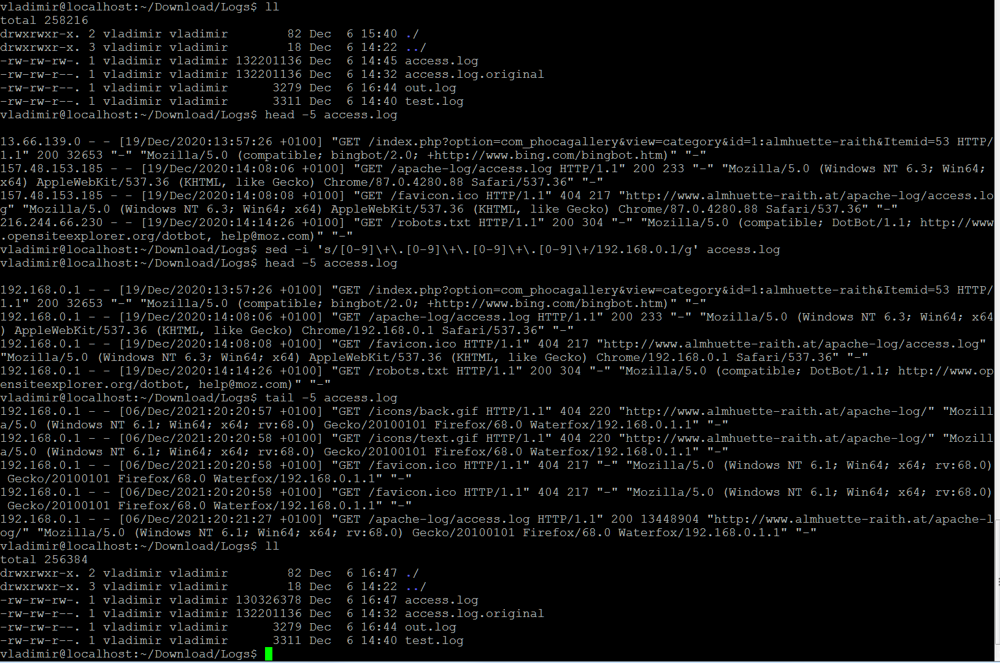

## _AWK_

- Вопрос 1:  
  "What is the most frequent browser?"  
  
  _Command:_ __ __  
  _Result:_  
  
  
- Вопрос 2:  
  "Show number of requests per month for ip 216.244.66.230 (for example: Sep 2016 - 100500 reqs, Oct 2016 - 0 reqs, Nov 2016 - 2 reqs...)"  
  
  _Command:_ __ __    
  _Result:_  
    
    
- Вопрос 3:  
  "Show total amount of data which server has provided for each unique ip (i.e. 100500 bytes for 1.2.3.4; 9001 bytes for 5.4.3.2 and so on)"  
  
  _Command:_ __ __    
  _Result:_
    
  
  
## _Sed_

- Вопрос 1:  
  "Change all browsers to "lynx""  
  
  _Command:_ __sed -i 's/"([A-Z][a-z]+)\/[0-9].+"\ /"lynx"\ /' __  
  _Result:_  
  
  
- Вопрос 2:  
  "Masquerade all ip addresses. Rewrite file."  
  
  _Command:_   
  _Result:_  
  
  
  
## _Extra_

- Вопрос 1:  
  "Show list of unique ips, who made more then 50 requests to the same url within 10 minutes (for example too many requests to "/")"  
  
  _Command:_ __ __  
  _Result:_  
    
 