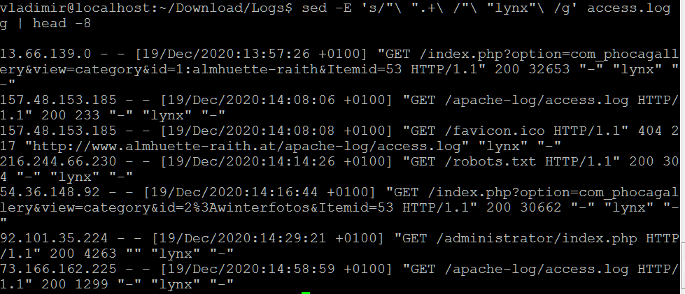

## _AWK_

- Вопрос 1:  
  "What is the most frequent browser?"  
  
  _Command:_ __awk -F\" '{print $6}' access.log | awk -F"/" '{$1;a[$1]++} END {for (i in a) print i,a[i]}' | sort -b -n -k2 -r__  
  _Result:_  
  
  
- Вопрос 2:  
  "Show number of requests per month for ip 216.244.66.230 (for example: Sep 2016 - 100500 reqs, Oct 2016 - 0 reqs, Nov 2016 - 2 reqs...)"  
  
  _Command:_ __awk '{ if ($1 == "216.244.66.230") {n=split($4, temp,":"); k=split(temp[1],result,"/"); date = result[2]result[3]; count[date]++} }  END  {for (key in count) print key, count[key]  }' access.log__    
  _Result:_  
    
    
- Вопрос 3:  
  "Show total amount of data which server has provided for each unique ip (i.e. 100500 bytes for 1.2.3.4; 9001 bytes for 5.4.3.2 and so on)"  
  
  _Command:_ __awk '{a[$1] += $10} END {for (i in a) print i, a[i]}' access.log__    
  _Result:_
    
  
  
## _Sed_

- Вопрос 1:  
  "Change all browsers to "lynx""  
  
  _Command:_ __sed 's/"\ ".\+"\ /"\ "lynx"\ /g' access.log > out.log__  
  _Result:_  
  
  
- Вопрос 2:  
  "Masquerade all ip addresses. Rewrite file."  
  
  _Command:_   __sed -i 's/[0-9]\+\.[0-9]\+\.[0-9]\+\.[0-9]\+/192.168.0.1/g' access.log__  
  _Result:_  
    

 