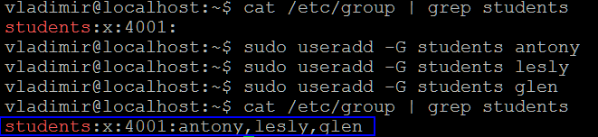
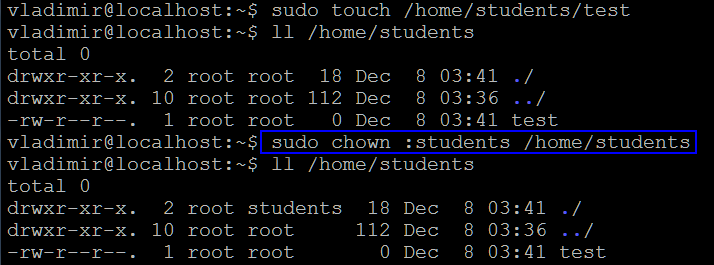

## _Task 1: Users and groups_

- Вопрос:  
  "Создайте группу sales с GID 4000 и пользователей bob, alice, eve c основной группой sales. 
  Измените пользователям пароли.
  Все новые аккаунты должны обязательно менять свои пароли каждый 30 дней.
  Новые аккаунты группы sales должны истечь по окончанию 90 дней срока, а bob должен изменять его пароль каждые 15 дней.
  Заставьте пользователей сменить пароль после первого логина."  
    
  _Result:_  
  
  
  
  
  
  
 
 
## _Task 2: Controlling access to files with Linux file system permissions_

- Вопрос:  
  "Создайте трёх пользователей glen, antony, lesly.
  У вас должна быть директория /home/students, где эти три пользователя могут работать совместно с файлами.
  Должен быть возможен только пользовательский и групповой доступ, создание и удаление файлов в /home/students. 
  Файлы, созданные в этой директории, должны автоматически присваиваться группе студентов students."  
  
  _Result:_  
  
  
  
  
  
  
## _Task 3: Controlling access to files with Linux file system permissions_

- Вопрос:  
   - От суперпользователя создайте папку /share/cases и создайте внутри 2 файла murders.txt и moriarty.txt.
   - Создайте общую директорию /share/cases.
   - Создайте группу bakerstreet с пользователями holmes, watson.
   - Создайте группу scotlandyard с пользователями lestrade, gregson, jones.
   - Задайте всем пользователям безопасные пароли.
   - Директория и всё её содержимое должно принадлежать группе bakerstreet, при этом файлы должны обновляться для чтения и записи  для владельца и группы (bakerstreet). У других пользователей не должно быть никаких разрешений. 
   - Вам также необходимо предоставить доступы на чтение и запись для группы scotlandyard, за исключением Jones, который может только читать документы.
   - Убедитесь, что ваша настройка применима к существующим и будущим файлам. После установки всех разрешений в директории проверьте от каждого пользователя все его возможные доступы.   
  
  _Result:_  
  
  
  
  
  

 