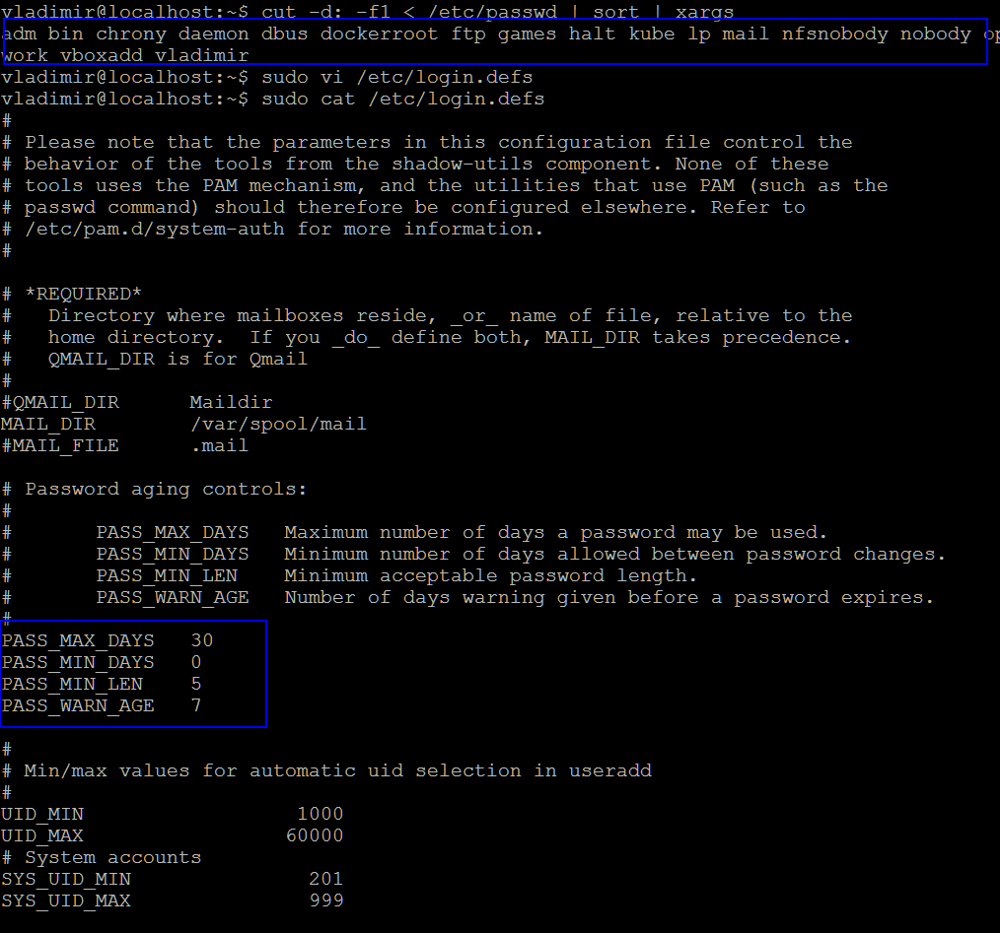

## _Task 1: Users and groups_

- Вопрос:  
  "Создайте группу sales с GID 4000 и пользователей bob, alice, eve c основной группой sales. 
  Измените пользователям пароли.
  Все новые аккаунты должны обязательно менять свои пароли каждый 30 дней.
  Новые аккаунты группы sales должны истечь по окончанию 90 дней срока, а bob должен изменять его пароль каждые 15 дней.
  Заставьте пользователей сменить пароль после первого логина."  
    
  _Result:_  
  
  
  
  
  
  
 
 
## _Task 2: Controlling access to files with Linux file system permissions_

- Вопрос:  
  "Создайте трёх пользователей glen, antony, lesly.
  У вас должна быть директория /home/students, где эти три пользователя могут работать совместно с файлами.
  Должен быть возможен только пользовательский и групповой доступ, создание и удаление файлов в /home/students. 
  Файлы, созданные в этой директории, должны автоматически присваиваться группе студентов students."  
  
  _Result:_  
  
  
  
  
  
  
## _Task 3: Controlling access to files with Linux file system permissions_

- Вопрос:  
  "От суперпользователя создайте папку /share/cases и создайте внутри 2 файла murders.txt и moriarty.txt.
  Создайте общую директорию /share/cases.
  Создайте группу bakerstreet с пользователями holmes, watson.
  Создайте группу scotlandyard с пользователями lestrade, gregson, jones.
  Задайте всем пользователям безопасные пароли."  
  
  _Command:_ __sed 's/"\ ".\\+"\ /"\ "lynx"\ /g' access.log > out.log__  
  _Result:_  
  

 