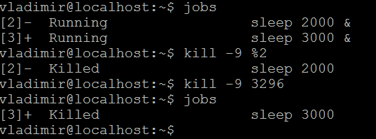

## _Задача 1_

- Вопрос 1:  
  "Run a sleep command three times at different intervals" 
  
  _Command(example):_ __sleep 1000 &__ 
  _Result:_
    
  
- Вопрос 2:  
  "Send a SIGSTOP signal to all of them in three different ways."  
  
  _Command:_ __kill -SIGSTOP 3287; kill -SIGSTOP %2; pkill -SIGSTOP sleep__ 

- Вопрос 3:   
  "Check their statuses with a job command"  
  
  
  
- Вопрос 4: 
  "Terminate one of them. (Any)"
  
  _Command:_ __kill -9 3287__ 
  _Result:_
  
  
- Вопрос 5: 
  "To other send a SIGCONT in two different ways."  
  
  _Command:_ __kill -SIGCONT %2; kill -SIGCONT 3296__     
  _Result:_  
  
  
- Вопрос 6: 
  "Kill one by PID and the second one by job ID"
  
  _Command:_ __kill -9 %2; kill -9 3296__    
  _Result:_  
  
  
  
## _Задача 2_

- Вопрос 1:  
  "Write two daemons: one should be a simple daemon and do sleep 10 after a start and then do echo 1 > /tmp/homework, the second one should be oneshot and do echo 2 > /tmp/homework without any sleep"  
 
- Вопрос 2:  
  "Make the second depended on the first one (should start only after the first)"  
  
  _Result:_  
  
  
  
- Вопрос 3:   
  "Write a timer for the second one and configure it to run on 01.01.2019 at 00:00"    
  
   _Result:_  
  
  
- Вопрос 4: 
  "Start all daemons and timer, check their statuses, timer list and /tmp/homework"
  
  _Command:_ __sudo systemctl daemon-reload__  
                     __systemctl enable <names of services and timer>__ 
                     __systemctl start <names of services and timer>__  
   _Result:_
  
  
- Вопрос 5: 
  "Stop all daemons and timer"
  
  _Command:_ __systemctl start <names of services and timer>__   
                      __systemctl enable <names of services and timer>__                  
  
  
  
## _Задача 3_

- Вопрос 1:  
  "Create an anacron job which executes a script with echo Hello > /opt/hello and runs every 2 days"  
  
  _Result:_  
  
  
- Вопрос 2:  
  "Create a cron job which executes the same command (will be better to create a script for this) and runs it in 1 minute after system boot"  
  
  _Result:_   
    
  
- Вопрос 3:   
  "Restart your virtual machine and check previous job proper execution"
  
  _Result:_   
     
     
     
   
   
  
  
  
## _Задача 4_

- Вопрос 1:  
  "Run a sleep command, redirect stdout and stderr into two different files (both of them will be empty)"    
  
  _Command:_ __sleep 300 2>2err.txt |& tee 1out.txt &__  
 					     
  
- Вопрос 2:  
  "Find with the lsof command which files this process uses, also find from which file it gain stdin"
  
  _Command:_ __lsof | grep sleep__  
  _Comment:_ "This process uses /dev/pts/0 (terminal) as stdin"
 					     
  _Result:_  
  
  
- Вопрос 3:   
  "List all ESTABLISHED TCP connections ONLY with lsof"  
  
  _Command:_ __sudo lsof -i TCP__  
  
  _Result:_    
  
