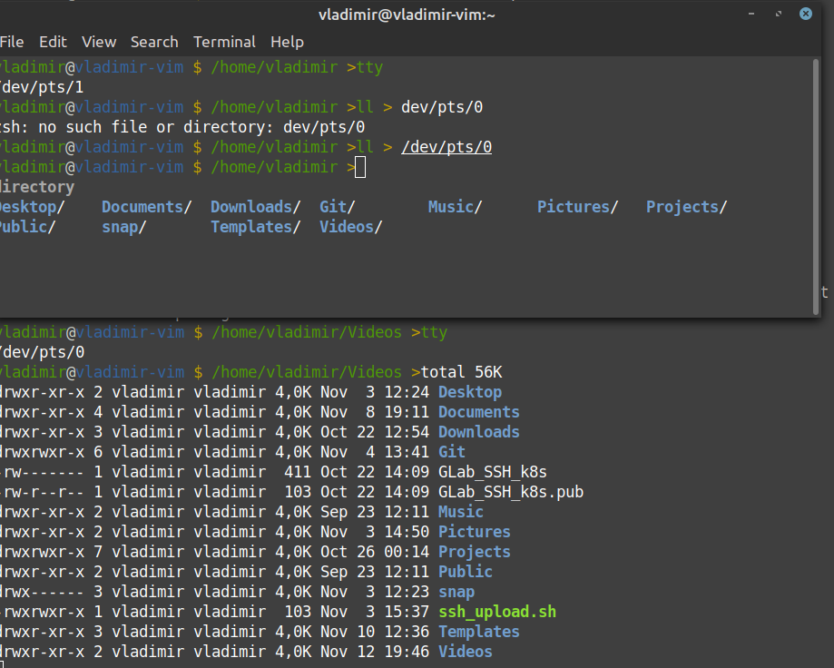

# This is file with answers for homework "3.2. Работа в терминале, лекция 2"

1. _Какого типа команда cd?_

Это встроенная команда оболочки(bash, fish, zsh etc.), обычно выполняемая ею напрямую.  

2. _Какая альтернатива без pipe команде grep <some_string> <some_file> | wc -l?_

**grep -ch  <some_string> <some_file>**  

3. _Какой процесс с PID 1 является родителем для всех процессов в вашей виртуальной машине Ubuntu 20.04?_

systemd (команда top или pstree)  

4. _Как будет выглядеть команда, которая перенаправит вывод stderr ls на другую сессию терминала?_

**ls 2> dev/pts/<pty session number>**  

5. _Получится ли одновременно передать команде файл на stdin и вывести ее stdout в другой файл?_

Да, с помощью конструкции типа: **CLIcommand < filename > outputfile **  

6. _Получится ли находясь в графическом режиме, вывести данные из PTY в какой-либо из эмуляторов TTY? Сможете ли вы наблюдать выводимые данные?_

Да, надо открыть два терминала и перенаправить вывод из одного в другой.    

  
Если речь идет только о средствах графической оболочки, то можно использовать команду **Move to another workspace** (правая кнопка мыши по заголовку приложения) для отправки его на другой воркспейс и, следовательно, на другой TTY  

7. _Выполните команду bash 5>&1. К чему она приведет? Что будет, если вы выполните echo netology > /proc/$$/fd/5? Почему так происходит?_

Нет изменений  
**Вывод:** netology  
Судя по выводу команды **ll /proc/$$/fd/** дескриптор 5 вляется симлинком на **/dev/pts/0**, то есть по сути еще одним PTY.  

8. _Получится ли в качестве входного потока для pipe использовать только stderr команды, не потеряв при этом отображение stdout на pty?_

Нет, для направления  потока в файл можно использовать для pipe или только StdOut или оба StdOut и StdErr.   

9. _Что выведет команда cat /proc/$$/environ? Как еще можно получить аналогичный по содержанию вывод?_

Переменные среды для текущего пользователя.  
Другими командами просмотра или редактирования (xargs, sed, strings) файлов, например **more < /proc/$$/environ**  

10. _Используя man, опишите что доступно по адресам /proc/<PID>/cmdline, /proc/<PID>/exe._

Это символическая ссылка на представление исполняемого файла и его аргументов запуска.  
11. _Узнайте, какую наиболее старшую версию набора инструкций SSE поддерживает ваш процессор с помощью /proc/cpuinfo._

**cat /proc/cpuinfo | grep sse**    
**Вывод:**  
flags		: fpu vme de pse tsc msr pae mce cx8 apic sep mtrr pge mca cmov pat pse36 clflush mmx fxsr sse sse2 ht syscall nx rdtscp lm constant_tsc arch_perfmon nopl xtopology tsc_reliable nonstop_tsc cpuid pni pclmulqdq ssse3 cx16 pcid sse4_1 sse4_2 x2apic popcnt tsc_deadline_timer aes xsave avx hypervisor lahf_lm pti tsc_adjust arat  

12. _Почитайте, почему так происходит, и как изменить поведение_

При выполнении команды на удаленной машине TTY не выделяется и команда выполняется в фоне. Это относится и к выполнению команды на локалхосте через ssh. Для принудительного выделения TTY необходимо использовать ключ -t после команды ssh.  

14. _Узнайте что делает команда tee и почему в отличие от sudo echo команда с sudo tee будет работать._

Команда tee используется для записи стандартного ввода  в любой стандартный вывод(файл). Echo не является отдельной программой, поэтому не может быть использована с рут-доступом. Использование отдельной команды позволяет повысить права для записи вывода в restricted area.  
